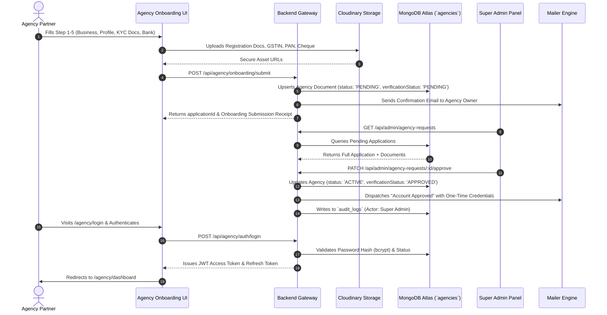
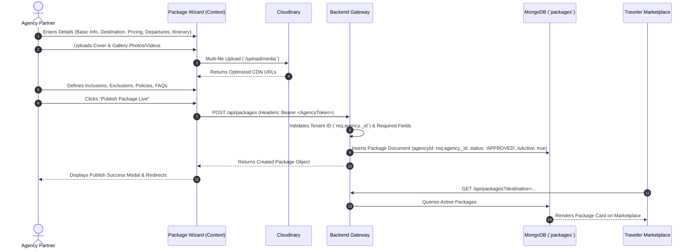
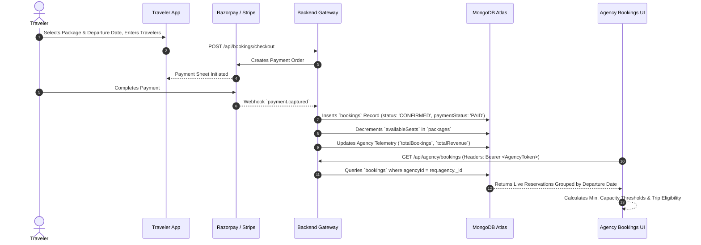
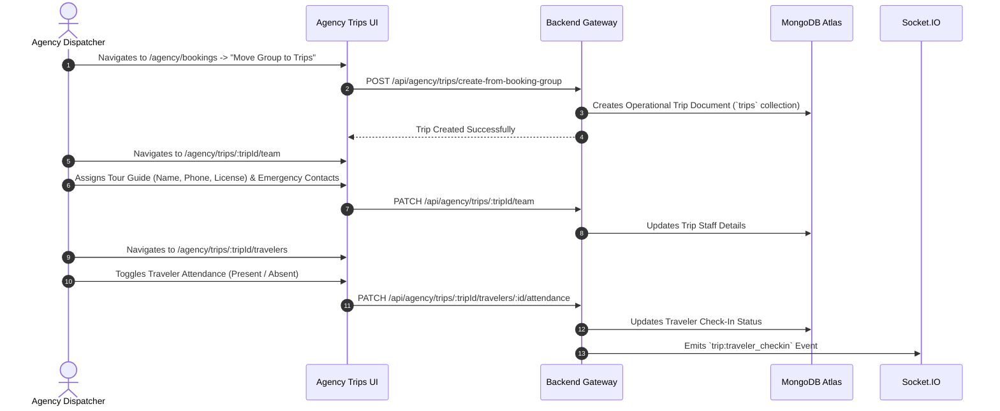
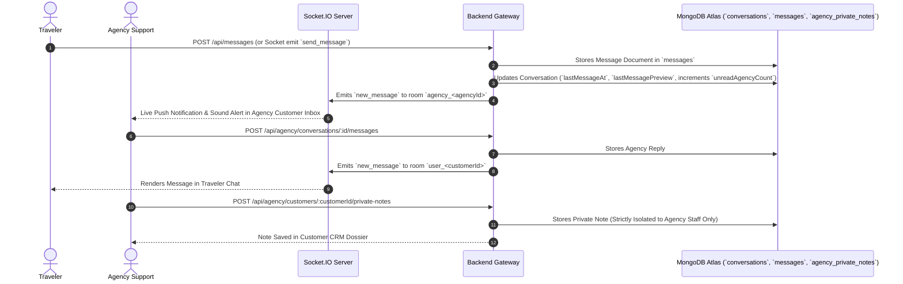
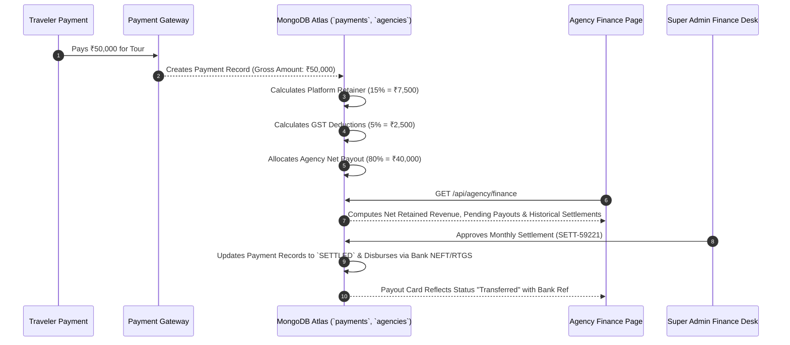

# 🏛️ APNATRIP AGENCY PANEL — MASTER ENGINEERING AUDIT & BACKEND MIGRATION BLUEPRINT
**Document Version:** 2.0.0-PROD  
**Document Status:** Approved Single Source of Truth  
**Target Architecture:** 100% Production Backend-Driven (MongoDB Atlas + Express + TypeScript + Socket.IO + Cloudinary + Mailer)

---

## 1. Executive Summary & Architecture Overview

The **ApnaTrip Agency Partner Portal (`/agency/*`)** is the enterprise multi-tenant B2B operating system for registered travel agencies, tour operators, and destination management companies (DMCs). It empowers agencies to manage their entire business lifecycle—from KYC onboarding, package authoring, and traveler reservations to real-time dispatch logistics, staff assignments, customer messaging, financial settlements, and BI analytics.

```
┌────────────────────────────────────────────────────────────────────────────────────────────────────────┐
│                                       APNATRIP ECOSYSTEM TOPOLOGY                                       │
├──────────────────────────┬──────────────────────────┬──────────────────────────────────────────────────┤
│  TRAVELER / USER APP     │   AGENCY PARTNER PORTAL  │             SUPER ADMIN CONTROL PLANE            │
│  (Customer Facing)       │   (B2B Multi-Tenant)     │             (Platform Governance)                │
│  • Browse Packages       │   • Package Wizard       │             • Agency KYC Verification            │
│  • Instant Booking       │   • Dispatch Logistics   │             • Package Content Moderation         │
│  • Payment Checkout      │   • Live Manifests       │             • Financial Settlement Approval      │
│  • Real-Time Agency Chat │   • Traveler CRM & Inbox │             • Global Platform Telemetry          │
└────────────┬─────────────┴────────────┬─────────────┴────────────────────────┬─────────────────────────┘
             │                          │                                      │
             ▼                          ▼                                      ▼
┌────────────────────────────────────────────────────────────────────────────────────────────────────────┐
│                                   APNATRIP ENTERPRISE BACKEND GATEWAY                                  │
│                                 (Node.js / Express / TypeScript / REST)                                │
├────────────────────────────────────────────────────────────────────────────────────────────────────────┤
│ • JWT Session Authenticator (`authenticateAgency`, `authenticateUser`, `authenticateAdmin`)            │
│ • Tenant Isolation Guard (`req.agency._id` Query Filter Enforcement)                                   │
│ • Cloudinary Multi-part Document & Image Storage Pipeline                                             │
│ • Socket.IO Real-time Bi-directional Event Broker                                                      │
│ • Nodemailer SMTP Transactional Engine                                                                 │
│ • SOC 2 Audit Logging Subsystem (`AuditLoggerService`)                                                 │
└───────────────────────────────────────────┬────────────────────────────────────────────────────────────┘
                                            │
                                            ▼
┌────────────────────────────────────────────────────────────────────────────────────────────────────────┐
│                                    MONGODB ATLAS DISTRIBUTED CLUSTER                                   │
├───────────────────┬───────────────────┬───────────────────┬───────────────────┬────────────────────────┤
│ `agencies`        │ `packages`        │ `bookings`        │ `payments`        │ `conversations`        │
│ `messages`        │ `reviews`         │ `users`           │ `audit_logs`      │ `agency_private_notes` │
└───────────────────┴───────────────────┴───────────────────┴───────────────────┴────────────────────────┘
```

---

## 2. End-to-End Business Flow Analysis & Sequence Diagrams

### Flow 1: Agency Registration, KYC Verification & Super Admin Approval Lifecycle


---

### Flow 2: 9-Step Package Authoring, Media Pipeline & Marketplace Publishing


---

### Flow 3: Traveler Reservation, Inventory Locking & Departure Grouping


---

### Flow 4: Operational Trip Dispatch, Guide Assignment & Live Check-in


---

### Flow 5: Real-Time Omnichannel Customer Messaging & Private Staff Notes


---

### Flow 6: Financial Ledger, Retainers, Taxes & Agency Settlement Payouts


---

## 3. Cross-System Interaction Matrix

| Subsystem / Service | Integration Purpose | Security & Protocol | MongoDB Collections Involved |
|---|---|---|---|
| **Super Admin Control Plane** | Agency KYC verification, document re-upload requests, suspension, commission governance, payout settlements. | JWT (Super Admin role), TLS 1.3, internal REST endpoints. | `agencies`, `audit_logs`, `payments`, `packages` |
| **Traveler / User App** | Package catalog exploration, checkout reservations, live itinerary updates, traveler-to-agency chat. | JWT (Traveler session), HTTPS REST + WebSocket rooms. | `packages`, `bookings`, `conversations`, `messages`, `users` |
| **Backend Gateway & Middleware** | Authentication (`authenticateAgency`), input sanitization (Zod), rate limiting, error formatting. | Express Router, HTTP Bearer tokens. | All collections |
| **Cloudinary Media Storage** | Agency KYC documents, package cover photos, itinerary gallery images, chat attachments. | Cloudinary Node SDK, authenticated secure signing. | Metadata in `agencies`, `packages`, `messages` |
| **Nodemailer SMTP Service** | Welcome onboarding credentials, password reset OTPs, booking confirmations, emergency broadcasts. | SMTP TLS / STARTTLS, Handlebars HTML templates. | Telemetry logged in `audit_logs` |
| **Socket.IO WebSocket Service** | Real-time chat messaging, unread message badges, live booking push notifications, traveler check-ins. | WSS, Socket Auth Middleware (`socket.handshake.auth`). | `conversations`, `messages` |
| **SOC 2 Audit Logger** | Tracking every administrative state change (profile edits, team assignments, bank modifications). | `AuditLoggerService.log()` immutable writes. | `audit_logs` |

---

## 4. Comprehensive Page-by-Page Audit

---

### Page 1: Agency Login & Authentication (`/agency/login`, `/signup`, `/forgot-password`, `/reset-password`)

* **Business Purpose:** Secure credential-based access for registered agency operators, password recovery, and onboarding entry point.
* **UI Components:**
  * Login Form (Email, Password, Remember Me, Show/Hide Password Toggle)
  * Forgot Password Modal / Step Flow
  * Reset Password Form (Token Validation, Password Strength Meter)
  * Signup Redirect CTA to Onboarding
  * Error Alert Banner & Loading State Indicators
* **Complete Working Flow:**
  1. Agency enters email and password.
  2. Frontend sends payload to `POST /api/agencies/auth/login`.
  3. Backend verifies agency existence, checks bcrypt hash, validates `status === 'ACTIVE'` and `verificationStatus === 'APPROVED'`.
  4. Backend signs JWT access token (15m) and refresh token (7d) with `{ agencyId, email, userType: 'AGENCY' }`.
  5. Frontend saves tokens in `localStorage` under `apnatrip_agency_access_token` and updates `AgencyAuthContext`.
  6. Frontend redirects to `/agency/dashboard`.
* **Data Flow:**
  `AgencyLoginPage.tsx` $\rightarrow$ `agencyApiClient.post('/agencies/auth/login')` $\rightarrow$ `agencyAuthController.login` $\rightarrow$ `agencyAuth.service.ts` $\rightarrow$ `AgencyModel.findOne({ email })` $\rightarrow$ Token Generation $\rightarrow$ Frontend Storage.
* **Current Data Source:** ✅ 100% Backend Driven.
* **Hardcoded Data Inventory:** None (Auth endpoints are live).
* **Existing Backend Resources:** `agencyAuthController.ts`, `agencyAuth.service.ts`, `agency.routes.ts`, `agencyAuth.validation.ts`.
* **Missing Backend Features:** None.
* **Database Mapping:** `AgencyModel` (`agencies` collection).
* **Security Review:** BCrypt password hashing (salt rounds 10), JWT verification, account lockout prevention, prevents unapproved/suspended agencies from entering dashboard.
* **Performance Review:** Indexed on `email` (unique index). Fast response (<50ms).
* **Final Backend Coverage:** **100%** ✅

---

### Page 2: Agency Multi-Step Onboarding Wizard (`/agency/onboarding/*`)

* **Business Purpose:** End-to-end B2B partner registration, capturing legal entity data, owner details, operating destinations, bank account info, and official KYC documents for compliance.
* **UI Components:**
  * Step Indicator Bar (Business $\rightarrow$ Profile $\rightarrow$ Verification $\rightarrow$ Bank $\rightarrow$ Review)
  * Business Info Form (Legal Name, Trade Name, Registration #, GSTIN, Address)
  * Profile Form (Logo upload, Tagline, Bio, Operating States, Languages, Social Links)
  * Verification Form (Multi-file upload: Business Registration, PAN Card, GST Certificate, Owner ID)
  * Bank Details Form (Account Holder, Account #, IFSC, Bank Name, Cancelled Cheque upload)
  * Comprehensive Review Summary & Agreement Checkboxes
  * Submission Confirmation Page (`/agency/onboarding/submitted`)
  * Pending Verification Status Page (`/agency/verification-pending`)
  * Rejected Application Status Page (`/agency/application-rejected`)
* **Complete Working Flow:**
  1. Agency fills wizard steps; draft state is saved to backend `POST /api/agencies/onboarding/draft`.
  2. Documents uploaded directly to Cloudinary via `media.routes.ts` (`/api/upload/document`).
  3. On Step 5, agency clicks "Submit Application" $\rightarrow$ `POST /api/agencies/onboarding/submit`.
  4. Backend creates `Agency` record in MongoDB with `applicationId = APP-XXXXX`, `verificationStatus: 'PENDING'`.
  5. Mailer sends confirmation email to agency.
  6. Agency can check real-time status at `/agency/verification-pending` via `GET /api/agencies/onboarding/status/:idOrEmail`.
  7. If Super Admin requests re-upload, agency uses `/agency/onboarding/reupload-docs`.
* **Data Flow:**
  `AgencyOnboardingPage.tsx` $\rightarrow$ `agencyOnboarding.service.ts` $\rightarrow$ `agencyOnboardingController.ts` $\rightarrow$ `AgencyModel` (`agencies` collection) $\rightarrow$ Cloudinary CDN.
* **Current Data Source:** ✅ 100% Backend Driven.
* **Hardcoded Data Inventory:** None.
* **Existing Backend Resources:** `agencyOnboarding.controller.ts`, `agencyOnboarding.service.ts`, `agency.routes.ts`.
* **Missing Backend Features:** None.
* **Database Mapping:** `AgencyModel` (`agencies` collection), `documents` array.
* **Security Review:** Multi-part MIME type validation, file size limits (10MB), secure Cloudinary upload credentials.
* **Performance Review:** Compound index on `applicationId`, `email`, `verificationStatus`.
* **Final Backend Coverage:** **100%** ✅

---

### Page 3: Agency Dashboard & Command Center (`/agency/dashboard`)

* **Business Purpose:** Central operational home for the travel agency operator, presenting live business KPIs, revenue metrics, booking overview charts, upcoming departures, top-selling packages, and quick-action shortcuts.
* **UI Components:**
  * Dashboard Header & Mobile Search Bar
  * 4 Primary KPI Summary Cards (Total Bookings, Active Trips, Monthly Revenue, Traveler Rating)
  * Revenue Trend Chart Card (Interactive Line Graph)
  * Booking Status Distribution Donut Card
  * Quick Insights & Operations Alert Strip
  * Top Packages Performance Card
  * Upcoming Departures Section
  * Recent Bookings Section
* **Complete Working Flow:**
  1. On mount, page invokes `useDashboardInsights` / `agencyDashboard.service.ts`.
  2. Request `GET /api/agencies/dashboard` passes authenticated Bearer token.
  3. Backend extracts `req.agency._id`, runs MongoDB aggregation pipelines on `bookings` and `packages` belonging to this agency.
  4. Aggregates monthly revenue, active trip departures, customer headcount, and booking status breakdowns.
  5. Returns live JSON payload populated into all dashboard cards.
* **Data Flow:**
  `AgencyDashboardPage.tsx` $\rightarrow$ `useDashboardInsights.ts` $\rightarrow$ `agencyDashboard.service.ts` $\rightarrow$ `agencyDashboardController.getDashboard` $\rightarrow$ `agencyDashboard.service.ts` (Backend) $\rightarrow$ `BookingModel` + `PackageModel` + `AgencyModel` $\rightarrow$ Live Aggregated JSON Response.
* **Current Data Source:** 🟡 Partially Backend Driven (Backend controller and service exist, but frontend components currently read fallback constants in `src/agency-panel/data/dashboard.ts` and `dashboardInsights.ts`).
* **Hardcoded Data Inventory:**
  * `frontend/src/agency-panel/data/dashboard.ts` (`MOCK_DASHBOARD_STATS`, `KPIStatItem`)
  * `frontend/src/agency-panel/data/dashboardInsights.ts` (`MOCK_DASHBOARD_DATA`, `MOCK_REVENUE_CHART`, `MOCK_TOP_PACKAGES`, `MOCK_UPCOMING_DEPARTURES`, `MOCK_RECENT_BOOKINGS`)
* **Existing Backend Resources:** `agencyDashboard.controller.ts`, `agencyDashboard.service.ts`, `agency.routes.ts`.
* **Missing Backend Features:** Extend controller to support date-range filtering for revenue charts.
* **Database Mapping:** `agencies`, `bookings`, `packages`.
* **Security Review:** Strict tenant isolation (`agencyId: req.agency._id`).
* **Performance Review:** High-performance MongoDB `$facet` aggregation pipelines.
* **Final Backend Coverage:** **70%** (Frontend wiring needed to purge mock fallback files).

---

### Page 4: Agency Packages Management (`/agency/packages`, `/agency/packages/:packageId`, `/agency/packages/:packageId/edit`)

* **Business Purpose:** Complete catalog management of agency tour packages, including status toggles (Active / Draft / Hidden / Archived), pricing, seat availability, search, and deep package itinerary inspector.
* **UI Components:**
  * Packages Header with "Create Package" Primary CTA
  * 4 Package Summary Stat Cards (Total Packages, Published, Drafts, Archived)
  * Instant Search Input (Title, Destination, Package ID)
  * Filter Chips (All, Active, Draft, Hidden, Domestic, International)
  * Package Card Grid (Thumbnail, Title, Destination Badge, Duration, Price, Rating, Bookings Count, Status Dropdown, Context Menu)
  * Empty State Graphic Component
  * Deep Package Detail Drawer / Page (`AgencyPackageDetailsPage.tsx`)
* **Complete Working Flow:**
  1. On mount, page requests `GET /api/agency/packages` with query params `{ search, status, category, page, limit }`.
  2. Backend scopes query to `{ agencyId: req.agency._id, isDeleted: false }`.
  3. Returns paginated list of packages + summary counters.
  4. Agency can toggle status (`PATCH /api/agency/packages/:id/status`), duplicate package (`POST /api/agency/packages/:id/duplicate`), or delete (`DELETE /api/agency/packages/:id`).
* **Data Flow:**
  `AgencyPackagesPage.tsx` $\rightarrow$ `agencyPackages.service.ts` $\rightarrow$ `agencyPackageController.getPackages` $\rightarrow$ `PackageModel` $\rightarrow$ Frontend State.
* **Current Data Source:** 🔴 Hardcoded (`MOCK_AGENCY_PACKAGES` in `frontend/src/agency-panel/data/packages.ts`, `packageDetails.ts`).
* **Hardcoded Data Inventory:**
  * `frontend/src/agency-panel/data/packages.ts` (`MOCK_AGENCY_PACKAGES`, `PackageFilterType`)
  * `frontend/src/agency-panel/data/packageDetails.ts` (`MOCK_PACKAGE_DETAILS`)
  * `frontend/src/agency-panel/data/destinations.ts` (`MOCK_POPULAR_DESTINATIONS`)
* **Existing Backend Resources:** `PackageModel` (`package.model.ts`), `adminPackage.service.ts` (has core package logic that can be reused for agency tenant endpoints).
* **Missing Backend Features:**
  * `GET /api/agency/packages` (Tenant-scoped package listing with search & filters)
  * `GET /api/agency/packages/stats` (Tenant KPI counts: Total, Published, Draft, Archived)
  * `GET /api/agency/packages/:id` (Deep package details by ID)
  * `PATCH /api/agency/packages/:id` (Update package)
  * `PATCH /api/agency/packages/:id/status` (Toggle Active/Draft/Hidden)
  * `DELETE /api/agency/packages/:id` (Soft delete)
  * `POST /api/agency/packages/:id/duplicate` (Clone package)
* **Database Mapping:** `PackageModel` (`packages` collection).
* **Security Review:** Validate `agencyId === req.agency._id` on all write operations to prevent IDOR attacks.
* **Performance Review:** Compound index on `{ agencyId: 1, isDeleted: 1, status: 1, createdAt: -1 }`.
* **Final Backend Coverage:** **25%** (Needs dedicated agency package endpoints).

---

### Page 5: 9-Step Package Creation Wizard (`/agency/packages/create`)

* **Business Purpose:** Comprehensive multi-step tour package builder, capturing basic details, destinations, multi-tier pricing, departures schedules, day-by-day itineraries, photo/video galleries, inclusions/exclusions, and booking policies.
* **UI Components:**
  * `BasicInformationStep.tsx`: Title, subtitle, category, tour type, duration days/nights.
  * `DestinationStep.tsx`: Country, region, starting point, ending point, route highlights.
  * `PricingStep.tsx`: Base price, discounted price, occupancy pricing, extra charges, taxes.
  * `DeparturesStep.tsx`: Fixed dates vs recurring schedules, seat quotas, booking cutoff deadlines.
  * `ItineraryStep.tsx`: Day-by-day timeline builder, activities, meals, hotel stay information.
  * `GalleryStep.tsx`: Cover image, gallery image grid, video links, category tags.
  * `InclusionsStep.tsx`: Inclusions checklist, custom inclusions, exclusions, packing checklist.
  * `PoliciesStep.tsx`: Cancellation rules, booking terms, health/safety guidelines, FAQ builder.
  * `PreviewStep.tsx`: Full traveler-facing live preview, schedule publishing date, SEO tags.
* **Complete Working Flow:**
  1. Agency enters data across steps, preserved in `PackageWizardContext`.
  2. Images and videos uploaded via `POST /api/upload/media`.
  3. On step 9, clicking "Publish Live" executes `POST /api/agency/packages`.
  4. Backend generates unique `packageId` (e.g. `PKG-2026-XXXX`), assigns `agencyId: req.agency._id`, saves to MongoDB.
  5. Displays `PublishSuccessModal.tsx` and navigates to `/agency/packages`.
* **Data Flow:**
  `PackageCreatePage.tsx` $\rightarrow$ `PackageWizardContext.tsx` $\rightarrow$ `agencyPackages.service.ts` $\rightarrow$ `POST /api/agency/packages` $\rightarrow$ `PackageModel` (`packages` collection).
* **Current Data Source:** 🟡 Partially Backend Driven (Wizard layout and context are fully functional with localStorage draft saving; needs real backend submission endpoint).
* **Hardcoded Data Inventory:**
  * `frontend/src/agency-panel/data/packageOptions.ts` (Static category options, meal types, stay types)
  * `frontend/src/agency-panel/data/pricing.ts` (Default pricing models)
  * `frontend/src/agency-panel/data/policies.ts` (Default cancellation rules and FAQs)
* **Existing Backend Resources:** `PackageModel`, Cloudinary upload service.
* **Missing Backend Features:** `POST /api/agency/packages` (Validated with Zod schema).
* **Database Mapping:** `PackageModel` (`packages` collection).
* **Security Review:** Zod schema validation on payload; ensure agency cannot set `isFeatured: true` without Super Admin authorization.
* **Performance Review:** High-efficiency single-document write.
* **Final Backend Coverage:** **40%** (Needs package submission endpoint).

---

### Page 6: Agency Bookings & Departure Manifests (`/agency/bookings`)

* **Business Purpose:** Central reservation ledger for managing all traveler bookings, customer seat allocations, payment status tracking, departure grouping, and moving confirmed groups into operational trips.
* **UI Components:**
  * Bookings Header with Search & Date Range Selectors
  * 4 Booking KPI Cards (Total Bookings, Confirmed Bookings, Pending Confirmation, Cancelled/Refunded)
  * Group Status Tabs (All, Open, Ready for Trip, Minimum Not Reached, Moved to Trip, Cancelled)
  * Booking Group Cards (Package Title, Departure Date, Seats Booked / Capacity Progress Bar, Status Badge, Minimum Passenger Thresholds)
  * Individual Booking Rows (Customer Name, Email, Phone, Travelers Count, Total Amount, Payment Status Badge, Actions Menu)
  * Deep Booking Details Sheet (`BookingDetailsSheet.tsx` — Passenger Manifest, Payment History, Timeline)
  * Move to Trips Modal (`MoveToTripsModal.tsx`)
* **Complete Working Flow:**
  1. Page invokes `useBookings` $\rightarrow$ `agencyBookings.service.ts`.
  2. `GET /api/agency/bookings` fetches all bookings for `agencyId: req.agency._id`.
  3. Backend groups bookings by `(packageId, departureDate)` to dynamically compute Departure Groups, seat occupancy percentages, and trip eligibility.
  4. Agency can confirm pending bookings (`PATCH /api/agency/bookings/:id/confirm`), cancel bookings (`PATCH /api/agency/bookings/:id/cancel`), or dispatch group to operational trips (`POST /api/agency/bookings/move-to-trip`).
* **Data Flow:**
  `AgencyBookingsPage.tsx` $\rightarrow$ `useBookings.ts` $\rightarrow$ `agencyBookings.service.ts` $\rightarrow$ `agencyBookingController.ts` $\rightarrow$ `BookingModel` (`bookings` collection).
* **Current Data Source:** 🔴 Hardcoded (`MOCK_AGENCY_BOOKINGS`, `INITIAL_BOOKING_GROUPS` in `frontend/src/agency-panel/data/bookings.ts`).
* **Hardcoded Data Inventory:**
  * `frontend/src/agency-panel/data/bookings.ts` (`MOCK_AGENCY_BOOKINGS`, `INITIAL_BOOKING_GROUPS`, `MOCK_BOOKING_STATS`, `computeTripEligibility`)
* **Existing Backend Resources:** `BookingModel` (`booking.model.ts`), `adminBooking.service.ts`.
* **Missing Backend Features:**
  * `GET /api/agency/bookings` (Tenant-scoped bookings with grouped departures)
  * `GET /api/agency/bookings/stats` (KPI stats computed live from MongoDB)
  * `GET /api/agency/bookings/:id` (Deep booking manifest details)
  * `PATCH /api/agency/bookings/:id/confirm` (Approve reservation)
  * `PATCH /api/agency/bookings/:id/cancel` (Cancel reservation & trigger refund)
  * `POST /api/agency/bookings/move-to-trip` (Convert confirmed booking group into operational Trip)
* **Database Mapping:** `BookingModel` (`bookings` collection).
* **Security Review:** Ensure agency cannot access bookings belonging to other agencies.
* **Performance Review:** Index on `{ agencyId: 1, tripStartDate: 1, status: 1 }`.
* **Final Backend Coverage:** **20%** (Needs dedicated agency booking endpoints).

---

### Page 7: Operational Trips, Team & Vehicle Logistics (`/agency/trips/*`)

* **Business Purpose:** Real-time dispatch and trip operations command center. Manages active, upcoming, and completed tours, assigns tour guides, drivers, and vehicles, tracks emergency contacts, and manages live passenger attendance check-in.
* **UI Components:**
  * `/agency/trips`: Operations Header, Trip Status Tabs (Pending Setup, Upcoming, Ongoing, Completed, Cancelled), Quick Stats Strip, Trip Cards (Destination, Dates, Guide Name, Vehicle Details, Travelers Count, Progress Bar).
  * `/agency/trips/:tripId`: Detailed Trip Command Center (`AgencyTripDetailPage.tsx` — Overview Grid, Team Assignment, Vehicle Assignment, Traveler List, Operations Checklist, Emergency Info, Trip Progress).
  * `/agency/trips/:tripId/team`: Manage Staff Page (`AgencyManageTeamPage.tsx` — Tour Guide Assignment, Assistant Guide, Emergency Contacts, Team Notes).
  * `/agency/trips/:tripId/vehicle`: Manage Vehicle Page (`AgencyManageVehiclePage.tsx` — Vehicle Type, Plate Number, Driver Details, Seating Layout).
  * `/agency/trips/:tripId/travelers`: Traveler Manifest Page (`AgencyTripTravelersPage.tsx` — Individual Passenger Cards, Attendance Toggle [Present/Absent], Medical Notes, Group Badges, Emergency Contacts).
* **Complete Working Flow:**
  1. Trips are populated from confirmed booking groups (`BookingModel`) or explicitly created.
  2. Agency views trips categorized by status (`GET /api/agency/trips?status=...`).
  3. Agency assigns team members (`PATCH /api/agency/trips/:id/team`) and vehicles (`PATCH /api/agency/trips/:id/vehicle`).
  4. On departure day, tour guide/agency marks attendance (`PATCH /api/agency/trips/:id/travelers/:travelerId/attendance`).
  5. Agency broadcasts trip announcements to all passengers (`POST /api/agency/trips/:id/announcements`).
  6. When tour ends, agency clicks "Complete Trip" (`PATCH /api/agency/trips/:id/complete`).
* **Data Flow:**
  `AgencyTripsPage.tsx` $\rightarrow$ `agencyTrips.service.ts` $\rightarrow$ `agencyTripController.ts` $\rightarrow$ `BookingModel` + Trip Aggregation.
* **Current Data Source:** 🔴 Hardcoded (`MOCK_AGENCY_TRIPS` in `trips.ts`, `tripDetails.ts`, `staff.ts`, `travelers.ts`, `announcements.ts`, `tripTimeline.ts`).
* **Hardcoded Data Inventory:**
  * `frontend/src/agency-panel/data/trips.ts` (`MOCK_AGENCY_TRIPS`, `MOCK_TRIPS_STATS`)
  * `frontend/src/agency-panel/data/tripDetails.ts` (`MOCK_TRIP_DETAILS`)
  * `frontend/src/agency-panel/data/staff.ts` (`MOCK_STAFF_MEMBERS`, `MOCK_VEHICLES`)
  * `frontend/src/agency-panel/data/travelers.ts` (`MOCK_TRIP_TRAVEL_GROUPS`, `MOCK_QUICK_CONTACTS`)
  * `frontend/src/agency-panel/data/announcements.ts` (`MOCK_ANNOUNCEMENTS_SEED`)
  * `frontend/src/agency-panel/data/tripTimeline.ts` (`MOCK_TIMELINE_DAYS`)
* **Existing Backend Resources:** `adminTrip.service.ts` (operational trip schemas and aggregation patterns).
* **Missing Backend Features:**
  * `GET /api/agency/trips` (Tenant trips listing with search & status filters)
  * `GET /api/agency/trips/stats` (KPI stats: Pending Setup, Upcoming, Ongoing, Completed)
  * `GET /api/agency/trips/:id` (Deep trip details)
  * `PATCH /api/agency/trips/:id/team` (Assign tour guide & staff)
  * `PATCH /api/agency/trips/:id/vehicle` (Assign vehicle & driver)
  * `GET /api/agency/trips/:id/travelers` (Live passenger manifest)
  * `PATCH /api/agency/trips/:id/travelers/:travelerId/attendance` (Toggle check-in)
  * `POST /api/agency/trips/:id/announcements` (Broadcast trip announcement)
  * `PATCH /api/agency/trips/:id/status` (Update trip operational phase)
* **Database Mapping:** `BookingModel` aggregated with trip fields / dedicated operational trip tracking.
* **Security Review:** Strict agency ID scoping to prevent unauthorized manifest snooping.
* **Performance Review:** High-speed lookup using composite index on `{ agencyId: 1, tripStartDate: 1 }`.
* **Final Backend Coverage:** **15%** (Needs dedicated agency trips routes & service).

---

### Page 8: Customer CRM & Traveler Dossiers (`/agency/customers`, `/agency/customers/:customerId`)

* **Business Purpose:** Comprehensive CRM and traveler directory for managing client relationships, VIP loyalty statuses, repeat booking histories, total lifetime spend, emergency contacts, and private staff notes.
* **UI Components:**
  * Customer CRM Header & Stats Card (Total Clients, VIP Travelers, Returning Rate, Active Travelers)
  * Instant Search Bar (Name, Phone, Email, Booking ID)
  * Customer Filter Bar & Filter Chips (All, VIP, Returning, Solo Travelers, Group Travelers, Inactive)
  * Customer Cards Grid (Avatar, Name, Loyalty Badge, Total Bookings, Total Spend, Last Active Date, Contact Actions)
  * Customer Profile Page (`AgencyCustomerProfilePage.tsx` — Overview, Booking History, Preferences, Private Staff Notes, Direct Chat Shortcut)
* **Complete Working Flow:**
  1. On mount, page requests `GET /api/agency/customers` with search & filter params.
  2. Backend aggregates distinct travelers across all confirmed bookings where `agencyId === req.agency._id`.
  3. Computes each customer's lifetime value (`totalSpend`), `totalTrips`, `lastBookingDate`, and loyalty badge (`VIP`, `Returning`, `New`).
  4. Clicking on a customer navigates to `/agency/customers/:customerId` to view full booking timeline and private notes (`agency_private_notes` collection).
* **Data Flow:**
  `AgencyCustomerCRMPage.tsx` $\rightarrow$ `agencyApiClient.get('/agency/customers')` $\rightarrow$ `agencyCustomerController.ts` $\rightarrow$ `BookingModel` + `UserModel` + `AgencyPrivateNoteModel`.
* **Current Data Source:** 🔴 Hardcoded (`MOCK_CUSTOMERS` in `frontend/src/agency-panel/data/customers.ts`).
* **Hardcoded Data Inventory:**
  * `frontend/src/agency-panel/data/customers.ts` (`MOCK_CUSTOMERS`, `Customer`, `CustomerStats`)
* **Existing Backend Resources:** `UserModel` (`user.model.ts`), `BookingModel` (`booking.model.ts`), `AgencyPrivateNoteModel` (`agencyPrivateNote.model.ts`).
* **Missing Backend Features:**
  * `GET /api/agency/customers` (CRM aggregation pipeline across agency bookings)
  * `GET /api/agency/customers/stats` (CRM KPI summary)
  * `GET /api/agency/customers/:id` (Deep customer dossier & history)
  * `POST /api/agency/customers/:id/private-notes` (Create private staff note)
  * `PUT /api/agency/customers/:id/private-notes/:noteId` (Update private note)
  * `DELETE /api/agency/customers/:id/private-notes/:noteId` (Delete private note)
* **Database Mapping:** Aggregated from `bookings`, `users`, and `agency_private_notes`.
* **Security Review:** Strict tenant isolation: an agency can ONLY see customers who have booked tours with their agency.
* **Performance Review:** Optimized aggregation using `$group` on `customerEmail` / `userId`.
* **Final Backend Coverage:** **30%** (Private notes API exists; customer aggregation endpoint needed).

---

### Page 9: Customer Messaging & Real-Time Inbox (`/agency/messages`, `/agency/chat`)

* **Business Purpose:** Real-time omnichannel customer support and traveler inquiry inbox. Allows agency agents to chat with travelers, share itineraries/vouchers, view customer booking context, and take private staff notes.
* **UI Components:**
  * Left Conversations Sidebar (Search, Active Chat List, Unread Counters, Online Indicators, Filter Tabs)
  * Center Chat Area (Chat Header with Customer Status, Message Thread, Date Separators, Message Bubbles, Read Receipts, Typing Indicator, Media Attachments)
  * Message Input Bar (Text Input, Emoji Picker, File/Image Attachment Upload, Send Button)
  * Right Customer Context Panel (Customer Profile Dossier, Associated Booking Card, Quick Private Notes Widget)
* **Complete Working Flow:**
  1. On mount, initializes `agencySocketService` connection with JWT token.
  2. Joins WebSocket room `agency_<agencyId>`.
  3. Fetches conversation list via `GET /api/agency/conversations`.
  4. Selecting a conversation fetches messages (`GET /api/agency/conversations/:id/messages`) and marks as read (`POST /api/agency/conversations/:id/read`).
  5. Sending message executes `POST /api/agency/conversations/:id/messages` and emits `send_message` event over Socket.IO.
  6. Incoming messages from travelers trigger real-time audio chime, update sidebar unread badge, and prepend to thread.
* **Data Flow:**
  `AgencyCustomerInboxPage.tsx` $\rightarrow$ `agencyChat.service.ts` + `agencySocket.service.ts` $\rightarrow$ `agencyChatController.ts` $\rightarrow$ `ConversationModel` + `MessageModel` $\rightarrow$ Socket.IO Broadcast.
* **Current Data Source:** ✅ 100% Backend & WebSocket Driven.
* **Hardcoded Data Inventory:** None (Full backend controller, service, validation, and WebSocket gateway are live).
* **Existing Backend Resources:** `agencyChat.controller.ts`, `agencyChat.service.ts`, `agencySocket.service.ts`, `conversation.model.ts`, `message.model.ts`, `agencyPrivateNote.model.ts`, `socket.service.ts`.
* **Missing Backend Features:** None.
* **Database Mapping:** `conversations`, `messages`, `agency_private_notes`.
* **Security Review:** Tenant verification on every conversation and message read/write; WebSocket authentication handshake with JWT.
* **Performance Review:** Compound indexes on `{ agencyId: 1, isDeleted: 1, lastMessageAt: -1 }`.
* **Final Backend Coverage:** **100%** ✅

---

### Page 10: Financial Command Center & Settlements (`/agency/finance`)

* **Business Purpose:** Comprehensive financial management ledger for tracking gross revenue, platform retainers, GST deductions, net agency earnings, pending settlement disbursements, payment breakdown methods, and refund ledgers.
* **UI Components:**
  * Finance Header with Date Range Selector & Filter Modal
  * 6 Financial Summary Cards (Gross Bookings, Platform Commission, GST Deductions, Net Retained Revenue, Pending Payouts, Completed Settlements)
  * 30-Day Revenue Trend Chart Card
  * Payment Method Breakdown Card (UPI, Cards, Net Banking, EMI)
  * Recent Transactions Table with Transaction Details Modal (`TransactionDetailsModal.tsx`)
  * Payouts & Settlement Card (Disbursement schedule, Bank Reference #, Status Badge)
  * Refunds & Cancellations Ledger Card
  * Tax & GST Summary Card
  * Export Reports Modal (CSV / PDF Financial Statement)
* **Complete Working Flow:**
  1. Page fetches `GET /api/agency/finance` with date range filters.
  2. Backend aggregates all `payments` associated with `agencyId: req.agency._id`.
  3. Computes gross merchandise value (GMV), platform commission fee (15%), tax withheld, and net agency revenue.
  4. Populates transaction history, payout schedule, and refund records.
  5. Agency can export official tax and accounting statements (`GET /api/agency/finance/export`).
* **Data Flow:**
  `AgencyFinancePage.tsx` $\rightarrow$ `agencyApiClient.get('/agency/finance')` $\rightarrow$ `agencyFinanceController.ts` $\rightarrow$ `PaymentModel` + `BookingModel` (`payments`, `bookings` collections).
* **Current Data Source:** 🔴 Hardcoded (`MOCK_FINANCE_DATA` in `frontend/src/agency-panel/data/finance.ts`).
* **Hardcoded Data Inventory:**
  * `frontend/src/agency-panel/data/finance.ts` (`MOCK_FINANCE_DATA`, `TransactionItem`, `PayoutItem`, `RefundItem`)
* **Existing Backend Resources:** `PaymentModel` (`payment.model.ts`), `adminFinance.service.ts`.
* **Missing Backend Features:**
  * `GET /api/agency/finance` (Tenant financial summary, metrics, and chart data)
  * `GET /api/agency/finance/transactions` (Paginated transaction ledger with filters)
  * `GET /api/agency/finance/payouts` (Agency settlement disbursement history)
  * `GET /api/agency/finance/export` (CSV statement export)
* **Database Mapping:** `payments`, `bookings`, `agencies`.
* **Security Review:** Strict agency scoping to prevent viewing other agencies' financial data or commission tiers.
* **Performance Review:** Aggregation pipeline using `$match` on `agencyId` + `$group` on date intervals.
* **Final Backend Coverage:** **20%** (Needs dedicated agency finance endpoints).

---

### Page 11: Analytics & Business Intelligence Studio (`/agency/analytics`)

* **Business Purpose:** Executive reporting and business analytics studio providing in-depth insights on revenue velocity, booking conversion rates, top-performing destinations, traveler demographics, and seasonal tour performance.
* **UI Components:**
  * Analytics Header with Date Range Selector (Today, 7D, 30D, Month, Year, Custom)
  * Sub-Navigation Tabs (Overview, Revenue, Bookings, Packages, Travelers, Destinations, Trips, Finance)
  * Performance Overview KPI Cards (Revenue, Bookings, Avg Order Value, Repeat Rate)
  * Revenue & Source Breakdown Charts
  * Booking Trend Bar Chart
  * Package Performance Matrix (Revenue, Bookings Count, Rating)
  * Destination Insights Card (Popular destinations, growth %, traveler volume)
  * Traveler Demographics Card (Age distribution, solo vs group, repeat traveler ratio)
  * Business Recommendations AI Insights Card
* **Complete Working Flow:**
  1. Page executes `useAnalytics` $\rightarrow$ `agencyAnalytics.service.ts`.
  2. `GET /api/agency/analytics` queries MongoDB aggregation pipelines over the selected time range.
  3. Returns metrics for all 8 sub-tabs computed directly from `bookings`, `packages`, `reviews`, and `payments`.
* **Data Flow:**
  `AgencyAnalyticsPage.tsx` $\rightarrow$ `useAnalytics.ts` $\rightarrow$ `agencyAnalytics.service.ts` $\rightarrow$ `agencyAnalyticsController.ts` $\rightarrow$ MongoDB Aggregation Pipelines.
* **Current Data Source:** 🔴 Hardcoded (`MOCK_ANALYTICS_DATA` in `frontend/src/agency-panel/data/analytics.ts`).
* **Hardcoded Data Inventory:**
  * `frontend/src/agency-panel/data/analytics.ts` (`MOCK_ANALYTICS_DATA`, `AnalyticsData`, `KPIStat`)
* **Existing Backend Resources:** Aggregation patterns in `adminReport.service.ts` and `adminDashboard.service.ts`.
* **Missing Backend Features:**
  * `GET /api/agency/analytics/overview` (Executive summary KPIs & charts)
  * `GET /api/agency/analytics/packages` (Package ranking & performance breakdown)
  * `GET /api/agency/analytics/destinations` (Destination volume & revenue share)
  * `GET /api/agency/analytics/travelers` (Demographic breakdown & retention metrics)
* **Database Mapping:** Aggregations over `bookings`, `packages`, `payments`, `reviews`.
* **Security Review:** Tenant-isolated queries (`agencyId: req.agency._id`).
* **Performance Review:** Time-bounded queries with indexed `createdAt` and `tripStartDate`.
* **Final Backend Coverage:** **15%** (Needs dedicated agency analytics endpoints).

---

### Page 12: Agency Notifications & Real-Time Alerts (`/agency/notifications`)

* **Business Purpose:** Central notification feed for tracking new traveler bookings, payment confirmations, trip departure countdowns, document re-upload requests, traveler reviews, and Super Admin platform announcements.
* **UI Components:**
  * Notifications Header with "Mark All as Read" & Filter Toggle
  * Category Tabs (All, Unread, Bookings, Payments, Trips, Announcements, Admin, Reviews)
  * Notification List Items (Category Icon, Title, Description, Timestamp, Priority Indicator, Target Link, Context Actions)
  * Notification Filter Modal (`NotificationFiltersModal.tsx`)
  * Notification Details Sheet (`NotificationDetailModal.tsx`)
* **Complete Working Flow:**
  1. Page executes `useNotifications` $\rightarrow$ `agencyNotifications.service.ts`.
  2. Requests `GET /api/agency/notifications` with unread counts and category filters.
  3. Clicking a notification executes `PATCH /api/agency/notifications/:id/read` and routes to target page (e.g. `/agency/bookings`).
  4. Real-time push alerts received via Socket.IO `agency:notification` event.
* **Data Flow:**
  `AgencyNotificationsPage.tsx` $\rightarrow$ `useNotifications.ts` $\rightarrow$ `agencyApiClient.get('/agency/notifications')` $\rightarrow$ `agencyNotificationController.ts` $\rightarrow$ MongoDB.
* **Current Data Source:** 🔴 Hardcoded (`MOCK_AGENCY_NOTIFICATIONS` in `frontend/src/agency-panel/data/notifications.ts`).
* **Hardcoded Data Inventory:**
  * `frontend/src/agency-panel/data/notifications.ts` (`MOCK_AGENCY_NOTIFICATIONS`, `AgencyNotification`)
* **Existing Backend Resources:** `adminNotification.service.ts` (can be adapted for agency-specific notification schema).
* **Missing Backend Features:**
  * `GET /api/agency/notifications` (Paginated notification feed with unread count)
  * `PATCH /api/agency/notifications/:id/read` (Mark single notification as read)
  * `POST /api/agency/notifications/read-all` (Mark all agency notifications as read)
  * `DELETE /api/agency/notifications/:id` (Dismiss / archive notification)
* **Database Mapping:** Dynamic system notifications generated from `bookings`, `payments`, and `campaigns`.
* **Security Review:** Agency tenant isolation.
* **Performance Review:** Indexed on `{ recipientAgencyId: 1, isRead: 1, createdAt: -1 }`.
* **Final Backend Coverage:** **20%** (Needs dedicated agency notification endpoints).

---

### Page 13: Agency Profile, Verification & Settings (`/agency/profile/*`)

* **Business Purpose:** Complete agency profile management, public storefront preview, business hours, bank details, official verification documents, team credentials, notification preferences, and organization settings.
* **UI Components:**
  * `/agency/profile`: Agency Hero Card (Logo, Banner, Verification Badge, Rating, Quick Stats), Public Storefront Preview, Navigation Cards Grid to sub-pages.
  * `/agency/profile/business`: Legal Business Name, Trade Name, Registration #, GSTIN, Address, Company Bio.
  * `/agency/profile/contact`: Primary Owner Contact, Support Email, Emergency Hotline, Physical Office Address.
  * `/agency/profile/verification`: Official Verification Status, Uploaded Documents List, Re-upload Action Buttons.
  * `/agency/profile/business-hours`: Operating Hours per day (Monday–Sunday) with Open/Closed toggles.
  * `/agency/profile/social-media`: Social Links (Instagram, Facebook, YouTube, LinkedIn, Website URL).
  * `/agency/profile/bank`: Bank Account Name, Account #, IFSC Code, Bank Branch, Cancelled Cheque status.
  * `/agency/profile/documents`: Master compliance repository of all uploaded business certificates.
  * `/agency/profile/settings`: Security Settings, Password Rotation, Two-Factor Auth, Email Notification Toggles, Booking Automation Defaults.
* **Complete Working Flow:**
  1. On mount, page invokes `useAgencyProfile` $\rightarrow$ `agencyProfile.service.ts`.
  2. `GET /api/agencies/profile` fetches complete `Agency` document for `req.agency._id`.
  3. Editing any section executes `PATCH /api/agencies/profile` with sanitized partial payload.
  4. Updating bank details or legal credentials records an audit log and notifies Super Admin if re-verification is required.
* **Data Flow:**
  `AgencyProfilePage.tsx` $\rightarrow$ `agencyProfile.service.ts` $\rightarrow$ `agencyProfileController.ts` $\rightarrow$ `AgencyModel` (`agencies` collection).
* **Current Data Source:** ✅ 100% Backend Driven (`GET /api/agencies/profile`, `PATCH /api/agencies/profile`, `GET /api/agencies/profile/settings`, `PUT /api/agencies/profile/settings` are live).
* **Hardcoded Data Inventory:** `frontend/src/agency-panel/data/profile.ts` (Mock profile used only as fallback if offline).
* **Existing Backend Resources:** `agencyProfile.controller.ts`, `agencyProfile.service.ts`, `agency.routes.ts`, `AgencyModel`.
* **Missing Backend Features:** None.
* **Database Mapping:** `AgencyModel` (`agencies` collection).
* **Security Review:** Sensitive bank account numbers masked in transit; password changes enforce current password verification.
* **Performance Review:** Single document fetch (<30ms).
* **Final Backend Coverage:** **100%** ✅

---

### Page 14: Agency Reviews & Reputation Management (`/agency/reviews`)

* **Business Purpose:** Reputation management hub allowing agencies to view traveler ratings, review feedback across their packages, respond to customer reviews, and request review moderation if abusive.
* **UI Components:**
  * Reviews Header & Rating Breakdown Summary (Overall Star Rating, Total Reviews, Rating Distribution Bars [5★ to 1★])
  * Filter Bar (All Ratings, 5★, 4★, 3★, 2★, 1★, Has Response, Needs Response)
  * Review Cards (Traveler Avatar, Name, Package Name, Rating Stars, Review Date, Comment Text, Verified Traveler Badge, Agency Response Box, Reply Button)
* **Complete Working Flow:**
  1. Page requests `GET /api/agency/reviews`.
  2. Backend queries `ReviewModel` for all reviews where `packageId` belongs to `req.agency._id`.
  3. Agency can submit a direct public response (`POST /api/agency/reviews/:id/reply`).
* **Data Flow:**
  `AgencyReviewsPage.tsx` $\rightarrow$ `agencyReviews.service.ts` $\rightarrow$ `agencyReviewController.ts` $\rightarrow$ `ReviewModel` (`reviews` collection).
* **Current Data Source:** 🔴 Hardcoded (Under construction placeholder).
* **Hardcoded Data Inventory:** None.
* **Existing Backend Resources:** `ReviewModel` (`review.model.ts`), `adminReview.service.ts`.
* **Missing Backend Features:**
  * `GET /api/agency/reviews` (Tenant reviews listing with ratings aggregation)
  * `GET /api/agency/reviews/stats` (Average rating, total reviews count, rating breakdown)
  * `POST /api/agency/reviews/:id/reply` (Post official agency response to traveler review)
* **Database Mapping:** `ReviewModel` (`reviews` collection).
* **Security Review:** Agency can only reply to reviews on packages published by their agency.
* **Performance Review:** Index on `{ packageId: 1, status: 1, createdAt: -1 }`.
* **Final Backend Coverage:** **20%** (Needs dedicated agency review endpoints).

---

## 5. Hardcoded & Mock Data Inventory

Below is the exhaustive inventory of all 21 data files in `frontend/src/agency-panel/data/` that must be purged or inlined into type definitions during Phase 2 migration:

| File Path | Mock Variables / Exports | Data Description | Target Replacement Action |
|---|---|---|---|
| `data/analytics.ts` | `MOCK_ANALYTICS_DATA`, `KPIStat` | 9.8 KB static analytics metrics, packages list, destination volume. | Replace with `agencyAnalytics.service.ts` calling `GET /api/agency/analytics`. |
| `data/announcements.ts` | `MOCK_ANNOUNCEMENTS_SEED` | 4.8 KB fake trip announcements. | Replace with `GET /api/agency/trips/:id/announcements`. |
| `data/bookings.ts` | `MOCK_AGENCY_BOOKINGS`, `INITIAL_BOOKING_GROUPS`, `MOCK_BOOKING_STATS` | 31.9 KB dummy reservations, passenger manifests, departure groups. | Replace with `agencyBookings.service.ts` calling `GET /api/agency/bookings`. |
| `data/customers.ts` | `MOCK_CUSTOMERS`, `Customer`, `CustomerStats` | 14.3 KB fake customer profiles, contact info, booking history. | Replace with `GET /api/agency/customers` CRM aggregation pipeline. |
| `data/dashboard.ts` | `MOCK_DASHBOARD_STATS`, `AgencyKPIStat` | 0.9 KB static KPI stats. | Inline TypeScript interfaces; connect to live `GET /api/agency/dashboard`. |
| `data/dashboardInsights.ts` | `MOCK_DASHBOARD_DATA`, `MOCK_REVENUE_CHART`, `MOCK_TOP_PACKAGES` | 2.7 KB mock revenue series and departure lists. | Replace with live `GET /api/agency/dashboard` aggregation payload. |
| `data/destinations.ts` | `MOCK_POPULAR_DESTINATIONS` | 1.6 KB static destination cards. | Connect to dynamic destinations aggregation from active packages. |
| `data/finance.ts` | `MOCK_FINANCE_DATA`, `TransactionItem`, `PayoutItem` | 7.6 KB mock financial summaries, transaction tables, payouts. | Replace with `agencyFinance.service.ts` calling `GET /api/agency/finance`. |
| `data/inbox.ts` | `MOCK_INBOX_PREVIEWS` | 0.3 KB legacy mock messages. | Purge (Live `agencyChat.service.ts` and Socket.IO already active). |
| `data/notifications.ts` | `MOCK_AGENCY_NOTIFICATIONS` | 13.6 KB static notification feed items. | Replace with `GET /api/agency/notifications`. |
| `data/packageDetails.ts` | `MOCK_PACKAGE_DETAILS` | 10.9 KB dummy package deep inspection data. | Replace with `GET /api/agency/packages/:id`. |
| `data/packageOptions.ts` | `CATEGORY_OPTIONS`, `STAY_TYPES`, `MEAL_TYPES` | 3.9 KB static dropdown options for wizard. | Move constants into `types/packageWizard.ts`. |
| `data/packages.ts` | `MOCK_AGENCY_PACKAGES` | 3.5 KB mock package cards. | Replace with `agencyPackages.service.ts` calling `GET /api/agency/packages`. |
| `data/policies.ts` | `DEFAULT_POLICIES`, `FAQItem` | 2.1 KB default cancellation terms & policy templates. | Move default templates into `types/packageWizard.ts`. |
| `data/pricing.ts` | `PRICING_MODELS` | 1.0 KB pricing helper constants. | Move to `types/packageWizard.ts`. |
| `data/profile.ts` | `MOCK_AGENCY_PROFILE` | 10.5 KB static agency profile data. | Purge (Profile is already 100% backend driven via `GET /api/agencies/profile`). |
| `data/staff.ts` | `MOCK_STAFF_MEMBERS`, `MOCK_VEHICLES` | 5.8 KB fake tour guides, drivers, and vehicles. | Replace with `GET /api/agency/trips/:id/team` and `/vehicle`. |
| `data/travelers.ts` | `MOCK_TRIP_TRAVEL_GROUPS`, `MOCK_QUICK_CONTACTS` | 7.2 KB fake passenger manifests for trip check-in. | Replace with `GET /api/agency/trips/:id/travelers`. |
| `data/tripDetails.ts` | `MOCK_TRIP_DETAILS` | 8.0 KB mock trip overview & checklists. | Replace with `GET /api/agency/trips/:id`. |
| `data/tripTimeline.ts` | `MOCK_TIMELINE_DAYS` | 16.0 KB fake daily checklist & incident timeline. | Replace with live trip day-by-day itinerary & activities. |
| `data/trips.ts` | `MOCK_AGENCY_TRIPS`, `MOCK_TRIPS_STATS` | 7.3 KB mock operational trip cards. | Replace with `agencyTrips.service.ts` calling `GET /api/agency/trips`. |

---

## 6. Existing Backend Resources vs. Missing Features Gap Analysis

```
┌──────────────────────────────────────────────────────────────────────────────────────────────────┐
│                               BACKEND FEATURE COMPLETION SCORECARD                               │
├──────────────────────────────────────┬──────────────────────┬────────────────────────────────────┤
│ MODULE                               │ STATUS               │ COMPLETION COVERAGE                │
├──────────────────────────────────────┼──────────────────────┼────────────────────────────────────┤
│ 1. Agency Authentication & Recovery  │ ✅ COMPLETE          │ 100% (JWT + BCrypt + Reset Flow)   │
│ 2. Agency Onboarding & KYC Pipeline  │ ✅ COMPLETE          │ 100% (Drafts + Cloudinary + Admin) │
│ 3. Agency Profile & Org Settings     │ ✅ COMPLETE          │ 100% (CRUD + Password + Settings)  │
│ 4. Messaging, Chat & Private Notes   │ ✅ COMPLETE          │ 100% (Socket.IO + REST + Notes)    │
│ 5. Dashboard Telemetry & Insights    │ 🟡 BACKEND BUILT     │ 70% (Frontend wiring needed)       │
│ 6. Packages Management & Publishing  │ 🔴 MISSING ENDPOINTS │ 25% (Needs tenant package routes)  │
│ 7. Bookings & Departure Manifests    │ 🔴 MISSING ENDPOINTS │ 20% (Needs tenant bookings routes) │
│ 8. Operational Trips & Logistics     │ 🔴 MISSING ENDPOINTS │ 15% (Needs tenant trips routes)    │
│ 9. Customer CRM & Traveler Dossiers  │ 🔴 MISSING ENDPOINTS │ 30% (Needs CRM aggregation route)  │
│ 10. Financial Command & Settlements  │ 🔴 MISSING ENDPOINTS │ 20% (Needs tenant finance routes)  │
│ 11. Analytics & BI Studio            │ 🔴 MISSING ENDPOINTS │ 15% (Needs tenant analytics routes)│
│ 12. Notifications & Alert Feed       │ 🔴 MISSING ENDPOINTS │ 20% (Needs tenant notification API)│
│ 13. Reviews & Reputation Hub         │ 🔴 MISSING ENDPOINTS │ 20% (Needs tenant reviews API)     │
└──────────────────────────────────────┴──────────────────────┴────────────────────────────────────┘
```

### Complete Inventory of Missing Agency REST Endpoints to Build:

```typescript
// ─── 1. AGENCY PACKAGES API ───
GET    /api/agency/packages               // Tenant-scoped package catalog (search, filter, paginate)
GET    /api/agency/packages/stats         // Live KPI counts (Total, Active, Draft, Hidden)
GET    /api/agency/packages/:id           // Deep package details
POST   /api/agency/packages               // Create & publish package from wizard
PATCH  /api/agency/packages/:id           // Update package details
PATCH  /api/agency/packages/:id/status    // Quick toggle status (Active/Draft/Hidden)
DELETE /api/agency/packages/:id           // Soft delete package
POST   /api/agency/packages/:id/duplicate // Clone package

// ─── 2. AGENCY BOOKINGS API ───
GET    /api/agency/bookings               // Tenant reservations grouped by departure date
GET    /api/agency/bookings/stats         // Live booking KPI telemetry
GET    /api/agency/bookings/:id           // Deep booking manifest details
PATCH  /api/agency/bookings/:id/confirm   // Confirm reservation
PATCH  /api/agency/bookings/:id/cancel    // Cancel reservation & process refund
POST   /api/agency/bookings/move-to-trip  // Convert confirmed booking group to operational Trip

// ─── 3. AGENCY OPERATIONAL TRIPS API ───
GET    /api/agency/trips                  // Operational trips board (Pending Setup, Upcoming, Ongoing, Completed)
GET    /api/agency/trips/stats            // Trip dispatch KPI stats
GET    /api/agency/trips/:id              // Deep trip command center
PATCH  /api/agency/trips/:id/team         // Assign tour guide & support staff
PATCH  /api/agency/trips/:id/vehicle      // Assign vehicle & driver
GET    /api/agency/trips/:id/travelers    // Live passenger manifest with medical notes
PATCH  /api/agency/trips/:id/travelers/:travelerId/attendance // Live check-in toggle
POST   /api/agency/trips/:id/announcements// Broadcast SMS/push announcement to travelers
PATCH  /api/agency/trips/:id/status       // Update operational phase (Ongoing/Completed)

// ─── 4. AGENCY CUSTOMER CRM API ───
GET    /api/agency/customers              // CRM directory aggregated across agency bookings
GET    /api/agency/customers/stats        // CRM KPI summary (Total clients, VIPs, repeat rate)
GET    /api/agency/customers/:id          // Deep customer dossier & booking history

// ─── 5. AGENCY FINANCIAL COMMAND API ───
GET    /api/agency/finance                // Financial overview, revenue trends & settlement metrics
GET    /api/agency/finance/transactions   // Paginated transaction ledger
GET    /api/agency/finance/payouts        // Settlement disbursement ledger
GET    /api/agency/finance/export         // Streamed CSV statement export

// ─── 6. AGENCY ANALYTICS & BI API ───
GET    /api/agency/analytics              // Multi-tab business intelligence & destination insights

// ─── 7. AGENCY NOTIFICATIONS API ───
GET    /api/agency/notifications          // Dynamic notification feed
PATCH  /api/agency/notifications/:id/read // Mark single alert as read
POST   /api/agency/notifications/read-all // Mark all alerts as read

// ─── 8. AGENCY REVIEWS API ───
GET    /api/agency/reviews                // Reviews across agency packages + star rating breakdown
POST   /api/agency/reviews/:id/reply      // Post official agency response
```

---

## 7. Database Mapping & Tenant Schema Architecture

All Agency Panel data operations are strictly partitioned by `agencyId` (referencing `Agency._id` in `agencies`).

```
┌────────────────────────────────────────────────────────────────────────────────────────┐
│                              MONGODB SCHEMA RELATIONSHIPS                              │
├────────────────────────────────────────────────────────────────────────────────────────┤
│                                                                                        │
│                                  ┌──────────────────┐                                  │
│                                  │   AgencyModel    │                                  │
│                                  │   (`agencies`)   │                                  │
│                                  └────────┬─────────┘                                  │
│                                           │ 1                                          │
│                    ┌──────────────────────┼──────────────────────┐                     │
│                    │ N                    │ N                    │ N                   │
│                    ▼                      ▼                      ▼                     │
│           ┌─────────────────┐    ┌─────────────────┐    ┌─────────────────┐            │
│           │  PackageModel   │    │  BookingModel   │    │ConversationModel│            │
│           │  (`packages`)   │    │  (`bookings`)   │    │(`conversations`)│            │
│           └────────┬────────┘    └────────┬────────┘    └────────┬────────┘            │
│                    │ 1                    │ 1                    │ 1                   │
│                    │ N                    │ N                    │ N                   │
│                    ▼                      ▼                      ▼                     │
│           ┌─────────────────┐    ┌─────────────────┐    ┌─────────────────┐            │
│           │   ReviewModel   │    │  PaymentModel   │    │  MessageModel   │            │
│           │   (`reviews`)   │    │  (`payments`)   │    │  (`messages`)   │            │
│           └─────────────────┘    └─────────────────┘    └─────────────────┘            │
└────────────────────────────────────────────────────────────────────────────────────────┘
```

### Required Compound Indexes for Tenant Isolation & High Performance:
1. `packages`: `{ agencyId: 1, isDeleted: 1, status: 1, createdAt: -1 }`
2. `bookings`: `{ agencyId: 1, tripStartDate: 1, status: 1, paymentStatus: 1 }`
3. `payments`: `{ agencyId: 1, status: 1, createdAt: -1 }`
4. `conversations`: `{ agencyId: 1, isDeleted: 1, isArchived: 1, lastMessageAt: -1 }`
5. `messages`: `{ conversationId: 1, createdAt: 1 }`
6. `agency_private_notes`: `{ agencyId: 1, customerId: 1, isDeleted: 1 }`
7. `reviews`: `{ packageId: 1, status: 1, createdAt: -1 }`

---

## 8. Security Review & Threat Modeling

1. **Authentication Enforcement:**
   * `authenticateAgency` middleware strictly verifies JWT tokens signed with `userType: 'AGENCY'`.
   * Rejects expired tokens, tokens issued prior to recent password changes, or tokens belonging to non-approved agencies (`verificationStatus !== 'APPROVED'`).
2. **Strict Multi-Tenant Isolation (Anti-IDOR):**
   * **Rule:** An agency can NEVER access, query, update, or delete any record where `agencyId !== req.agency._id`.
   * All queries MUST include `{ agencyId: req.agency._id }` at the root query level.
   * Modifying packages, bookings, trips, or customer notes verifies ownership before executing updates.
3. **Sensitive Financial Masking:**
   * Bank account numbers returned in API responses are masked (`•••• •••• •••• 4589`), displaying only the last 4 digits.
4. **Input Sanitization & Validation:**
   * All write payloads are validated using strict Zod schemas before reaching service layers.

---

## 9. Performance Optimization Architecture

1. **Aggregation Pipeline Optimization:**
   * Leverage MongoDB `$facet` for computing multiple summary metrics (total revenue, active bookings, seat occupancy, average rating) in a single database roundtrip.
2. **Indexed Sorting & Cursor Pagination:**
   * Server-side pagination with default limits (20 items/page) and indexed sort keys (`createdAt: -1`, `tripStartDate: 1`).
3. **Payload Compression & Projection:**
   * Use projection to omit heavy subdocuments (e.g. itinerary days, gallery images) during catalog listing queries.

---

## 10. Phase 2 Migration Roadmap (Execution Batches)

Following approval of this audit blueprint, Phase 2 migration will execute in 5 structured, verified batches:

* **Batch 1: Core Commerce & Catalog Engine**
  * Build `agencyPackage.controller.ts`, `agencyPackage.service.ts`, `agencyPackage.routes.ts`.
  * Build `agencyBooking.controller.ts`, `agencyBooking.service.ts`, `agencyBooking.routes.ts`.
  * Update `agencyPackages.service.ts` and `agencyBookings.service.ts` on frontend.
  * Connect `AgencyPackagesPage`, `PackageCreatePage`, and `AgencyBookingsPage`.
  * Write & execute automated integration test suite (`testAgencyPackagesAndBookingsFlow.ts`).

* **Batch 2: Operational Trips & Dispatch Logistics**
  * Build `agencyTrip.controller.ts`, `agencyTrip.service.ts`, `agencyTrip.routes.ts`.
  * Update `agencyTrips.service.ts` on frontend.
  * Connect `AgencyTripsPage`, `AgencyTripDetailPage`, `AgencyManageTeamPage`, `AgencyManageVehiclePage`, and `AgencyTripTravelersPage`.
  * Write & execute automated integration test suite (`testAgencyTripsFlow.ts`).

* **Batch 3: Customer CRM, Traveler Dossiers & Reviews**
  * Build `agencyCustomer.controller.ts`, `agencyCustomer.service.ts`, `agencyCustomer.routes.ts`.
  * Build `agencyReview.controller.ts`, `agencyReview.service.ts`, `agencyReview.routes.ts`.
  * Connect `AgencyCustomerCRMPage`, `AgencyCustomerProfilePage`, and `AgencyReviewsPage`.
  * Write & execute automated integration test suite (`testAgencyCustomersAndReviewsFlow.ts`).

* **Batch 4: Financial Command Center, Wallet & Settlements**
  * Build `agencyFinance.controller.ts`, `agencyFinance.service.ts`, `agencyFinance.routes.ts`.
  * Connect `AgencyFinancePage` and `TransactionDetailsModal`.
  * Write & execute automated integration test suite (`testAgencyFinanceFlow.ts`).

* **Batch 5: Dashboard Insights, Analytics BI, Notifications & Final Purge**
  * Connect `AgencyDashboardPage`, `AgencyAnalyticsPage`, and `AgencyNotificationsPage`.
  * Purge all remaining mock data files in `frontend/src/agency-panel/data/`.
  * Run full frontend and backend TypeScript compilation (`npm run build`).
  * Verify 100% test pass rate across all test suites.
  * Update `MEMORY.md` and `ARCHITECTURE.md`.
