# Travel OS — Master Full-Stack Architecture Blueprint

This document defines the complete end-to-end system architecture, cross-panel synchronization flows, data layers, authentication mechanisms, and module relationships for **Travel OS**.

---

## 1. System Overview & Core Panels

Travel OS is a multi-sided marketplace and operating system for travel agencies, travelers, and platform operators. It is composed of three interconnected panels powered by a unified TypeScript backend:

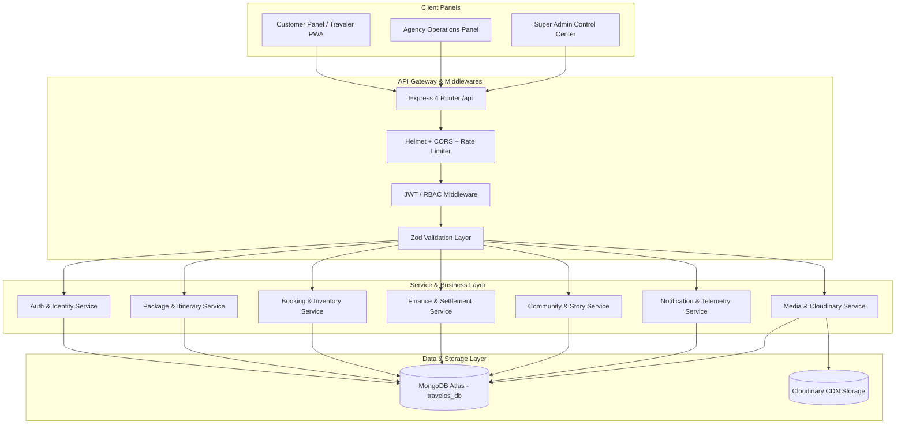

---

## 2. Panel Capabilities & Responsibilities

### A. Customer Panel (Traveler App)
- **Identity & Profiles**: Registration, Google OAuth, KYC verification, Traveler Passport, travel preferences, saved companions.
- **Discovery & Exploration**: Destination discovery, curated packages, agency storefronts, AI trip match, filter engine.
- **Booking & Trips**: Group seat reservation, custom package requests, payment milestones, live trip timeline, digital vouchers.
- **Community & Social**: Travel stories, verified reviews, reputation tiers, community discussions, trip partner connections.

### B. Agency Panel (Operations Center)
- **Onboarding & Verification**: Business profile, GST/PAN compliance, bank account verification, document upload to Cloudinary.
- **Package Creation Engine (Wizard)**: Multi-step builder (General info, itinerary days, accommodations, pricing tiers, inclusions/exclusions, cancellation policy, departure dates).
- **Booking & Passenger Management**: Real-time reservations, passenger manifest, payment status tracking, document validation, emergency contacts.
- **Trip Operations & Live Tracking**: Staff/guide assignment, vehicle allocations, active trip checklists, broadcast notices, incident logs.
- **Finance & Payouts**: Commission tracking, settlement statements, invoice generation, bank payout reconciliation.

### C. Super Admin Panel (Platform Governance)
- **Agency Vetting & Requests**: Verification workflows, KYC approval/rejection, commission rate assignment, compliance audit.
- **Marketplace Governance**: Package curation, featured destination management, CMS hero banners, global announcements, review moderation.
- **Financial Clearinghouse**: Platform fee settlement, refund authorization, transaction ledger, payout execution.
- **Access Control & Audit**: Fine-grained RBAC matrix, admin activity logging, suspicious activity detection, device session termination.

---

## 3. Backend Modular Architecture

The backend follows a strict **Controller-Service-Repository-Model** pattern:

```text
HTTP Request
    │
    ▼
[Routes] (/api/...)
    │
    ▼
[Middlewares] (cors, rateLimiter, authenticate, requireRole, validateRequest)
    │
    ▼
[Controllers] (Extract params/body, invoke service, return ResponseUtil)
    │
    ▼
[Services] (Business logic, multi-document transactions, event dispatch)
    │
    ▼
[Repositories] (Atomic MongoDB queries, aggregation pipelines, projection)
    │
    ▼
[Models] (Mongoose Schemas, indexes, validation, type interfaces)
    │
    ▼
[MongoDB Atlas] (travelos_db)
```

---

## 4. Cross-Panel Synchronization Flows

### Example: Customer Onboarding & Preference Flow

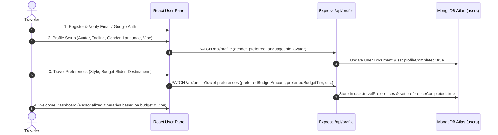

### Example: Customer Profile Live Telemetry Flow

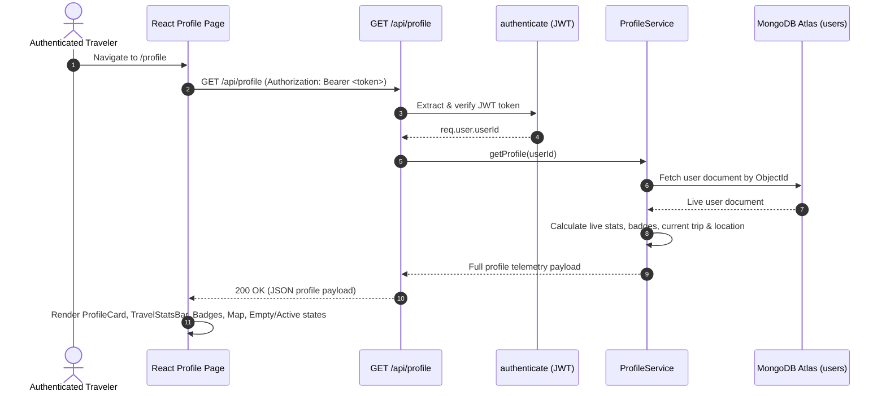

### Example: Booking Lifecycle Synchronization

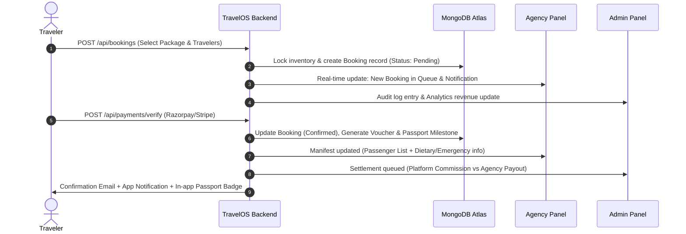

---

## 5. Security & Authentication Framework

1. **Authentication Token Lifecycle**:
   - Short-lived Access Token (JWT, 15m).
   - Long-lived Refresh Token (JWT, 7d), stored hashed (SHA-256) in `refreshtokens` collection with automatic rotation and reuse attack detection.
2. **Server-Side Identity Enforcement**:
   - Customer: `req.user.userId`
   - Agency: `req.agency.agencyId`
   - Admin: `req.admin.adminId`
   - *No ownership IDs are ever accepted directly from frontend request bodies.*
3. **Role-Based Access Control (RBAC)**:
   - Module-level permissions: `READ`, `WRITE`, `UPDATE`, `DELETE`, `APPROVE`, `EXPORT`.
   - Explicit `PermissionGate` components on frontend and `requirePermission()` middleware on backend.

---

## 6. Cloudinary Media Architecture

Every media asset uploaded to Cloudinary follows a strict contract:
- **Folders**: Partitioned by domain (`travelos/customers/profile`, `travelos/agencies/documents`, `travelos/trips/cover`, `travelos/cms/banners`).
- **Metadata Stored in MongoDB**:
  - `url`: Secure HTTPS Cloudinary URL.
  - `publicId`: Cloudinary asset identifier.
  - `folder`: Storage path.
  - `mediaType`: `image` | `video` | `raw` (PDF).
  - `ownerId`: ObjectId of user/agency.
  - `uploadedAt`: ISO timestamp.

---

## 7. Directory Structure

```text
APNA_TRIPV4/
├── MEMORY.md                 # Permanent task history & verified milestones
├── ARCHITECTURE.md           # Master full-stack architecture blueprint
├── RULES.md                  # Permanent development rules & protocols
├── package.json              # Monorepo root configuration
├── backend/
│   ├── .env                  # Environment variables (MongoDB, JWT, Cloudinary)
│   ├── .env.example          # Environment template
│   ├── package.json          # Express TypeScript dependencies
│   ├── tsconfig.json         # TypeScript compiler configuration
│   ├── src/
│   │   ├── app.ts            # Express application factory & middleware stack
│   │   ├── server.ts         # Production startup sequence & shutdown lifecycle
│   │   ├── config/           # Database, env, logger, cloudinary, swagger, cors
│   │   ├── constants/        # HTTP codes, status enums, RBAC constants
│   │   ├── controllers/      # Route controllers for all 23 domain modules
│   │   ├── middlewares/      # Auth, error handling, rate limiting, logging
│   │   ├── models/           # Mongoose schemas & data types
│   │   ├── repositories/     # Data access layer
│   │   ├── routes/           # REST endpoints
│   │   ├── services/         # Business domain logic
│   │   └── utils/            # Async handler, crypto, response, date utils
│   └── scripts/              # Automated diagnostic & test suites
└── frontend/
    ├── package.json          # Vite React TypeScript dependencies
    ├── vite.config.ts        # Vite build & proxy settings
    └── src/
        ├── admin-panel/      # Super Admin pages, widgets, workflows
        ├── agency-panel/     # Agency portal, package wizard, bookings, trips
        ├── components/       # Shared UI components (Mobile-first & Desktop)
        ├── context/          # Auth, Theme, Toast, Permission providers
        ├── data/             # Static reference constants & mock fallbacks
        ├── pages/            # Customer pages (Home, Explore, Trips, Community, Profile)
        ├── services/         # Axios / Fetch API clients
        └── types/            # TypeScript interfaces & domain types
```

---

## 8. Global Theme System Architecture (Light / Dark / System)

Travel OS incorporates a centralized, zero-flicker, production-grade theme system:

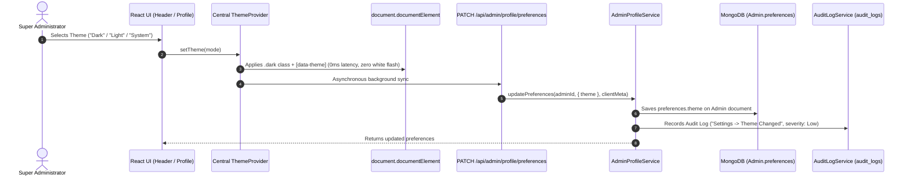

### Key Components:
1. **Frontend Centralized Provider** (`frontend/src/context/ThemeContext.tsx`):
   - Single source of truth managing `'Light' | 'Dark' | 'System'`.
   - Real-time `matchMedia('(prefers-color-scheme: dark)')` listener for dynamic OS theme transitions without page reload or flicker.
   - Synchronizes immediately with DOM `class="dark"` and `data-theme="dark|light"`.
   - Fast cache in `localStorage` prevents initial mount flash before MongoDB profile resolves.
2. **Backend Preference Storage & Normalization**:
   - Stored in existing `Admin.preferences.theme` (`'Light' | 'Dark' | 'System'`).
   - Case-insensitive Zod normalization in `UpdateAdminPreferencesSchema`.
   - Generates immutable audit logs in `audit_logs` collection.
3. **CSS Design Tokens** (`frontend/src/index.css`):
   - Token variables (`--bg-app`, `--bg-card`, `--bg-surface`, `--border-subtle`, `--text-main`, `--text-muted`, `--brand-primary`).
   - Universal component color adaptors preserving 100% of the approved UI layout, typography, padding, and animations.

---

## 9. Super Admin Dashboard Architecture & Real-Time Aggregations

The Super Admin Dashboard is 100% backend-driven and aggregates platform metrics directly from MongoDB Atlas:

```mermaid
graph TD
    subgraph Frontend Dashboard UI
        KPIGrid[8 KPI Summary Cards]
        ChartsGrid[4 Time-Series Charts 7d/30d/90d/1y]
        ActivityList[Recent Activities Feed]
        TxList[Latest Transactions List]
        ApprovalsQueue[Pending Approvals Queue]
        HealthProbe[System Health Telemetry Probe]
        LiveCenter[Live Activity Center & Real Stream]
    end

    subgraph REST API Endpoints /api/admin/dashboard
        E1["/stats -> getStats()"]
        E2["/charts -> getCharts(range)"]
        E3["/recent-activities -> getRecentActivities()"]
        E4["/latest-transactions -> getLatestTransactions()"]
        E5["/pending-approvals -> getPendingApprovals()"]
        E6["/system-health -> getSystemHealth()"]
        E7["/live -> getLiveActivity()"]
        E8["/active-trips -> getActiveTrips()"]
        E9["/payment-queue -> getPaymentQueue()"]
        E10["/support-queue -> getSupportQueue()"]
    end

    subgraph MongoDB Atlas Collections
        C1[(payments)]
        C2[(bookings)]
        C3[(agencies)]
        C4[(users)]
        C5[(packages)]
        C6[(support_tickets)]
        C7[(audit_logs)]
        C8[(adminsessions)]
    end

    KPIGrid --> E1
    ChartsGrid --> E2
    ActivityList --> E3
    TxList --> E4
    ApprovalsQueue --> E5
    HealthProbe --> E6
    LiveCenter --> E7
    LiveCenter --> E8
    LiveCenter --> E9
    LiveCenter --> E10

    E1 --> C1 & C2 & C3 & C4 & C5 & C6
    E2 --> C1 & C2 & C3 & C4
    E3 --> C7
    E4 --> C1
    E5 --> C3 & C5
    E7 --> C7 & C8 & C2 & C3 & C1 & C6
    E8 --> C2
    E9 --> C1
    E10 --> C6
```

### Aggregation & Metric Mapping:
- **Platform Revenue & GMV**: Real `$match` + `$group` aggregation on `payments` and `bookings` collections with 30-day comparative growth percentage calculations.
- **Time-Series Charts**: Grouped by `$dateToString: { format: '%b %d', date: '$createdAt' }` across selectable ranges (`7d`, `30d`, `90d`, `1y`).
- **Recent Activities**: Sourced from `audit_logs` collection with dynamic event badge formatting and relative timestamps.
- **Latest Transactions**: Sourced from `payments` collection.
- **Pending Approvals**: Unified queue of pending KYC registrations (`agencies`) and pending catalog packages (`packages`).
- **System Health Telemetry**: Live probes checking MongoDB connection state (`mongoose.connection.readyState`), API latency, SMTP mailer status, and Cloudinary media storage.
- **Live Activity Center**: Continuous real-time stream reading authentic audit events from `audit_logs` with auto-polling toggle and instant manual refresh.

### Security & Authentication:
- All endpoints protected by `authenticateAdmin` middleware.
- Session validation against `AdminSession` collection.

---

## 10. Super Admin Agency Requests & KYC Verification Pipeline

The Agency Requests module (`/admin/verification-pending`, `/super-admin/agency-requests`) is 100% backend-driven, operating directly on the single unified `agencies` collection (`AgencyModel`) and the immutable `audit_logs` collection (`AuditLogModel`).

### Architecture Data Flow

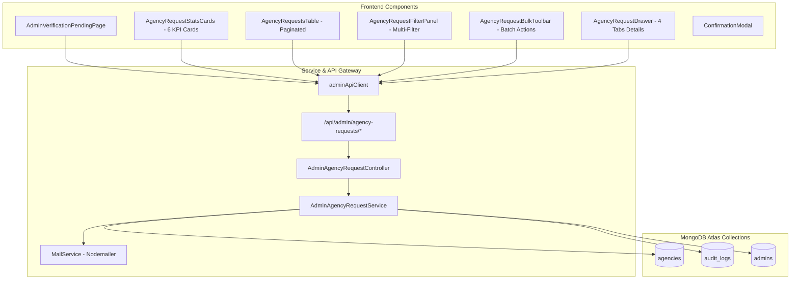

### Endpoints Implemented

| Method | Route | Description |
| :--- | :--- | :--- |
| `GET` | `/api/admin/agency-requests/stats` | Dynamic calculation of 6 KPI cards (Pending, Approved Today, Rejected Today, Under Review, Missing Docs, Avg Approval Time) with 30-day percentage comparison. |
| `GET` | `/api/admin/agency-requests` | Paginated, filtered, and regex-searched query returning agencies from MongoDB. |
| `GET` | `/api/admin/agency-requests/export` | Generates formatted CSV file stream directly from MongoDB. |
| `GET` | `/api/admin/agency-requests/:id` | Full agency profile retrieval including uploaded documents, KYC checklist, timeline, review notes, and live activity from `audit_logs`. |
| `POST` | `/api/admin/agency-requests/:id/notes` | Appends internal compliance review notes and records audit log. |
| `PUT` | `/api/admin/agency-requests/:id/approve` | Transitions agency status to `ACTIVE` / `APPROVED`, appends timeline event, records audit log, and dispatches approval transactional email. |
| `PUT` | `/api/admin/agency-requests/:id/reject` | Transitions agency status to `REJECTED`, records rejection reason, appends timeline event, records audit log, and dispatches rejection email. |
| `PUT` | `/api/admin/agency-requests/:id/request-docs` | Transitions verification status to `MISSING_DOCS`, stores requested document types, records audit log, and dispatches notification email. |
| `POST` | `/api/admin/agency-requests/bulk-action` | Batch processing for bulk approve, reject, or request documents across multiple agency IDs. |

### Security & Business Rules:
- **Zero Mock / Zero Duplicate Rule**: All data reads and writes target the single `agencies` collection (`AgencyModel`).
- **Audit Logging**: Every administrative action (Approve, Reject, Request Docs, Add Note, Bulk Actions, CSV Export) creates an immutable record in `audit_logs`.
- **Transactional Communication**: Real transactional emails dispatched via `MailService` using SMTP.

---

## 11. Panel-Scoped Theme Architecture & Isolation Boundaries

To guarantee complete independence across customer, agency, and super-admin portals, theme contexts are scoped per portal root rather than globally on `document.documentElement` or `<body>`.

### Hierarchy & Boundaries

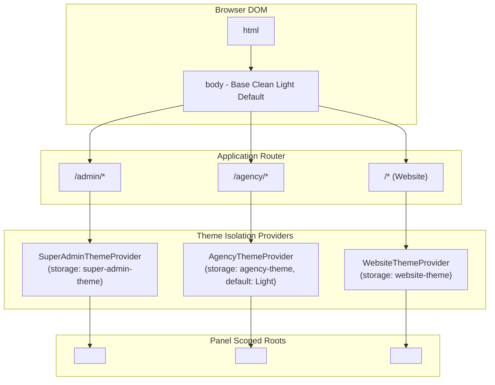

### Storage Keys & Scope Mapping:

| Portal Panel | Routes | Theme Provider | Storage Key | Scoped Container |
| :--- | :--- | :--- | :--- | :--- |
| **Super Admin Panel** | `/admin/*`, `/super-admin/*` | `SuperAdminThemeProvider` | `super-admin-theme` | `<div id="super-admin-root" className="super-admin-root ...">` |
| **Agency Panel & Onboarding** | `/agency/*` | `AgencyThemeProvider` | `agency-theme` | `<div id="agency-root" className="agency-root ...">` |
| **Customer Website & User Portal** | `/*`, `/home`, `/explore`, etc. | `WebsiteThemeProvider` | `website-theme` | `<div id="website-root" className="website-root ...">` |

### CSS Scoping Rule:
- Dark mode CSS selectors are strictly namespaced under `.super-admin-root.dark` or `.website-root.dark`.
- Neither `<html>` nor `<body>` ever receives global `.dark` classes, preventing cross-panel bleeding.

---

## 12. Production Agency Registration & Onboarding Pipeline

The Agency Onboarding & Registration pipeline is 100% backend-driven and uses the `agencies` collection (`AgencyModel`) as the single source of truth across prospective registration, compliance review, and active agency operation.

### End-to-End Registration Flow

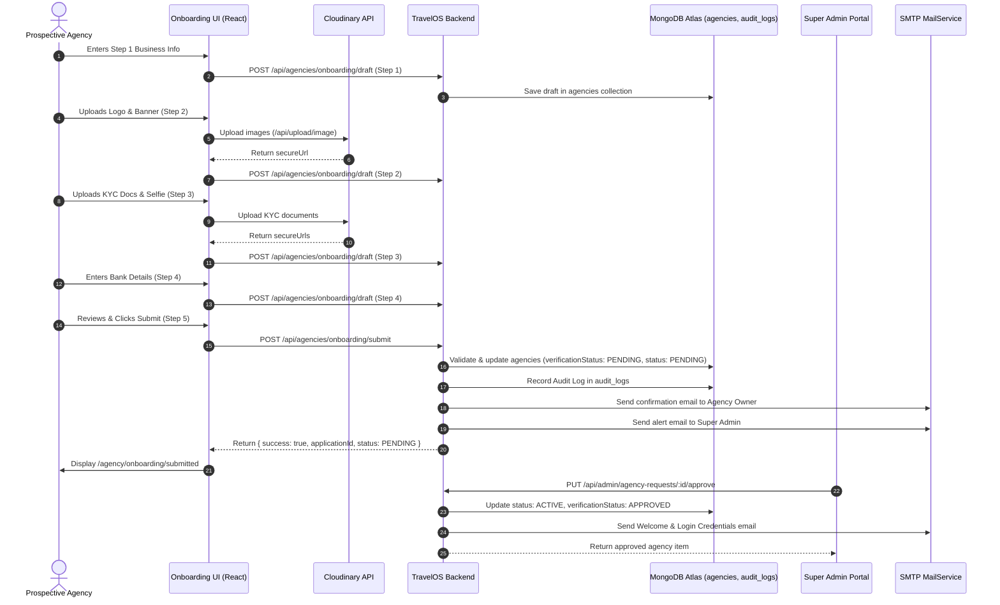

### Onboarding Endpoints Implemented

| Method | Endpoint | Description |
| :--- | :--- | :--- |
| `POST` | `/api/agencies/onboarding/draft` | Auto-saves or updates multi-step registration draft state in MongoDB. |
| `GET` | `/api/agencies/onboarding/draft/:idOrEmail` | Retrieves saved draft data for application resumption. |
| `POST` | `/api/agencies/onboarding/submit` | Finalizes application, validates fields, logs audit trail, dispatches emails. |
| `GET` | `/api/agencies/onboarding/status/:idOrEmail` | Returns real-time application tracker status and timeline. |
| `GET` | `/api/agencies/onboarding/requested-documents/:idOrEmail` | Fetches specific documents requested for re-upload with reasons and locked verified items. |
| `POST` | `/api/agencies/onboarding/reupload-documents` | Re-uploads requested documents with strict whitelist validation, sets status to `Re-upload Submitted`, and transitions agency back to review. |

---

## 14. Super Admin Approved Agencies Directory Architecture & Lifecycle

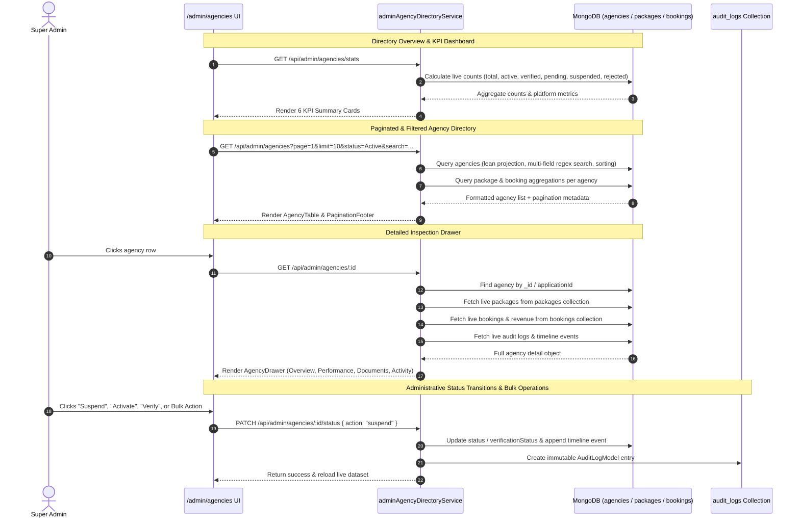

### Approved Agencies Directory Endpoints:


## 15. Agency Messages & Live Real-Time Customer Inbox Architecture

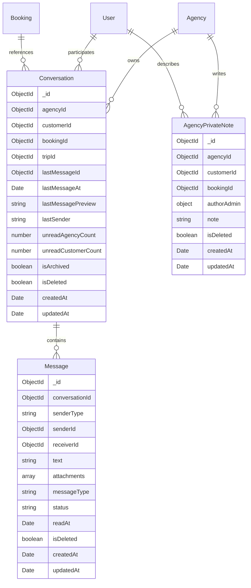

### Real-Time Socket.IO Architecture & Flow

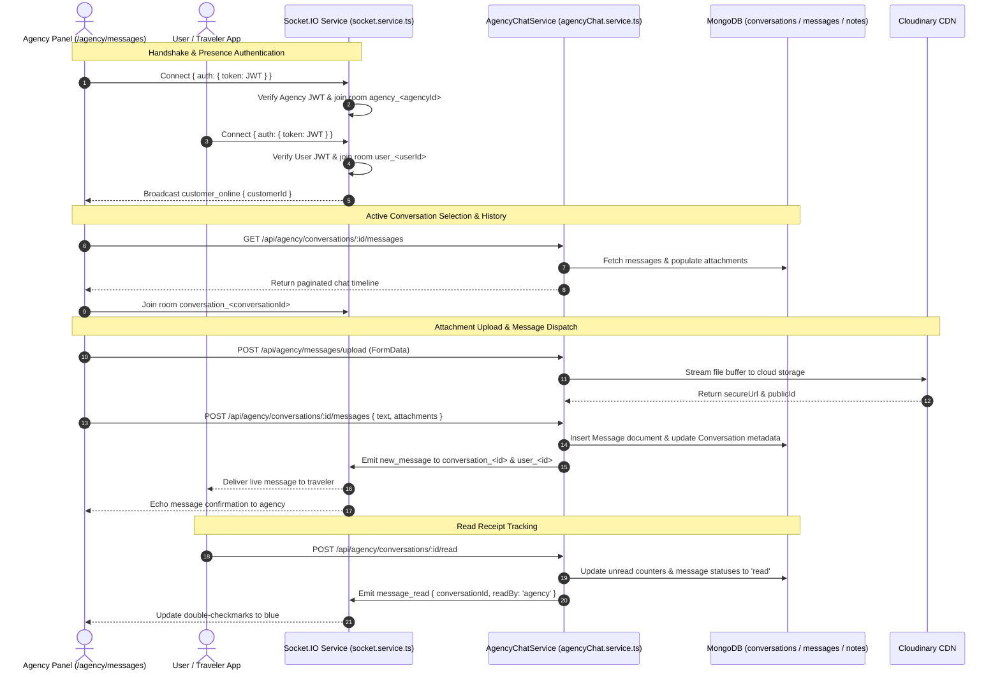

### Agency Messages REST Endpoints:

| Method | Endpoint | Description |
| :--- | :--- | :--- |
| `GET` | `/api/agency/conversations` | Fetches filtered, paginated conversations for authenticated agency with search and unread aggregates. |
| `GET` | `/api/agency/conversations/:id` | Detailed conversation object with populated customer profile, booking overview, travel companions, and private notes. |
| `GET` | `/api/agency/conversations/:id/messages` | Paginated message timeline sorted chronologically (oldest first). |
| `POST` | `/api/agency/conversations/:id/messages` | Sends a new text or rich attachment message to traveler with Socket.IO notification. |
| `POST` | `/api/agency/conversations/:id/read` | Marks all incoming customer messages in the thread as read. |
| `POST` | `/api/agency/customers/:id/private-notes` | Creates an agency staff-only private note attached to customer and booking. |
| `PUT` | `/api/agency/customers/:id/private-notes/:noteId` | Updates an existing staff private note. |
| `DELETE` | `/api/agency/customers/:id/private-notes/:noteId` | Soft deletes an agency staff private note. |
| `POST` | `/api/agency/messages/upload` | Uploads chat attachments (PDFs, images, documents) directly to Cloudinary. |

---

## 16. Super Admin Traveler User Management System Architecture (`/admin/users`)

The Super Admin User Management module (`/admin/users`) is a production-grade, 100% backend-driven system backed directly by MongoDB collections (`users`, `bookings`, `payments`, `audit_logs`, `passwordresets`):

```mermaid
graph TD
    subgraph Client Admin UI (/admin/users)
        Header[AdminUserHeader - Quick Search & Export CSV]
        KPIs[UserKPISection - 6 Live Stat Cards]
        Filters[UserFilterPanel - 7 Filter Selectors]
        BulkBar[UserBulkActionBar - Batch Actions Toolbar]
        Table[UsersTable & UserTableRow - 13 Data Columns]
        Pagination[UserPagination - Server-side Navigation]
        Drawer[UserDetailsDrawer - 5 Tabs Live Inspector]
        Modals[AddUser / EditUser / Confirm / Notification Modals]
    end

    subgraph Service & Gateway Layer
        ApiClient[adminApiClient]
        Routes["/api/admin/users/*"]
        Controller[AdminUserManagementController]
        Service[AdminUserManagementService]
    end

    subgraph Database Layer (MongoDB)
        Users[(users)]
        Bookings[(bookings)]
        Payments[(payments)]
        AuditLogs[(audit_logs)]
        PasswordResets[(passwordresets)]
    end

    Header & KPIs & Filters & BulkBar & Table & Pagination & Drawer & Modals --> ApiClient
    ApiClient --> Routes --> Controller --> Service
    Service --> Users & Bookings & Payments & AuditLogs & PasswordResets
```

### Endpoints Implemented

| Method | Endpoint | Description |
| :--- | :--- | :--- |
| `GET` | `/api/admin/users/stats` | Live computed KPI telemetry (Total Users, Active, New Today, Premium, Suspended, Verified) directly from MongoDB. |
| `GET` | `/api/admin/users` | Server-side paginated & filtered list with multi-field search and real-time booking/spend aggregations. |
| `GET` | `/api/admin/users/export` | Direct database query streaming complete filtered datasets to CSV. |
| `GET` | `/api/admin/users/:id` | Full user profile with populated live bookings, generated trips, payment invoices, and audit log events. |
| `POST` | `/api/admin/users` | Creates new traveler user in `UserModel` and creates an audit log record. |
| `PATCH` | `/api/admin/users/:id` | Updates user profile, membership tier, or status with audit logging. |
| `DELETE` | `/api/admin/users/:id` | Soft deletes user account (`isDeleted: true`, `deletedAt`, `deletedBy`) without dropping records. |
| `POST` | `/api/admin/users/bulk-action` | Batch operations for verify, suspend, activate, and soft delete. |
| `POST` | `/api/admin/users/:id/reset-password` | Generates secure cryptographic reset token in `PasswordResetModel`. |
| `POST` | `/api/admin/users/:id/notifications` | Dispatches traveler notifications with audit trail. |

### Architectural Highlights:
1. **Single Source of Truth**: Reuses existing `UserModel`, `BookingModel`, `PaymentModel`, and `AuditLogModel` schemas. Zero duplicate databases or standalone counters.
2. **Aggregated Booking Metrics**: Live MongoDB aggregation queries calculate `totalSpend`, `tripsCompleted`, `totalBookings`, and `cancellationRate` for every user without N+1 query overhead.
3. **5-Tab Details Drawer**: Slide-over inspector dynamically loads authentic **Overview**, **Bookings**, **Trips**, **Payments**, and **Activity Log** data without fake static arrays.
4. **Audit Logging & Security**: All administrative updates are logged into `audit_logs` with admin actor ID, timestamp, IP address, and change details. Endpoints are strictly guarded by `authenticateAdmin`.

---

## 17. Agency Partner Portal Production Backend Architecture (`/agency/*`)

The ApnaTrip Agency Partner Portal (`/agency/*`) operates as a multi-tenant operational console backed by dedicated MongoDB models (`AgencyModel`, `PackageModel`, `BookingModel`, `TripModel`, `NotificationModel`, `ReviewModel`, `PaymentModel`, `AuditLogModel`). All queries and mutations are isolated by `agencyId: req.agency._id`.

```mermaid
graph TD
    subgraph Agency Client Panel (/agency/*)
        DASH[Agency Dashboard & KPIs]
        PKG[Packages Management & Wizard]
        BKG[Bookings & Grouped Departures]
        OPS[Operational Trips & Dispatch]
        CRM[Customer CRM & Dossiers]
        REV[Reviews & Reputation]
        FIN[Financial Command & Payouts]
        NOTIF[Omnichannel Notifications]
    end

    subgraph Agency Gateway Layer
        AGY_AUTH[authenticateAgency JWT Middleware]
        AGY_ROUTER["/api/agency/* Router"]
    end

    subgraph Controllers & Services
        PC[AgencyPackageService]
        BC[AgencyBookingService]
        TC[AgencyTripService]
        CC[AgencyCustomerService]
        RC[AgencyReviewService]
        FC[AgencyFinanceService]
        AC[AgencyAnalyticsService]
        NC[AgencyNotificationService]
    end

    subgraph Database Layer (MongoDB Atlas)
        M_AGY[(agencies)]
        M_PKG[(packages)]
        M_BKG[(bookings)]
        M_TRIP[(trips)]
        M_NOTIF[(notifications)]
        M_REV[(reviews)]
        M_PAY[(payments)]
        M_AUD[(audit_logs)]
    end

    DASH & PKG & BKG & OPS & CRM & REV & FIN & NOTIF --> AGY_AUTH --> AGY_ROUTER
    AGY_ROUTER --> PC & BC & TC & CC & RC & FC & AC & NC
    PC & BC & TC & CC & RC & FC & AC & NC --> M_AGY & M_PKG & M_BKG & M_TRIP & M_NOTIF & M_REV & M_PAY & M_AUD
```

### Complete Agency Portal Endpoint Matrix

| Module | Method | Endpoint | Description |
| :--- | :--- | :--- | :--- |
| **Auth** | `POST` | `/api/agencies/auth/login` | Agency email & password authentication, issuing scoped Agency JWT. |
| **Auth** | `GET` | `/api/agencies/auth/me` | Fetches authenticated agency details and session. |
| **Auth** | `POST` | `/api/agencies/auth/change-password` | First login & routine password updates. |
| **Dashboard** | `GET` | `/api/agencies/dashboard` | Aggregated 4 KPI cards, time-series charts, occupancy, top packages, insights. |
| **Dashboard** | `GET` | `/api/agencies/dashboard/recent-bookings` | 5 most recent agency bookings with live statuses. |
| **Dashboard** | `GET` | `/api/agencies/dashboard/upcoming-departures` | 5 nearest upcoming trip departures with guide/driver indicators. |
| **Packages** | `GET` | `/api/agencies/packages/stats` | Category counts, active/draft/archived breakdown, total capacity. |
| **Packages** | `GET` | `/api/agencies/packages` | Filterable, searchable, paginated agency package catalog. |
| **Packages** | `POST` | `/api/agencies/packages` | Creates new travel package and writes audit log. |
| **Packages** | `GET` | `/api/agencies/packages/:id` | Full package details with itineraries, tiers, inclusions, exclusions. |
| **Packages** | `PATCH` | `/api/agencies/packages/:id` | Updates package fields with audit logging. |
| **Packages** | `PATCH` | `/api/agencies/packages/:id/status` | Toggles package status (`Active`, `Draft`, `Archived`). |
| **Packages** | `POST` | `/api/agencies/packages/:id/duplicate` | Deep clones existing package into a draft copy. |
| **Packages** | `DELETE` | `/api/agencies/packages/:id` | Soft deletes package (`isDeleted: true`). |
| **Bookings** | `GET` | `/api/agencies/bookings/stats` | Confirmed, pending, cancelled, trip-ready metrics. |
| **Bookings** | `GET` | `/api/agencies/bookings` | Grouped departures inventory and individual booking listings. |
| **Bookings** | `GET` | `/api/agencies/bookings/:id` | Deep passenger manifest with companions and payment verification. |
| **Bookings** | `PATCH` | `/api/agencies/bookings/:id/confirm` | Confirms pending booking and updates inventory. |
| **Bookings** | `PATCH` | `/api/agencies/bookings/:id/cancel` | Processes booking cancellation and releases inventory. |
| **Trips** | `GET` | `/api/agencies/trips` | Operational trips list with status filters (`Upcoming`, `Ongoing`, `Completed`). |
| **Trips** | `GET` | `/api/agencies/trips/:id` | Full operational trip dossier (team, vehicle, hotel, emergency, checklist). |
| **Trips** | `PATCH` | `/api/agencies/trips/:id/team` | Assigns tour guides, drivers, and field staff. |
| **Trips** | `PATCH` | `/api/agencies/trips/:id/vehicle` | Updates vehicle type, plate number, and dispatch logs. |
| **Trips** | `PATCH` | `/api/agencies/trips/:id/hotel` | Updates hotel/resort allocations and check-in times. |
| **Trips** | `PATCH` | `/api/agencies/trips/:id/emergency` | Updates emergency protocol contacts and nearest medical stations. |
| **Trips** | `PATCH` | `/api/agencies/trips/:id/status` | Updates trip status (`Upcoming`, `Ongoing`, `Completed`, `Delayed`, `Cancelled`). |
| **Trips** | `PATCH` | `/api/agencies/trips/:id/travelers/:travelerId/attendance` | Marks traveler attendance (`Present`, `Absent`, `Late`). |
| **Trips** | `POST` | `/api/agencies/trips/:id/travelers/check-in-all` | 1-click batch check-in for all trip passengers. |
| **Trips** | `POST` | `/api/agencies/trips/:id/announcements` | Dispatches traveler trip broadcast alerts. |
| **Trips** | `POST` | `/api/agencies/trips/:id/incidents` | Logs operational field incidents. |
| **Trips** | `PATCH` | `/api/agencies/trips/:id/incidents/:incidentId/toggle` | Toggles incident resolved/unresolved status. |
| **Trips** | `POST` | `/api/agencies/trips/:id/notes` | Appends dispatch/operations staff notes. |
| **Trips** | `POST` | `/api/agencies/trips/:id/photos` | Uploads trip photos and media records. |
| **Trips** | `PATCH` | `/api/agencies/trips/:id/days/:dayNumber/status` | Marks itinerary day status (`Pending`, `In Progress`, `Completed`). |
| **Customers** | `GET` | `/api/agencies/customers` | Traveler CRM directory with booking counts and lifetime spend. |
| **Customers** | `GET` | `/api/agencies/customers/stats` | Total unique travelers, repeat booking rate, average lifetime value. |
| **Customers** | `GET` | `/api/agencies/customers/:id` | Traveler profile dossier with full trip history, companions, notes. |
| **Customers** | `POST` | `/api/agencies/customers/:id/notes` | Creates staff private customer note. |
| **Customers** | `PUT` | `/api/agencies/customers/:id/notes/:noteId` | Updates staff private note. |
| **Customers** | `DELETE` | `/api/agencies/customers/:id/notes/:noteId` | Deletes staff private note. |
| **Reviews** | `GET` | `/api/agencies/reviews` | Verified agency customer reviews with rating filters. |
| **Reviews** | `GET` | `/api/agencies/reviews/stats` | Average rating, rating distribution (5-star to 1-star), verified review percentage. |
| **Reviews** | `POST` | `/api/agencies/reviews/:id/reply` | Publishes official agency reply to customer review. |
| **Reviews** | `PATCH` | `/api/agencies/reviews/:id/flag` | Flags review for Super Admin moderation. |
| **Finance** | `GET` | `/api/agencies/finance` | Financial command center summary (6 KPI cards, breakdown, settlements). |
| **Finance** | `GET` | `/api/agencies/finance/transactions` | Full ledger with status/date filters and pagination. |
| **Finance** | `GET` | `/api/agencies/finance/transactions/:id` | Single transaction invoice & breakdown detail. |
| **Finance** | `POST` | `/api/agencies/finance/request-payout` | Submits bank withdrawal/settlement payout request. |
| **Analytics** | `GET` | `/api/agencies/analytics` | Business intelligence analytics (revenue trends, bookings, top packages, occupancy). |
| **Notifications** | `GET` | `/api/agencies/notifications` | Activity inbox with category filters and unread counts. |
| **Notifications** | `PATCH` | `/api/agencies/notifications/:id/read` | Toggles single notification read/unread state. |
| **Notifications** | `POST` | `/api/agencies/notifications/read-all` | Marks all unread notifications as read. |
| **Notifications** | `POST` | `/api/agencies/notifications/clear-read` | Deletes all read notifications. |
| **Notifications** | `DELETE` | `/api/agencies/notifications/:id` | Deletes single notification. |
| **Notifications** | `PATCH` | `/api/agencies/notifications/:id/archive` | Archives notification. |

---

## 11. Customer / Traveler Panel Production Architecture

The Customer Panel is a high-performance, real-time Progressive Web Application (PWA) allowing travelers to discover tour packages, inspect agency credentials, book departures, verify Razorpay transactions, track live operations and guides, access travel vouchers, chat in real time, and share community travel stories.

```mermaid
graph TD
    subgraph Traveler Client
        Home[Home / Landing]
        Explore[Explore & Search]
        PkgDetail[Package Details]
        Checkout[Checkout & Razorpay]
        Trips[My Trips & Documents]
        Chat[Chat & Support Desk]
        Feed[Community & Reviews]
    end

    subgraph Backend Gateways
        PackRoute[/api/packages]
        SearchRoute[/api/search]
        BookRoute[/api/bookings]
        TripRoute[/api/trips]
        NotifRoute[/api/notifications]
        ChatRoute[/api/chat]
        CommRoute[/api/community]
        RevRoute[/api/reviews]
    end

    subgraph Real-Time Socket Layer
        SocketEngine[Socket.IO Server]
        UserRoom[user_{userId} Room]
        AgencyRoom[agency_{agencyId} Room]
    end

    subgraph Database Layer
        MongoPackages[(packages)]
        MongoAgencies[(agencies)]
        MongoBookings[(bookings)]
        MongoTrips[(trips)]
        MongoNotifs[(notifications)]
        MongoConvs[(conversations & messages)]
        MongoPosts[(community_posts)]
        MongoReviews[(reviews)]
    end

    Home --> PackRoute
    Explore --> SearchRoute
    PkgDetail --> PackRoute
    Checkout --> BookRoute
    Trips --> TripRoute
    Chat --> ChatRoute
    Feed --> CommRoute
    Feed --> RevRoute

    BookRoute --> MongoBookings
    BookRoute --> SocketEngine
    TripRoute --> MongoTrips
    ChatRoute --> MongoConvs
    ChatRoute --> SocketEngine
    NotifRoute --> MongoNotifs
    NotifRoute --> SocketEngine

    SocketEngine --> UserRoom
    SocketEngine --> AgencyRoom
```

### Customer Panel RESTful Endpoints Directory

| Domain | Method | Endpoint | Description |
| :--- | :--- | :--- | :--- |
| **Packages** | `GET` | `/api/packages` | Public catalog with filters (`budget`, `duration`, `difficulty`, `rating`). |
| **Packages** | `GET` | `/api/packages/featured` | Curated top packages for homepage carousel. |
| **Packages** | `GET` | `/api/packages/trending` | Trending packages based on bookings volume. |
| **Packages** | `GET` | `/api/packages/:id` | Single package itinerary, inclusions, agency, and pricing. |
| **Packages** | `GET` | `/api/packages/:id/similar` | Machine-recommended similar packages in same region/category. |
| **Agencies** | `GET` | `/api/agencies` | Public directory of verified travel agencies and ratings. |
| **Agencies** | `GET` | `/api/agencies/:id` | Single agency public profile with packages and reviews. |
| **Search** | `GET` | `/api/search` | Multi-entity global search across packages, destinations, and agencies. |
| **Bookings** | `POST` | `/api/bookings/checkout` | Initiates checkout, computes pricing breakdown, creates Razorpay order. |
| **Bookings** | `POST` | `/api/bookings/verify-payment` | Cryptographically verifies Razorpay signature and confirms booking. |
| **Bookings** | `GET` | `/api/bookings/my` | Authenticated customer booking history. |
| **Bookings** | `GET` | `/api/bookings/:id` | Single booking status, transaction receipt, and departure details. |
| **Travelers** | `GET` | `/api/travelers` | Saved companions for 1-click checkout autofill. |
| **Travelers** | `POST` | `/api/travelers` | Saves new companion record to customer profile. |
| **Trips** | `GET` | `/api/trips/my` | Real-time trips, countdowns, guide/driver roster, and travel stats. |
| **Trips** | `GET` | `/api/trips/stats` | Lifetime travel statistics, badges, spend, and countries visited. |
| **Trips** | `GET` | `/api/trips/:id` | Single trip live operations dossier, vehicle, hotel, and itinerary days. |
| **Trips** | `GET` | `/api/trips/:id/documents` | Official travel documents (Booking slip, Tax invoice, Hotel voucher, Insurance). |
| **Notifications**| `GET` | `/api/notifications/my` | Customer activity inbox. |
| **Notifications**| `GET` | `/api/notifications/unread-count` | Real-time badge counter for header bell icon. |
| **Notifications**| `PATCH`| `/api/notifications/:id/read` | Marks single notification as read. |
| **Notifications**| `PATCH`| `/api/notifications/read-all` | Marks all notifications as read. |
| **Chat** | `GET` | `/api/chat/conversations` | Customer chat inbox with agencies and concierge support desk. |
| **Chat** | `GET` | `/api/chat/conversations/:id` | Conversation message history and unread zeroing. |
| **Chat** | `POST` | `/api/chat/conversations/:id/messages` | Transmits customer message and dispatches WebSocket event. |
| **Community** | `GET` | `/api/community/posts` | Public community travel feed (stories, tips, photos). |
| **Community** | `POST` | `/api/community/posts` | Authenticated post publishing. |
| **Community** | `POST` | `/api/community/posts/:id/like` | Increments post like counter. |
| **Reviews** | `GET` | `/api/reviews` | Public verified customer reviews by package or agency. |
| **Reviews** | `POST` | `/api/reviews` | Submits verified customer rating & review with agency alert dispatch. |


