# Travel OS — Master Full-Stack Architecture Blueprint

This document defines the complete end-to-end system architecture, cross-panel synchronization flows, data layers, authentication mechanisms, and module relationships for **Travel OS**.

---

## 1. System Overview & Core Panels

Travel OS is a multi-sided marketplace and operating system for travel agencies, travelers, and platform operators. It is composed of three interconnected panels powered by a unified TypeScript backend:

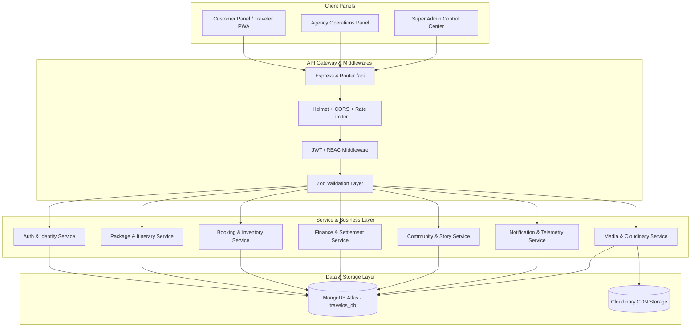
```mermaid
graph TD
    subgraph Client Panels
        CP[Customer Panel / Traveler PWA]
        AP[Agency Operations Panel]
        SA[Super Admin Control Center]
    end

    subgraph API Gateway & Middlewares
        RT[Express 4 Router /api]
        SEC[Helmet + CORS + Rate Limiter]
        AUTH[JWT / RBAC Middleware]
        VAL[Zod Validation Layer]
    end

    subgraph Service & Business Layer
        ASVC[Auth & Identity Service]
        PSVC[Package & Itinerary Service]
        BSVC[Booking & Inventory Service]
        FSVC[Finance & Settlement Service]
        CSVC[Community & Story Service]
        MSVC[Media & Cloudinary Service]
        NSVC[Notification & Telemetry Service]
    end

    subgraph Data & Storage Layer
        MDB[(MongoDB Atlas - travelos_db)]
        CLD[(Cloudinary CDN Storage)]
    end

    CP --> RT
    AP --> RT
    SA --> RT

    RT --> SEC --> AUTH --> VAL
    VAL --> ASVC
    VAL --> PSVC
    VAL --> BSVC
    VAL --> FSVC
    VAL --> CSVC
    VAL --> MSVC
    VAL --> NSVC

    ASVC --> MDB
    PSVC --> MDB
    BSVC --> MDB
    FSVC --> MDB
    CSVC --> MDB
    NSVC --> MDB
    MSVC --> CLD
    MSVC --> MDB
```

---

## 2. Panel Capabilities & Responsibilities

### A. Customer Panel (Traveler App)
- **Identity & Profiles**: Registration, Google OAuth, KYC verification, Traveler Passport, travel preferences, saved companions.
- **Discovery & Exploration**: Destination discovery, curated packages, agency storefronts, AI trip match, filter engine.
- **Booking & Trips**: Group seat reservation, custom package requests, payment milestones, live trip timeline, digital vouchers.
- **Community & Social**: Travel stories, verified reviews, reputation tiers, community discussions, trip partner connections.

### B. Agency Panel (Operations Center)
- **Onboarding & Verification**: Business profile, GST/PAN compliance, bank account verification, document upload to Cloudinary.
- **Package Creation Engine (Wizard)**: Multi-step builder (General info, itinerary days, accommodations, pricing tiers, inclusions/exclusions, cancellation policy, departure dates).
- **Booking & Passenger Management**: Real-time reservations, passenger manifest, payment status tracking, document validation, emergency contacts.
- **Trip Operations & Live Tracking**: Staff/guide assignment, vehicle allocations, active trip checklists, broadcast notices, incident logs.
- **Finance & Payouts**: Commission tracking, settlement statements, invoice generation, bank payout reconciliation.

### C. Super Admin Panel (Platform Governance)
- **Agency Vetting & Requests**: Verification workflows, KYC approval/rejection, commission rate assignment, compliance audit.
- **Marketplace Governance**: Package curation, featured destination management, CMS hero banners, global announcements, review moderation.
- **Financial Clearinghouse**: Platform fee settlement, refund authorization, transaction ledger, payout execution.
- **Access Control & Audit**: Fine-grained RBAC matrix, admin activity logging, suspicious activity detection, device session termination.

---

## 3. Backend Modular Architecture

The backend follows a strict **Controller-Service-Repository-Model** pattern:

```text
HTTP Request
    │
    ▼
[Routes] (/api/...)
    │
    ▼
[Middlewares] (cors, rateLimiter, authenticate, requireRole, validateRequest)
    │
    ▼
[Controllers] (Extract params/body, invoke service, return ResponseUtil)
    │
    ▼
[Services] (Business logic, multi-document transactions, event dispatch)
    │
    ▼
[Repositories] (Atomic MongoDB queries, aggregation pipelines, projection)
    │
    ▼
[Models] (Mongoose Schemas, indexes, validation, type interfaces)
    │
    ▼
[MongoDB Atlas] (travelos_db)
```

---

## 4. Cross-Panel Synchronization Flows

### Example: Customer Onboarding & Preference Flow

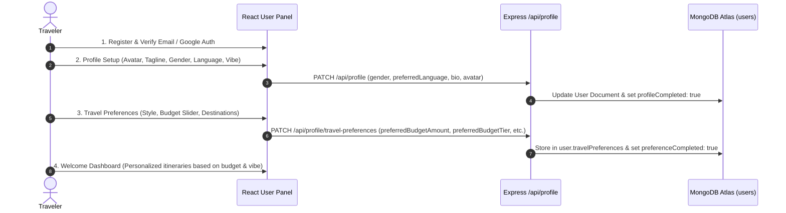
```mermaid
sequenceDiagram
    autonumber
    actor Customer as Traveler
    participant App as React User Panel
    participant API as Express /api/profile
    participant DB as MongoDB Atlas (users)

    Customer->>App: 1. Register & Verify Email / Google Auth
    Customer->>App: 2. Profile Setup (Avatar, Tagline, Gender, Language, Vibe)
    App->>API: PATCH /api/profile (gender, preferredLanguage, bio, avatar)
    API->>DB: Update User Document & set profileCompleted: true
    Customer->>App: 3. Travel Preferences (Style, Budget Slider, Destinations)
    App->>API: PATCH /api/profile/travel-preferences (preferredBudgetAmount, preferredBudgetTier, etc.)
    API->>DB: Store in user.travelPreferences & set preferenceCompleted: true
    Customer->>App: 4. Welcome Dashboard (Personalized itineraries based on budget & vibe)
```

### Example: Customer Profile Live Telemetry Flow

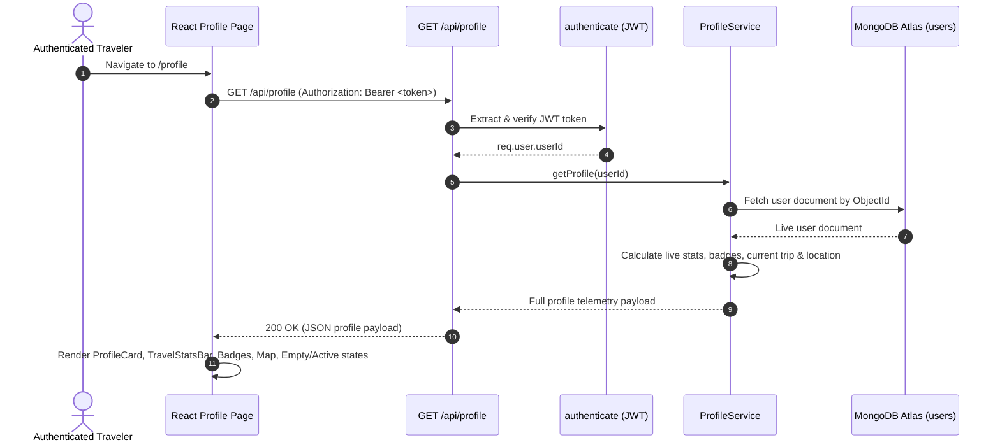
```mermaid
sequenceDiagram
    autonumber
    actor Customer as Authenticated Traveler
    participant App as React Profile Page
    participant API as GET /api/profile
    participant Middleware as authenticate (JWT)
    participant Service as ProfileService
    participant DB as MongoDB Atlas (users)

    Customer->>App: Navigate to /profile
    App->>API: GET /api/profile (Authorization: Bearer <token>)
    API->>Middleware: Extract & verify JWT token
    Middleware-->>API: req.user.userId
    API->>Service: getProfile(userId)
    Service->>DB: Fetch user document by ObjectId
    DB-->>Service: Live user document
    Service->>Service: Calculate live stats, badges, current trip & location
    Service-->>API: Full profile telemetry payload
    API-->>App: 200 OK (JSON profile payload)
    App->>App: Render ProfileCard, TravelStatsBar, Badges, Map, Empty/Active states
```

### Example: Booking Lifecycle Synchronization

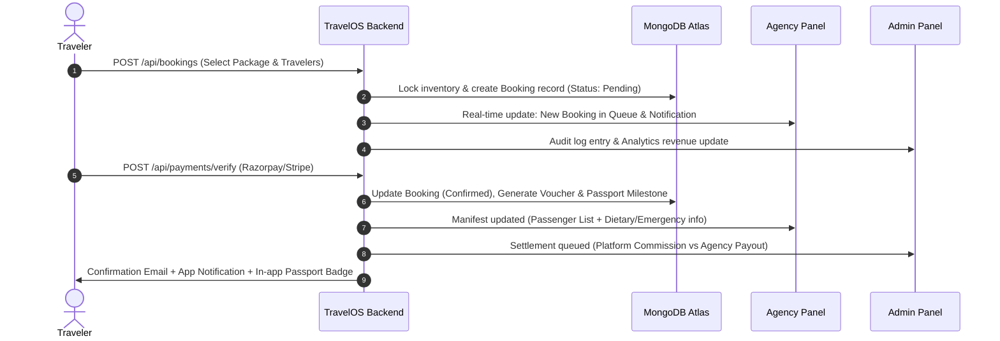
```mermaid
sequenceDiagram
    autonumber
    actor Customer as Traveler
    participant API as TravelOS Backend
    participant DB as MongoDB Atlas
    participant Agency as Agency Panel
    participant Admin as Admin Panel

    Customer->>API: POST /api/bookings (Select Package & Travelers)
    API->>DB: Lock inventory & create Booking record (Status: Pending)
    API->>Agency: Real-time update: New Booking in Queue & Notification
    API->>Admin: Audit log entry & Analytics revenue update

    Customer->>API: POST /api/payments/verify (Razorpay/Stripe)
    API->>DB: Update Booking (Confirmed), Generate Voucher & Passport Milestone
    API->>Agency: Manifest updated (Passenger List + Dietary/Emergency info)
    API->>Admin: Settlement queued (Platform Commission vs Agency Payout)
    API->>Customer: Confirmation Email + App Notification + In-app Passport Badge
```

---

## 5. Security & Authentication Framework

1. **Authentication Token Lifecycle**:
   - Short-lived Access Token (JWT, 15m).
   - Long-lived Refresh Token (JWT, 7d), stored hashed (SHA-256) in `refreshtokens` collection with automatic rotation and reuse attack detection.
2. **Server-Side Identity Enforcement**:
   - Customer: `req.user.userId`
   - Agency: `req.agency.agencyId`
   - Admin: `req.admin.adminId`
   - *No ownership IDs are ever accepted directly from frontend request bodies.*
3. **Role-Based Access Control (RBAC)**:
   - Module-level permissions: `READ`, `WRITE`, `UPDATE`, `DELETE`, `APPROVE`, `EXPORT`.
   - Explicit `PermissionGate` components on frontend and `requirePermission()` middleware on backend.

---

## 6. Cloudinary Media Architecture

Every media asset uploaded to Cloudinary follows a strict contract:
- **Folders**: Partitioned by domain (`travelos/customers/profile`, `travelos/agencies/documents`, `travelos/trips/cover`, `travelos/cms/banners`).
- **Metadata Stored in MongoDB**:
  - `url`: Secure HTTPS Cloudinary URL.
  - `publicId`: Cloudinary asset identifier.
  - `folder`: Storage path.
  - `mediaType`: `image` | `video` | `raw` (PDF).
  - `ownerId`: ObjectId of user/agency.
  - `uploadedAt`: ISO timestamp.

---

## 7. Directory Structure

```text
APNA_TRIPV4/
├── MEMORY.md                 # Permanent task history & verified milestones
├── ARCHITECTURE.md           # Master full-stack architecture blueprint
├── RULES.md                  # Permanent development rules & protocols
├── package.json              # Monorepo root configuration
├── backend/
│   ├── .env                  # Environment variables (MongoDB, JWT, Cloudinary)
│   ├── .env.example          # Environment template
│   ├── package.json          # Express TypeScript dependencies
│   ├── tsconfig.json         # TypeScript compiler configuration
│   ├── src/
│   │   ├── app.ts            # Express application factory & middleware stack
│   │   ├── server.ts         # Production startup sequence & shutdown lifecycle
│   │   ├── config/           # Database, env, logger, cloudinary, swagger, cors
│   │   ├── constants/        # HTTP codes, status enums, RBAC constants
│   │   ├── controllers/      # Route controllers for all 23 domain modules
│   │   ├── middlewares/      # Auth, error handling, rate limiting, logging
│   │   ├── models/           # Mongoose schemas & data types
│   │   ├── repositories/     # Data access layer
│   │   ├── routes/           # REST endpoints
│   │   ├── services/         # Business domain logic
│   │   └── utils/            # Async handler, crypto, response, date utils
│   └── scripts/              # Automated diagnostic & test suites
└── frontend/
    ├── package.json          # Vite React TypeScript dependencies
    ├── vite.config.ts        # Vite build & proxy settings
    └── src/
        ├── admin-panel/      # Super Admin pages, widgets, workflows
        ├── agency-panel/     # Agency portal, package wizard, bookings, trips
        ├── components/       # Shared UI components (Mobile-first & Desktop)
        ├── context/          # Auth, Theme, Toast, Permission providers
        ├── data/             # Static reference constants & mock fallbacks
        ├── pages/            # Customer pages (Home, Explore, Trips, Community, Profile)
        ├── services/         # Axios / Fetch API clients
        └── types/            # TypeScript interfaces & domain types
```

---

## 8. Global Theme System Architecture (Light / Dark / System)

Travel OS incorporates a centralized, zero-flicker, production-grade theme system:

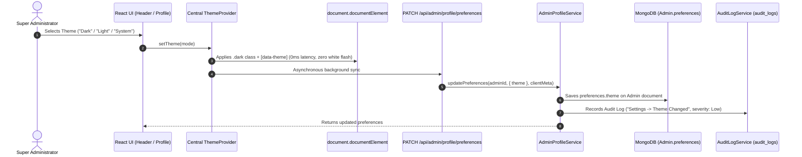
```mermaid
sequenceDiagram
    autonumber
    actor Admin as Super Administrator
    participant UI as React UI (Header / Profile)
    participant Ctx as Central ThemeProvider
    participant DOM as document.documentElement
    participant API as PATCH /api/admin/profile/preferences
    participant Svc as AdminProfileService
    participant MDB as MongoDB (Admin.preferences)
    participant AL as AuditLogService (audit_logs)

    Admin->>UI: Selects Theme ("Dark" / "Light" / "System")
    UI->>Ctx: setTheme(mode)
    Ctx->>DOM: Applies .dark class + [data-theme] (0ms latency, zero white flash)
    Ctx->>API: Asynchronous background sync
    API->>Svc: updatePreferences(adminId, { theme }, clientMeta)
    Svc->>MDB: Saves preferences.theme on Admin document
    Svc->>AL: Records Audit Log ("Settings -> Theme Changed", severity: Low)
    Svc-->>UI: Returns updated preferences
```

### Key Components:
1. **Frontend Centralized Provider** (`frontend/src/context/ThemeContext.tsx`):
   - Single source of truth managing `'Light' | 'Dark' | 'System'`.
   - Real-time `matchMedia('(prefers-color-scheme: dark)')` listener for dynamic OS theme transitions without page reload or flicker.
   - Synchronizes immediately with DOM `class="dark"` and `data-theme="dark|light"`.
   - Fast cache in `localStorage` prevents initial mount flash before MongoDB profile resolves.
2. **Backend Preference Storage & Normalization**:
   - Stored in existing `Admin.preferences.theme` (`'Light' | 'Dark' | 'System'`).
   - Case-insensitive Zod normalization in `UpdateAdminPreferencesSchema`.
   - Generates immutable audit logs in `audit_logs` collection.
3. **CSS Design Tokens** (`frontend/src/index.css`):
   - Token variables (`--bg-app`, `--bg-card`, `--bg-surface`, `--border-subtle`, `--text-main`, `--text-muted`, `--brand-primary`).
   - Universal component color adaptors preserving 100% of the approved UI layout, typography, padding, and animations.

---

## 9. Super Admin Dashboard Architecture & Real-Time Aggregations

The Super Admin Dashboard is 100% backend-driven and aggregates platform metrics directly from MongoDB Atlas:


```mermaid
graph TD
    subgraph Frontend Dashboard UI
        KPIGrid[8 KPI Summary Cards]
        ChartsGrid[4 Time-Series Charts 7d/30d/90d/1y]
        ActivityList[Recent Activities Feed]
        TxList[Latest Transactions List]
        ApprovalsQueue[Pending Approvals Queue]
        HealthProbe[System Health Telemetry Probe]
        LiveCenter[Live Activity Center & Real Stream]
    end

    subgraph REST API Endpoints /api/admin/dashboard
        E1["/stats -> getStats()"]
        E2["/charts -> getCharts(range)"]
        E3["/recent-activities -> getRecentActivities()"]
        E4["/latest-transactions -> getLatestTransactions()"]
        E5["/pending-approvals -> getPendingApprovals()"]
        E6["/system-health -> getSystemHealth()"]
        E7["/live -> getLiveActivity()"]
        E8["/active-trips -> getActiveTrips()"]
        E9["/payment-queue -> getPaymentQueue()"]
        E10["/support-queue -> getSupportQueue()"]
    end

    subgraph MongoDB Atlas Collections
        C1[(payments)]
        C2[(bookings)]
        C3[(agencies)]
        C4[(users)]
        C5[(packages)]
        C6[(support_tickets)]
        C7[(audit_logs)]
        C8[(adminsessions)]
    end

    KPIGrid --> E1
    ChartsGrid --> E2
    ActivityList --> E3
    TxList --> E4
    ApprovalsQueue --> E5
    HealthProbe --> E6
    LiveCenter --> E7
    LiveCenter --> E8
    LiveCenter --> E9
    LiveCenter --> E10

    E1 --> C1 & C2 & C3 & C4 & C5 & C6
    E2 --> C1 & C2 & C3 & C4
    E3 --> C7
    E4 --> C1
    E5 --> C3 & C5
    E7 --> C7 & C8 & C2 & C3 & C1 & C6
    E8 --> C2
    E9 --> C1
    E10 --> C6
```

### Aggregation & Metric Mapping:
- **Platform Revenue & GMV**: Real `$match` + `$group` aggregation on `payments` and `bookings` collections with 30-day comparative growth percentage calculations.
- **Time-Series Charts**: Grouped by `$dateToString: { format: '%b %d', date: '$createdAt' }` across selectable ranges (`7d`, `30d`, `90d`, `1y`).
- **Recent Activities**: Sourced from `audit_logs` collection with dynamic event badge formatting and relative timestamps.
- **Latest Transactions**: Sourced from `payments` collection.
- **Pending Approvals**: Unified queue of pending KYC registrations (`agencies`) and pending catalog packages (`packages`).
- **System Health Telemetry**: Live probes checking MongoDB connection state (`mongoose.connection.readyState`), API latency, SMTP mailer status, and Cloudinary media storage.
- **Live Activity Center**: Continuous real-time stream reading authentic audit events from `audit_logs` with auto-polling toggle and instant manual refresh.

### Security & Authentication:
- All endpoints protected by `authenticateAdmin` middleware.
- Session validation against `AdminSession` collection.

---

## 10. Super Admin Agency Requests & KYC Verification Pipeline

The Agency Requests module (`/admin/verification-pending`, `/super-admin/agency-requests`) is 100% backend-driven, operating directly on the single unified `agencies` collection (`AgencyModel`) and the immutable `audit_logs` collection (`AuditLogModel`).

### Architecture Data Flow

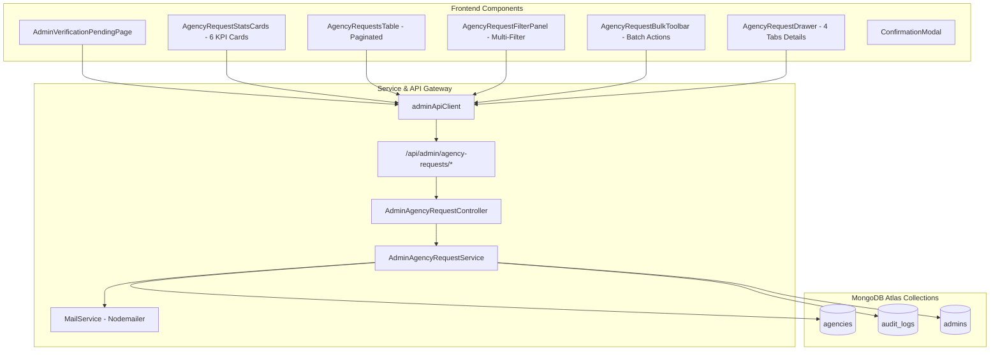
```mermaid
graph TD
    subgraph Frontend Components
        ReqPage[AdminVerificationPendingPage]
        StatsCards[AgencyRequestStatsCards - 6 KPI Cards]
        Table[AgencyRequestsTable - Paginated]
        Filter[AgencyRequestFilterPanel - Multi-Filter]
        BulkToolbar[AgencyRequestBulkToolbar - Batch Actions]
        Drawer[AgencyRequestDrawer - 4 Tabs Details]
        Modal[ConfirmationModal]
    end

    subgraph Service & API Gateway
        ApiClient[adminApiClient]
        Routes["/api/admin/agency-requests/*"]
        Controller[AdminAgencyRequestController]
        Service[AdminAgencyRequestService]
        Mail[MailService - Nodemailer]
    end

    subgraph MongoDB Atlas Collections
        AgenciesColl[(agencies)]
        AuditLogsColl[(audit_logs)]
        AdminsColl[(admins)]
    end

    ReqPage & StatsCards & Table & Filter & BulkToolbar & Drawer --> ApiClient
    ApiClient --> Routes --> Controller --> Service
    Service --> AgenciesColl & AuditLogsColl & AdminsColl
    Service --> Mail
```

### Endpoints Implemented

| Method | Route | Description |
| :--- | :--- | :--- |
| `GET` | `/api/admin/agency-requests/stats` | Dynamic calculation of 6 KPI cards (Pending, Approved Today, Rejected Today, Under Review, Missing Docs, Avg Approval Time) with 30-day percentage comparison. |
| `GET` | `/api/admin/agency-requests` | Paginated, filtered, and regex-searched query returning agencies from MongoDB. |
| `GET` | `/api/admin/agency-requests/export` | Generates formatted CSV file stream directly from MongoDB. |
| `GET` | `/api/admin/agency-requests/:id` | Full agency profile retrieval including uploaded documents, KYC checklist, timeline, review notes, and live activity from `audit_logs`. |
| `POST` | `/api/admin/agency-requests/:id/notes` | Appends internal compliance review notes and records audit log. |
| `PUT` | `/api/admin/agency-requests/:id/approve` | Transitions agency status to `ACTIVE` / `APPROVED`, appends timeline event, records audit log, and dispatches approval transactional email. |
| `PUT` | `/api/admin/agency-requests/:id/reject` | Transitions agency status to `REJECTED`, records rejection reason, appends timeline event, records audit log, and dispatches rejection email. |
| `PUT` | `/api/admin/agency-requests/:id/request-docs` | Transitions verification status to `MISSING_DOCS`, stores requested document types, records audit log, and dispatches notification email. |
| `POST` | `/api/admin/agency-requests/bulk-action` | Batch processing for bulk approve, reject, or request documents across multiple agency IDs. |

### Security & Business Rules:
- **Zero Mock / Zero Duplicate Rule**: All data reads and writes target the single `agencies` collection (`AgencyModel`).
- **Audit Logging**: Every administrative action (Approve, Reject, Request Docs, Add Note, Bulk Actions, CSV Export) creates an immutable record in `audit_logs`.
- **Transactional Communication**: Real transactional emails dispatched via `MailService` using SMTP.

---

## 10.2 Traveler KYC & Identity Verification Workspace Architecture

The Traveler KYC system governs identity verification across customer accounts (`users`), one-time travel profiles (`travel_profiles`), and compliance records (`user_kycs`).

### Architecture Data Flow & State Machine

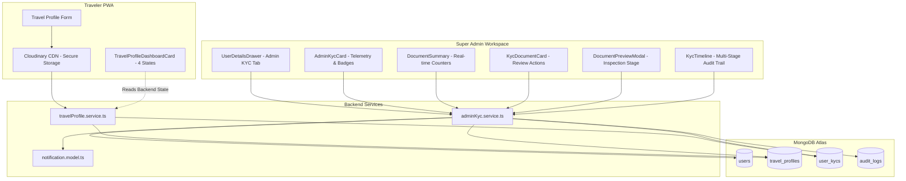
```mermaid
graph TD
    subgraph Traveler PWA
        TP[Travel Profile Form]
        Card[TravelProfileDashboardCard - 4 States]
        Cloud[Cloudinary CDN - Secure Storage]
    end

    subgraph Backend Services
        TP_SVC[travelProfile.service.ts]
        KYC_SVC[adminKyc.service.ts]
        NOTIF_SVC[notification.model.ts]
    end

    subgraph MongoDB Atlas
        U_COLL[(users)]
        TP_COLL[(travel_profiles)]
        KYC_COLL[(user_kycs)]
        AUDIT_COLL[(audit_logs)]
    end

    subgraph Super Admin Workspace
        Drawer[UserDetailsDrawer - Admin KYC Tab]
        Header[AdminKycCard - Telemetry & Badges]
        Summary[DocumentSummary - Real-time Counters]
        Docs[KycDocumentCard - Review Actions]
        Modal[DocumentPreviewModal - Inspection Stage]
        Timeline[KycTimeline - Multi-Stage Audit Trail]
    end

    TP --> Cloud
    Cloud --> TP_SVC
    TP_SVC --> TP_COLL
    TP_SVC --> KYC_COLL
    KYC_SVC --> KYC_COLL & U_COLL & TP_COLL & AUDIT_COLL
    Drawer & Header & Summary & Docs & Modal & Timeline --> KYC_SVC
    KYC_SVC --> NOTIF_SVC
    Card -. Reads Backend State .-> TP_SVC
```

### Complete KYC State Machine
```text
NOT_SUBMITTED ──► PROFILE_COMPLETED ──► DOCUMENTS_UPLOADED ──► UNDER_REVIEW ──► OCR_PROCESSING
                                                                                    │
                                                                                    ▼
VERIFIED (Auto-Unlocks Silver Tier) ◄────────── ADMIN_REVIEW ──────────► REJECTED (With Reason)
        ▲                                             │                               │
        │                                             ▼                               ▼
        └── Renewed ◄── EXPIRED                 SUSPENDED                 Re-upload CTA ──► PENDING
```

### Mathematical Parent Status Derivation Rules
The parent status is computed strictly from document statuses:
- **If no required documents exist** $\implies$ `None` (`NOT_SUBMITTED`).
- **If ANY required document is `Rejected`** $\implies$ Overall KYC status is `Rejected`.
- **Else if ANY required document is `Pending`** $\implies$ Overall KYC status is `Pending` (`UNDER_REVIEW`).
- **Else if ALL required documents are `Verified`** $\implies$ Overall KYC status is `Verified`.
- **Else if documents expire** $\implies$ Overall KYC status is `Expired`.

### Document Collection Standards
- **Mandatory (Either/Or):**
  - **Aadhaar Card (Front + Back):** UIDAI format masking (`•••• •••• 4289`), QR code check, address match.
  - **Voter ID (Front only):** ECI serial masking (`WBC••••412`), full name match.
- **Optional:**
  - **Driving Licence (Front + Back):** Sarathi register match, expiry check.
  - **Passport (Photo page only):** ICAO 9303 MRZ validation.
- **Excluded:** Visa is NOT collected during traveler profile setup.

### Admin Review Workspace
- **Header:** Displays status badge, verification ID, dates, reviewer, risk score (0-100), biometric face match %, document match %, fraud detection, and government gateway status.
- **Document Summary Bar:** Dynamic counters (`Uploaded`, `Verified`, `Pending`, `Rejected`, `Expired`) with interactive category filtering.
- **Review Cards:** Masked numbers, expiry, country, OCR result, forgery check, and actions: `Preview`, `Approve`, `Reject`, `Re-upload`, `Download`, `Metadata`.
- **Preview Modal:** Inspection stage with Zoom (+/-), 90° rotation, brightness/contrast filters, prev/next pagination, and quick review decision buttons.
- **Audit Timeline:** Multi-stage breakdown: `Submitted` $\to$ `OCR Completed` $\to$ `Forgery Check` $\to$ `Face Match` $\to$ `Government Validation` $\to$ `Admin Viewed` $\to$ `Approved`.

### Traveler App 4-State Lifecycle (`TravelProfileDashboardCard`)
- **State 1 (In Progress):** Completion card with "Complete Travel Profile" CTA.
- **State 2 (Pending Verification):** Compact informational card (~45% reduced height) without promotional clutter.
- **State 3 (Verified):** Card returns `null` and is automatically removed from the Home screen, naturally reflowing the page.
- **State 4 (Rejected):** "Verification Failed" warning with administrative reason and "Re-upload Documents" CTA.

### Automated Membership Unlock
Upon admin approval of KYC:
- User is automatically upgraded from `Free` to **Silver Tier Membership** (`user.membership = 'Silver'`) with 1-year validity (`membershipValidTill`).
- Unlocks 1-click booking, 5% discounts, and priority refund queues.
- High-priority approval notifications dispatched to the traveler.

---

## 11. Panel-Scoped Theme Architecture & Isolation Boundaries

To guarantee complete independence across customer, agency, and super-admin portals, theme contexts are scoped per portal root rather than globally on `document.documentElement` or `<body>`.

### Hierarchy & Boundaries

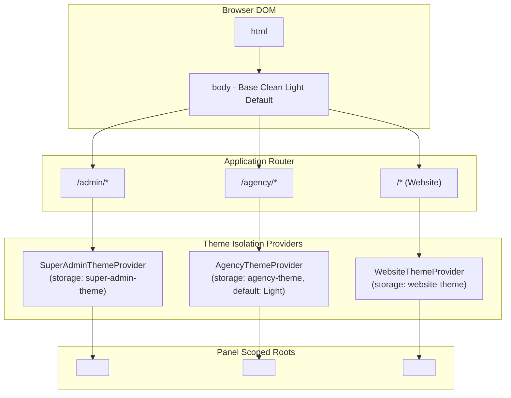
```mermaid
graph TD
    subgraph Browser DOM
        HTML[html]
        Body[body - Base Clean Light Default]
    end

    subgraph Application Router
        HTML --> Body
        Body --> AdminRoutes["/admin/*"]
        Body --> AgencyRoutes["/agency/*"]
        Body --> UserRoutes["/* (Website)"]
    end

    subgraph Theme Isolation Providers
        AdminRoutes --> SuperAdminThemeProvider["SuperAdminThemeProvider<br/>(storage: super-admin-theme)"]
        AgencyRoutes --> AgencyThemeProvider["AgencyThemeProvider<br/>(storage: agency-theme, default: Light)"]
        UserRoutes --> WebsiteThemeProvider["WebsiteThemeProvider<br/>(storage: website-theme)"]
    end

    subgraph Panel Scoped Roots
        SuperAdminThemeProvider --> AdminRoot["<div id='super-admin-root' class='super-admin-root dark'>"]
        AgencyThemeProvider --> AgencyRoot["<div id='agency-root' class='agency-root'>"]
        WebsiteThemeProvider --> WebsiteRoot["<div id='website-root' class='website-root'>"]
    end
```

### Storage Keys & Scope Mapping:

| Portal Panel | Routes | Theme Provider | Storage Key | Scoped Container |
| :--- | :--- | :--- | :--- | :--- |
| **Super Admin Panel** | `/admin/*`, `/super-admin/*` | `SuperAdminThemeProvider` | `super-admin-theme` | `<div id="super-admin-root" className="super-admin-root ...">` |
| **Agency Panel & Onboarding** | `/agency/*` | `AgencyThemeProvider` | `agency-theme` | `<div id="agency-root" className="agency-root ...">` |
| **Customer Website & User Portal** | `/*`, `/home`, `/explore`, etc. | `WebsiteThemeProvider` | `website-theme` | `<div id="website-root" className="website-root ...">` |

### CSS Scoping Rule:
- Dark mode CSS selectors are strictly namespaced under `.super-admin-root.dark` or `.website-root.dark`.
- Neither `<html>` nor `<body>` ever receives global `.dark` classes, preventing cross-panel bleeding.

---

## 12. Production Agency Registration & Onboarding Pipeline

The Agency Onboarding & Registration pipeline is 100% backend-driven and uses the `agencies` collection (`AgencyModel`) as the single source of truth across prospective registration, compliance review, and active agency operation.

### End-to-End Registration Flow

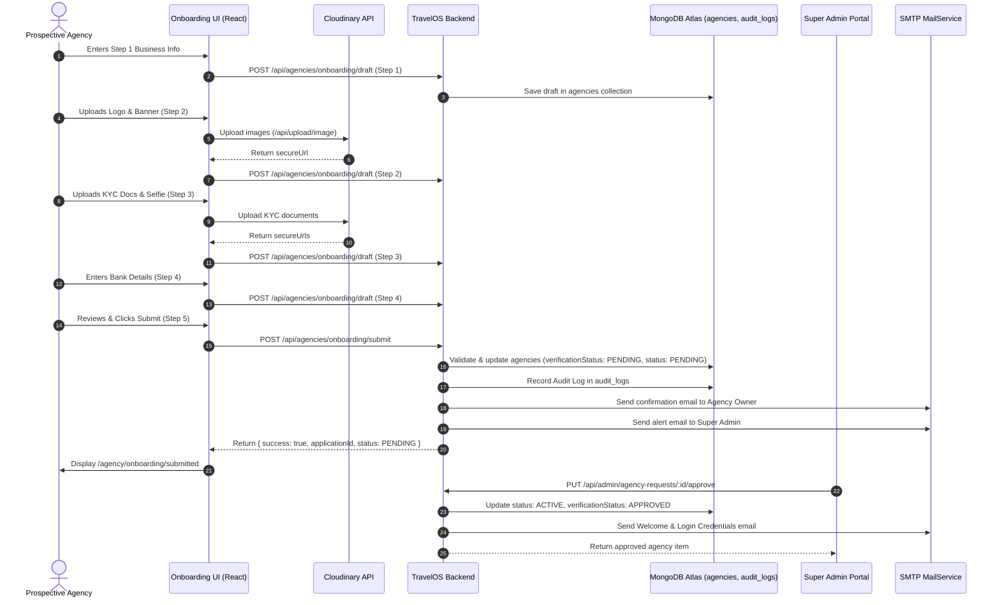
```mermaid
sequenceDiagram
    autonumber
    actor Agency as Prospective Agency
    participant Client as Onboarding UI (React)
    participant Cloudinary as Cloudinary API
    participant Server as TravelOS Backend
    participant Mongo as MongoDB Atlas (agencies, audit_logs)
    participant Admin as Super Admin Portal
    participant Mail as SMTP MailService

    Agency->>Client: Enters Step 1 Business Info
    Client->>Server: POST /api/agencies/onboarding/draft (Step 1)
    Server->>Mongo: Save draft in agencies collection

    Agency->>Client: Uploads Logo & Banner (Step 2)
    Client->>Cloudinary: Upload images (/api/upload/image)
    Cloudinary-->>Client: Return secureUrl
    Client->>Server: POST /api/agencies/onboarding/draft (Step 2)

    Agency->>Client: Uploads KYC Docs & Selfie (Step 3)
    Client->>Cloudinary: Upload KYC documents
    Cloudinary-->>Client: Return secureUrls
    Client->>Server: POST /api/agencies/onboarding/draft (Step 3)

    Agency->>Client: Enters Bank Details (Step 4)
    Client->>Server: POST /api/agencies/onboarding/draft (Step 4)

    Agency->>Client: Reviews & Clicks Submit (Step 5)
    Client->>Server: POST /api/agencies/onboarding/submit
    Server->>Mongo: Validate & update agencies (verificationStatus: PENDING, status: PENDING)
    Server->>Mongo: Record Audit Log in audit_logs
    Server->>Mail: Send confirmation email to Agency Owner
    Server->>Mail: Send alert email to Super Admin
    Server-->>Client: Return { success: true, applicationId, status: PENDING }
    Client->>Agency: Display /agency/onboarding/submitted

    Admin->>Server: PUT /api/admin/agency-requests/:id/approve
    Server->>Mongo: Update status: ACTIVE, verificationStatus: APPROVED
    Server->>Mail: Send Welcome & Login Credentials email
    Server-->>Admin: Return approved agency item
```

### Onboarding Endpoints Implemented

| Method | Endpoint | Description |
| :--- | :--- | :--- |
| `POST` | `/api/agencies/onboarding/draft` | Auto-saves or updates multi-step registration draft state in MongoDB. |
| `GET` | `/api/agencies/onboarding/draft/:idOrEmail` | Retrieves saved draft data for application resumption. |
| `POST` | `/api/agencies/onboarding/submit` | Finalizes application, validates fields, logs audit trail, dispatches emails. |
| `GET` | `/api/agencies/onboarding/status/:idOrEmail` | Returns real-time application tracker status and timeline. |
| `GET` | `/api/agencies/onboarding/requested-documents/:idOrEmail` | Fetches specific documents requested for re-upload with reasons and locked verified items. |
| `POST` | `/api/agencies/onboarding/reupload-documents` | Re-uploads requested documents with strict whitelist validation, sets status to `Re-upload Submitted`, and transitions agency back to review. |

---

## 14. Super Admin Approved Agencies Directory Architecture & Lifecycle

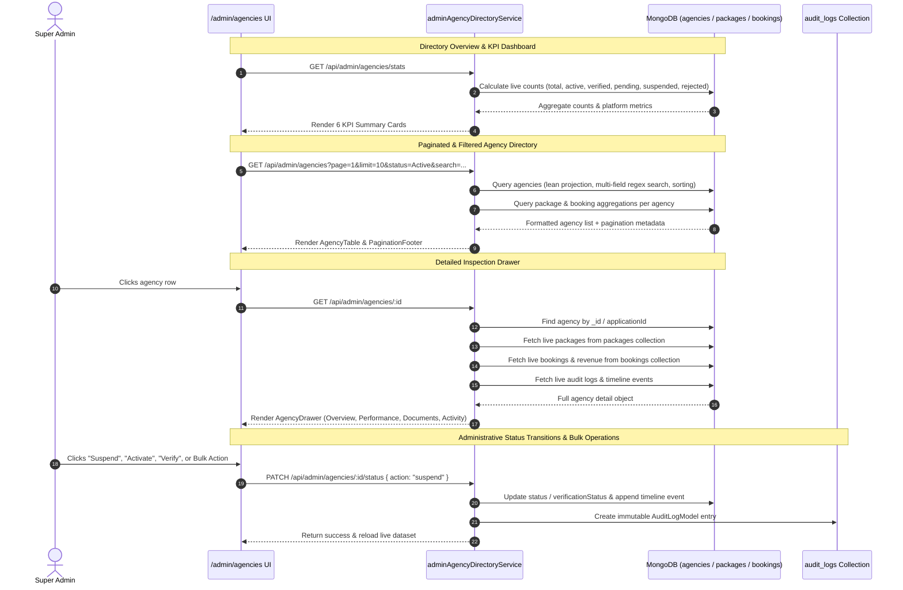
```mermaid
sequenceDiagram
    autonumber
    actor Admin as Super Admin
    participant AdminUI as /admin/agencies UI
    participant Service as adminAgencyDirectoryService
    participant Mongo as MongoDB (agencies / packages / bookings)
    participant Audit as audit_logs Collection

    Note over AdminUI,Mongo: Directory Overview & KPI Dashboard
    AdminUI->>Service: GET /api/admin/agencies/stats
    Service->>Mongo: Calculate live counts (total, active, verified, pending, suspended, rejected)
    Mongo-->>Service: Aggregate counts & platform metrics
    Service-->>AdminUI: Render 6 KPI Summary Cards

    Note over AdminUI,Mongo: Paginated & Filtered Agency Directory
    AdminUI->>Service: GET /api/admin/agencies?page=1&limit=10&status=Active&search=...
    Service->>Mongo: Query agencies (lean projection, multi-field regex search, sorting)
    Service->>Mongo: Query package & booking aggregations per agency
    Mongo-->>Service: Formatted agency list + pagination metadata
    Service-->>AdminUI: Render AgencyTable & PaginationFooter

    Note over AdminUI,Mongo: Detailed Inspection Drawer
    Admin->>AdminUI: Clicks agency row
    AdminUI->>Service: GET /api/admin/agencies/:id
    Service->>Mongo: Find agency by _id / applicationId
    Service->>Mongo: Fetch live packages from packages collection
    Service->>Mongo: Fetch live bookings & revenue from bookings collection
    Service->>Mongo: Fetch live audit logs & timeline events
    Mongo-->>Service: Full agency detail object
    Service-->>AdminUI: Render AgencyDrawer (Overview, Performance, Documents, Activity)

    Note over AdminUI,Audit: Administrative Status Transitions & Bulk Operations
    Admin->>AdminUI: Clicks "Suspend", "Activate", "Verify", or Bulk Action
    AdminUI->>Service: PATCH /api/admin/agencies/:id/status { action: "suspend" }
    Service->>Mongo: Update status / verificationStatus & append timeline event
    Service->>Audit: Create immutable AuditLogModel entry
    Service-->>AdminUI: Return success & reload live dataset
```

### Approved Agencies Directory Endpoints:


## 15. Agency Messages & Live Real-Time Customer Inbox Architecture

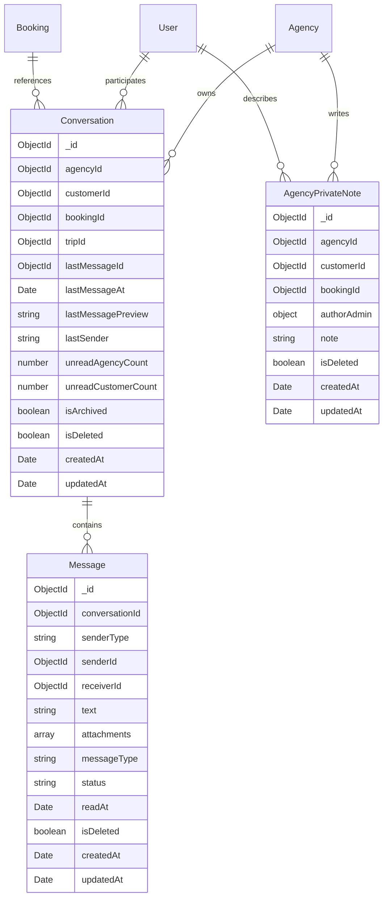
```mermaid
erDiagram
    Agency ||--o{ Conversation : owns
    User ||--o{ Conversation : participates
    Booking ||--o{ Conversation : references
    Conversation ||--o{ Message : contains
    Agency ||--o{ AgencyPrivateNote : writes
    User ||--o{ AgencyPrivateNote : describes

    Conversation {
        ObjectId _id
        ObjectId agencyId
        ObjectId customerId
        ObjectId bookingId
        ObjectId tripId
        ObjectId lastMessageId
        Date lastMessageAt
        string lastMessagePreview
        string lastSender
        number unreadAgencyCount
        number unreadCustomerCount
        boolean isArchived
        boolean isDeleted
        Date createdAt
        Date updatedAt
    }

    Message {
        ObjectId _id
        ObjectId conversationId
        string senderType
        ObjectId senderId
        ObjectId receiverId
        string text
        array attachments
        string messageType
        string status
        Date readAt
        boolean isDeleted
        Date createdAt
        Date updatedAt
    }

    AgencyPrivateNote {
        ObjectId _id
        ObjectId agencyId
        ObjectId customerId
        ObjectId bookingId
        object authorAdmin
        string note
        boolean isDeleted
        Date createdAt
        Date updatedAt
    }
```

### Real-Time Socket.IO Architecture & Flow

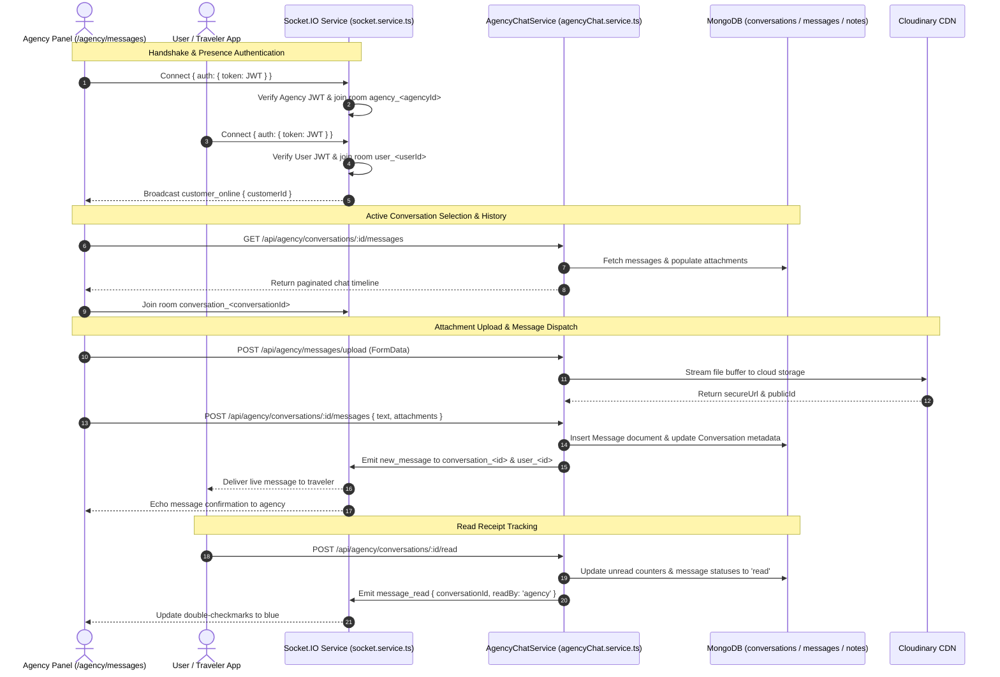
```mermaid
sequenceDiagram
    autonumber
    actor AgencyClient as Agency Panel (/agency/messages)
    actor TravelerClient as User / Traveler App
    participant SocketGateway as Socket.IO Service (socket.service.ts)
    participant RESTService as AgencyChatService (agencyChat.service.ts)
    participant DB as MongoDB (conversations / messages / notes)
    participant Cloudinary as Cloudinary CDN

    Note over AgencyClient,SocketGateway: Handshake & Presence Authentication
    AgencyClient->>SocketGateway: Connect { auth: { token: JWT } }
    SocketGateway->>SocketGateway: Verify Agency JWT & join room agency_<agencyId>
    TravelerClient->>SocketGateway: Connect { auth: { token: JWT } }
    SocketGateway->>SocketGateway: Verify User JWT & join room user_<userId>
    SocketGateway-->>AgencyClient: Broadcast customer_online { customerId }

    Note over AgencyClient,DB: Active Conversation Selection & History
    AgencyClient->>RESTService: GET /api/agency/conversations/:id/messages
    RESTService->>DB: Fetch messages & populate attachments
    RESTService-->>AgencyClient: Return paginated chat timeline
    AgencyClient->>SocketGateway: Join room conversation_<conversationId>

    Note over AgencyClient,Cloudinary: Attachment Upload & Message Dispatch
    AgencyClient->>RESTService: POST /api/agency/messages/upload (FormData)
    RESTService->>Cloudinary: Stream file buffer to cloud storage
    Cloudinary-->>RESTService: Return secureUrl & publicId
    AgencyClient->>RESTService: POST /api/agency/conversations/:id/messages { text, attachments }
    RESTService->>DB: Insert Message document & update Conversation metadata
    RESTService->>SocketGateway: Emit new_message to conversation_<id> & user_<id>
    SocketGateway-->>TravelerClient: Deliver live message to traveler
    SocketGateway-->>AgencyClient: Echo message confirmation to agency

    Note over TravelerClient,DB: Read Receipt Tracking
    TravelerClient->>RESTService: POST /api/agency/conversations/:id/read
    RESTService->>DB: Update unread counters & message statuses to 'read'
    RESTService->>SocketGateway: Emit message_read { conversationId, readBy: 'agency' }
    SocketGateway-->>AgencyClient: Update double-checkmarks to blue
```

### Agency Messages REST Endpoints:

| Method | Endpoint | Description |
| :--- | :--- | :--- |
| `GET` | `/api/agency/conversations` | Fetches filtered, paginated conversations for authenticated agency with search and unread aggregates. |
| `GET` | `/api/agency/conversations/:id` | Detailed conversation object with populated customer profile, booking overview, travel companions, and private notes. |
| `GET` | `/api/agency/conversations/:id/messages` | Paginated message timeline sorted chronologically (oldest first). |
| `POST` | `/api/agency/conversations/:id/messages` | Sends a new text or rich attachment message to traveler with Socket.IO notification. |
| `POST` | `/api/agency/conversations/:id/read` | Marks all incoming customer messages in the thread as read. |
| `POST` | `/api/agency/customers/:id/private-notes` | Creates an agency staff-only private note attached to customer and booking. |
| `PUT` | `/api/agency/customers/:id/private-notes/:noteId` | Updates an existing staff private note. |
| `DELETE` | `/api/agency/customers/:id/private-notes/:noteId` | Soft deletes an agency staff private note. |
| `POST` | `/api/agency/messages/upload` | Uploads chat attachments (PDFs, images, documents) directly to Cloudinary. |

---

## 16. Super Admin Traveler User Management System Architecture (`/admin/users`)

The Super Admin User Management module (`/admin/users`) is a production-grade, 100% backend-driven system backed directly by MongoDB collections (`users`, `bookings`, `payments`, `audit_logs`, `passwordresets`):

```mermaid
graph TD
    subgraph Client Admin UI (/admin/users)
        Header[AdminUserHeader - Quick Search & Export CSV]
        KPIs[UserKPISection - 6 Live Stat Cards]
        Filters[UserFilterPanel - 7 Filter Selectors]
        BulkBar[UserBulkActionBar - Batch Actions Toolbar]
        Table[UsersTable & UserTableRow - 13 Data Columns]
        Pagination[UserPagination - Server-side Navigation]
        Drawer[UserDetailsDrawer - 5 Tabs Live Inspector]
        Modals[AddUser / EditUser / Confirm / Notification Modals]
    end

    subgraph Service & Gateway Layer
        ApiClient[adminApiClient]
        Routes["/api/admin/users/*"]
        Controller[AdminUserManagementController]
        Service[AdminUserManagementService]
    end

    subgraph Database Layer (MongoDB)
        Users[(users)]
        Bookings[(bookings)]
        Payments[(payments)]
        AuditLogs[(audit_logs)]
        PasswordResets[(passwordresets)]
    end

    Header & KPIs & Filters & BulkBar & Table & Pagination & Drawer & Modals --> ApiClient
    ApiClient --> Routes --> Controller --> Service
    Service --> Users & Bookings & Payments & AuditLogs & PasswordResets
```

### Endpoints Implemented

| Method | Endpoint | Description |
| :--- | :--- | :--- |
| `GET` | `/api/admin/users/stats` | Live computed KPI telemetry (Total Users, Active, New Today, Premium, Suspended, Verified) directly from MongoDB. |
| `GET` | `/api/admin/users` | Server-side paginated & filtered list with multi-field search and real-time booking/spend aggregations. |
| `GET` | `/api/admin/users/export` | Direct database query streaming complete filtered datasets to CSV. |
| `GET` | `/api/admin/users/:id` | Full user profile with populated live bookings, generated trips, payment invoices, and audit log events. |
| `POST` | `/api/admin/users` | Creates new traveler user in `UserModel` and creates an audit log record. |
| `PATCH` | `/api/admin/users/:id` | Updates user profile, membership tier, or status with audit logging. |
| `DELETE` | `/api/admin/users/:id` | Soft deletes user account (`isDeleted: true`, `deletedAt`, `deletedBy`) without dropping records. |
| `POST` | `/api/admin/users/bulk-action` | Batch operations for verify, suspend, activate, and soft delete. |
| `POST` | `/api/admin/users/:id/reset-password` | Generates secure cryptographic reset token in `PasswordResetModel`. |
| `POST` | `/api/admin/users/:id/notifications` | Dispatches traveler notifications with audit trail. |

### Architectural Highlights:
1. **Single Source of Truth**: Reuses existing `UserModel`, `BookingModel`, `PaymentModel`, and `AuditLogModel` schemas. Zero duplicate databases or standalone counters.
2. **Aggregated Booking Metrics**: Live MongoDB aggregation queries calculate `totalSpend`, `tripsCompleted`, `totalBookings`, and `cancellationRate` for every user without N+1 query overhead.
3. **5-Tab Details Drawer**: Slide-over inspector dynamically loads authentic **Overview**, **Bookings**, **Trips**, **Payments**, and **Activity Log** data without fake static arrays.
4. **Audit Logging & Security**: All administrative updates are logged into `audit_logs` with admin actor ID, timestamp, IP address, and change details. Endpoints are strictly guarded by `authenticateAdmin`.

---

## 17. Agency Partner Portal Production Backend Architecture (`/agency/*`)

The ApnaTrip Agency Partner Portal (`/agency/*`) operates as a multi-tenant operational console backed by dedicated MongoDB models (`AgencyModel`, `PackageModel`, `BookingModel`, `TripModel`, `NotificationModel`, `ReviewModel`, `PaymentModel`, `AuditLogModel`). All queries and mutations are isolated by `agencyId: req.agency._id`.

```mermaid
graph TD
    subgraph Agency Client Panel (/agency/*)
        DASH[Agency Dashboard & KPIs]
        PKG[Packages Management & Wizard]
        BKG[Bookings & Grouped Departures]
        OPS[Operational Trips & Dispatch]
        CRM[Customer CRM & Dossiers]
        REV[Reviews & Reputation]
        FIN[Financial Command & Payouts]
        NOTIF[Omnichannel Notifications]
    end

    subgraph Agency Gateway Layer
        AGY_AUTH[authenticateAgency JWT Middleware]
        AGY_ROUTER["/api/agency/* Router"]
    end

    subgraph Controllers & Services
        PC[AgencyPackageService]
        BC[AgencyBookingService]
        TC[AgencyTripService]
        CC[AgencyCustomerService]
        RC[AgencyReviewService]
        FC[AgencyFinanceService]
        AC[AgencyAnalyticsService]
        NC[AgencyNotificationService]
    end

    subgraph Database Layer (MongoDB Atlas)
        M_AGY[(agencies)]
        M_PKG[(packages)]
        M_BKG[(bookings)]
        M_TRIP[(trips)]
        M_NOTIF[(notifications)]
        M_REV[(reviews)]
        M_PAY[(payments)]
        M_AUD[(audit_logs)]
    end

    DASH & PKG & BKG & OPS & CRM & REV & FIN & NOTIF --> AGY_AUTH --> AGY_ROUTER
    AGY_ROUTER --> PC & BC & TC & CC & RC & FC & AC & NC
    PC & BC & TC & CC & RC & FC & AC & NC --> M_AGY & M_PKG & M_BKG & M_TRIP & M_NOTIF & M_REV & M_PAY & M_AUD
```

### Complete Agency Portal Endpoint Matrix

| Module | Method | Endpoint | Description |
| :--- | :--- | :--- | :--- |
| **Auth** | `POST` | `/api/agencies/auth/login` | Agency email & password authentication, issuing scoped Agency JWT. |
| **Auth** | `GET` | `/api/agencies/auth/me` | Fetches authenticated agency details and session. |
| **Auth** | `POST` | `/api/agencies/auth/change-password` | First login & routine password updates. |
| **Dashboard** | `GET` | `/api/agencies/dashboard` | Aggregated 4 KPI cards, time-series charts, occupancy, top packages, insights. |
| **Dashboard** | `GET` | `/api/agencies/dashboard/recent-bookings` | 5 most recent agency bookings with live statuses. |
| **Dashboard** | `GET` | `/api/agencies/dashboard/upcoming-departures` | 5 nearest upcoming trip departures with guide/driver indicators. |
| **Packages** | `GET` | `/api/agencies/packages/stats` | Category counts, active/draft/archived breakdown, total capacity. |
| **Packages** | `GET` | `/api/agencies/packages` | Filterable, searchable, paginated agency package catalog. |
| **Packages** | `POST` | `/api/agencies/packages` | Creates new travel package and writes audit log. |
| **Packages** | `GET` | `/api/agencies/packages/:id` | Full package details with itineraries, tiers, inclusions, exclusions. |
| **Packages** | `PATCH` | `/api/agencies/packages/:id` | Updates package fields with audit logging. |
| **Packages** | `PATCH` | `/api/agencies/packages/:id/status` | Toggles package status (`Active`, `Draft`, `Archived`). |
| **Packages** | `POST` | `/api/agencies/packages/:id/duplicate` | Deep clones existing package into a draft copy. |
| **Packages** | `DELETE` | `/api/agencies/packages/:id` | Soft deletes package (`isDeleted: true`). |
| **Bookings** | `GET` | `/api/agencies/bookings/stats` | Confirmed, pending, cancelled, trip-ready metrics. |
| **Bookings** | `GET` | `/api/agencies/bookings` | Grouped departures inventory and individual booking listings. |
| **Bookings** | `GET` | `/api/agencies/bookings/:id` | Deep passenger manifest with companions and payment verification. |
| **Bookings** | `PATCH` | `/api/agencies/bookings/:id/confirm` | Confirms pending booking and updates inventory. |
| **Bookings** | `PATCH` | `/api/agencies/bookings/:id/cancel` | Processes booking cancellation and releases inventory. |
| **Trips** | `GET` | `/api/agencies/trips` | Operational trips list with status filters (`Upcoming`, `Ongoing`, `Completed`). |
| **Trips** | `GET` | `/api/agencies/trips/:id` | Full operational trip dossier (team, vehicle, hotel, emergency, checklist). |
| **Trips** | `PATCH` | `/api/agencies/trips/:id/team` | Assigns tour guides, drivers, and field staff. |
| **Trips** | `PATCH` | `/api/agencies/trips/:id/vehicle` | Updates vehicle type, plate number, and dispatch logs. |
| **Trips** | `PATCH` | `/api/agencies/trips/:id/hotel` | Updates hotel/resort allocations and check-in times. |
| **Trips** | `PATCH` | `/api/agencies/trips/:id/emergency` | Updates emergency protocol contacts and nearest medical stations. |
| **Trips** | `PATCH` | `/api/agencies/trips/:id/status` | Updates trip status (`Upcoming`, `Ongoing`, `Completed`, `Delayed`, `Cancelled`). |
| **Trips** | `PATCH` | `/api/agencies/trips/:id/travelers/:travelerId/attendance` | Marks traveler attendance (`Present`, `Absent`, `Late`). |
| **Trips** | `POST` | `/api/agencies/trips/:id/travelers/check-in-all` | 1-click batch check-in for all trip passengers. |
| **Trips** | `POST` | `/api/agencies/trips/:id/announcements` | Dispatches traveler trip broadcast alerts. |
| **Trips** | `POST` | `/api/agencies/trips/:id/incidents` | Logs operational field incidents. |
| **Trips** | `PATCH` | `/api/agencies/trips/:id/incidents/:incidentId/toggle` | Toggles incident resolved/unresolved status. |
| **Trips** | `POST` | `/api/agencies/trips/:id/notes` | Appends dispatch/operations staff notes. |
| **Trips** | `POST` | `/api/agencies/trips/:id/photos` | Uploads trip photos and media records. |
| **Trips** | `PATCH` | `/api/agencies/trips/:id/days/:dayNumber/status` | Marks itinerary day status (`Pending`, `In Progress`, `Completed`). |
| **Customers** | `GET` | `/api/agencies/customers` | Traveler CRM directory with booking counts and lifetime spend. |
| **Customers** | `GET` | `/api/agencies/customers/stats` | Total unique travelers, repeat booking rate, average lifetime value. |
| **Customers** | `GET` | `/api/agencies/customers/:id` | Traveler profile dossier with full trip history, companions, notes. |
| **Customers** | `POST` | `/api/agencies/customers/:id/notes` | Creates staff private customer note. |
| **Customers** | `PUT` | `/api/agencies/customers/:id/notes/:noteId` | Updates staff private note. |
| **Customers** | `DELETE` | `/api/agencies/customers/:id/notes/:noteId` | Deletes staff private note. |
| **Reviews** | `GET` | `/api/agencies/reviews` | Verified agency customer reviews with rating filters. |
| **Reviews** | `GET` | `/api/agencies/reviews/stats` | Average rating, rating distribution (5-star to 1-star), verified review percentage. |
| **Reviews** | `POST` | `/api/agencies/reviews/:id/reply` | Publishes official agency reply to customer review. |
| **Reviews** | `PATCH` | `/api/agencies/reviews/:id/flag` | Flags review for Super Admin moderation. |
| **Finance** | `GET` | `/api/agencies/finance` | Financial command center summary (6 KPI cards, breakdown, settlements). |
| **Finance** | `GET` | `/api/agencies/finance/transactions` | Full ledger with status/date filters and pagination. |
| **Finance** | `GET` | `/api/agencies/finance/transactions/:id` | Single transaction invoice & breakdown detail. |
| **Finance** | `POST` | `/api/agencies/finance/request-payout` | Submits bank withdrawal/settlement payout request. |
| **Analytics** | `GET` | `/api/agencies/analytics` | Business intelligence analytics (revenue trends, bookings, top packages, occupancy). |
| **Notifications** | `GET` | `/api/agencies/notifications` | Activity inbox with category filters and unread counts. |
| **Notifications** | `PATCH` | `/api/agencies/notifications/:id/read` | Toggles single notification read/unread state. |
| **Notifications** | `POST` | `/api/agencies/notifications/read-all` | Marks all unread notifications as read. |
| **Notifications** | `POST` | `/api/agencies/notifications/clear-read` | Deletes all read notifications. |
| **Notifications** | `DELETE` | `/api/agencies/notifications/:id` | Deletes single notification. |
| **Notifications** | `PATCH` | `/api/agencies/notifications/:id/archive` | Archives notification. |

---

## 11. Customer / Traveler Panel Production Architecture

The Customer Panel is a high-performance, real-time Progressive Web Application (PWA) allowing travelers to discover tour packages, inspect agency credentials, book departures, verify Razorpay transactions, track live operations and guides, access travel vouchers, chat in real time, and share community travel stories.

```mermaid
graph TD
    subgraph Traveler Client
        Home[Home / Landing]
        Explore[Explore & Search]
        PkgDetail[Package Details]
        Checkout[Checkout & Razorpay]
        Trips[My Trips & Documents]
        Chat[Chat & Support Desk]
        Feed[Community & Reviews]
    end

    subgraph Backend Gateways
        PackRoute[/api/packages]
        SearchRoute[/api/search]
        BookRoute[/api/bookings]
        TripRoute[/api/trips]
        NotifRoute[/api/notifications]
        ChatRoute[/api/chat]
        CommRoute[/api/community]
        RevRoute[/api/reviews]
    end

    subgraph Real-Time Socket Layer
        SocketEngine[Socket.IO Server]
        UserRoom[user_{userId} Room]
        AgencyRoom[agency_{agencyId} Room]
    end

    subgraph Database Layer
        MongoPackages[(packages)]
        MongoAgencies[(agencies)]
        MongoBookings[(bookings)]
        MongoTrips[(trips)]
        MongoNotifs[(notifications)]
        MongoConvs[(conversations & messages)]
        MongoPosts[(community_posts)]
        MongoReviews[(reviews)]
    end

    Home --> PackRoute
    Explore --> SearchRoute
    PkgDetail --> PackRoute
    Checkout --> BookRoute
    Trips --> TripRoute
    Chat --> ChatRoute
    Feed --> CommRoute
    Feed --> RevRoute

    BookRoute --> MongoBookings
    BookRoute --> SocketEngine
    TripRoute --> MongoTrips
    ChatRoute --> MongoConvs
    ChatRoute --> SocketEngine
    NotifRoute --> MongoNotifs
    NotifRoute --> SocketEngine

    SocketEngine --> UserRoom
    SocketEngine --> AgencyRoom
```

### Customer Panel RESTful Endpoints Directory

| Domain | Method | Endpoint | Description |
| :--- | :--- | :--- | :--- |
| **Packages** | `GET` | `/api/packages` | Public catalog with filters (`budget`, `duration`, `difficulty`, `rating`). |
| **Packages** | `GET` | `/api/packages/featured` | Curated top packages for homepage carousel. |
| **Packages** | `GET` | `/api/packages/trending` | Trending packages based on bookings volume. |
| **Packages** | `GET` | `/api/packages/:id` | Single package itinerary, inclusions, agency, and pricing. |
| **Packages** | `GET` | `/api/packages/:id/similar` | Machine-recommended similar packages in same region/category. |
| **Agencies** | `GET` | `/api/agencies` | Public directory of verified travel agencies and ratings. |
| **Agencies** | `GET` | `/api/agencies/:id` | Single agency public profile with packages and reviews. |
| **Search** | `GET` | `/api/search` | Multi-entity global search across packages, destinations, and agencies. |
| **Bookings** | `POST` | `/api/bookings/checkout` | Initiates checkout, computes pricing breakdown, creates Razorpay order. |
| **Bookings** | `POST` | `/api/bookings/verify-payment` | Cryptographically verifies Razorpay signature and confirms booking. |
| **Bookings** | `GET` | `/api/bookings/my` | Authenticated customer booking history. |
| **Bookings** | `GET` | `/api/bookings/:id` | Single booking status, transaction receipt, and departure details. |
| **Travelers** | `GET` | `/api/travelers` | Saved companions for 1-click checkout autofill. |
| **Travelers** | `POST` | `/api/travelers` | Saves new companion record to customer profile. |
| **Trips** | `GET` | `/api/trips/my` | Real-time trips, countdowns, guide/driver roster, and travel stats. |
| **Trips** | `GET` | `/api/trips/stats` | Lifetime travel statistics, badges, spend, and countries visited. |
| **Trips** | `GET` | `/api/trips/:id` | Single trip live operations dossier, vehicle, hotel, and itinerary days. |
| **Trips** | `GET` | `/api/trips/:id/documents` | Official travel documents (Booking slip, Tax invoice, Hotel voucher, Insurance). |
| **Notifications**| `GET` | `/api/notifications/my` | Customer activity inbox. |
| **Notifications**| `GET` | `/api/notifications/unread-count` | Real-time badge counter for header bell icon. |
| **Notifications**| `PATCH`| `/api/notifications/:id/read` | Marks single notification as read. |
| **Notifications**| `PATCH`| `/api/notifications/read-all` | Marks all notifications as read. |
| **Chat** | `GET` | `/api/chat/conversations` | Customer chat inbox with agencies and concierge support desk. |
| **Chat** | `GET` | `/api/chat/conversations/:id` | Conversation message history and unread zeroing. |
| **Chat** | `POST` | `/api/chat/conversations/:id/messages` | Transmits customer message and dispatches WebSocket event. |
| **Community** | `GET` | `/api/community/posts` | Public community travel feed (stories, tips, photos). |
| **Community** | `POST` | `/api/community/posts` | Authenticated post publishing. |
| **Community** | `POST` | `/api/community/posts/:id/like` | Increments post like counter. |
| **Reviews** | `GET` | `/api/reviews` | Public verified customer reviews by package or agency. |
| **Reviews** | `POST` | `/api/reviews` | Submits verified customer rating & review with agency alert dispatch. |
| **Car Rental** | `GET` | `/api/cars` | Filterable vehicle marketplace (category, transmission, price sort). |
| **Car Rental** | `GET` | `/api/cars/:id` | Single vehicle specifications, host agency, deposit, and features. |
| **Car Rental** | `GET` | `/api/cars/:id/reviews` | Verified driver reviews and rating breakdown for specific car. |
| **Car Rental** | `POST`| `/api/cars/:id/reviews` | Authenticated customer review submission for rented vehicle. |
| **Car Rental** | `POST`| `/api/cars/bookings` | Creates vehicle rental reservation (Supports 100% full or 20% advance token). |
| **Car Rental** | `GET` | `/api/cars/bookings/my` | Authenticated customer car rental reservations and voucher status. |

---

## 13. Car Rental Marketplace Architecture & Lifecycle

The Car Rental module functions as a peer marketplace alongside Vacation Packages. It connects travelers with verified agency fleet operators and private vehicle hosts under strict booking verification.

### End-to-End Car Rental Data Flow

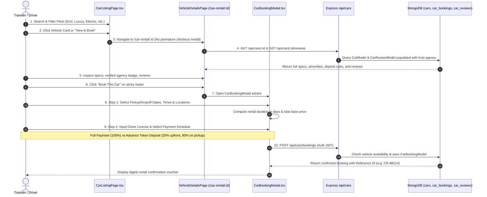
```mermaid
sequenceDiagram
    autonumber
    actor Customer as Traveler / Driver
    participant Catalog as CarListingPage.tsx
    participant Detail as VehicleDetailsPage (/car-rental/:id)
    participant Modal as CarBookingModal.tsx
    participant API as Express /api/cars
    participant DB as MongoDB (cars, car_bookings, car_reviews)

    Customer->>Catalog: 1. Search & Filter Fleet (SUV, Luxury, Electric, etc.)
    Customer->>Catalog: 2. Click Vehicle Card or "View & Book"
    Catalog->>Detail: 3. Navigate to /car-rental/:id (No premature checkout modal)
    Detail->>API: 4. GET /api/cars/:id & GET /api/cars/:id/reviews
    API->>DB: Query CarModel & CarReviewModel populated with host agency
    DB-->>Detail: Return full specs, amenities, deposit rules, and reviews
    Customer->>Detail: 5. Inspect specs, verified agency badge, reviews
    Customer->>Detail: 6. Click "Book This Car" on sticky footer
    Detail->>Modal: 7. Open CarBookingModal wizard
    Customer->>Modal: 8. Step 1: Select Pickup/Dropoff Dates, Times & Locations
    Modal->>Modal: Compute rental duration in days & total base price
    Customer->>Modal: 9. Step 2: Input Driver License & Select Payment Schedule
    Note over Customer,Modal: Full Payment (100%) vs Advance Token Deposit (20% upfront, 80% on pickup)
    Modal->>API: 10. POST /api/cars/bookings (Auth JWT)
    API->>DB: Check vehicle availability & save CarBookingModel
    DB-->>Modal: Return confirmed booking with Reference ID (e.g. CR-98214)
    Modal-->>Customer: Display digital rental confirmation voucher
```

### Car Rental Split-Payment Logic
1. **Advance Token Payment**:
   - Upfront Deposit: $20\%$ of total rental amount + security deposit.
   - Status: `partial_advance`.
   - Remaining Balance: $80\%$ collected by agency host during physical vehicle handover / key release.
2. **Full Payment**:
   - Upfront Deposit: $100\%$ of total rental amount + refundable security deposit.
   - Status: `paid`.

---

## 14. Master MongoDB Database Architecture — All 30 Collections

The database `travelos_db` runs on MongoDB Atlas and contains exactly 30 production Mongoose collections organized into 5 core functional clusters:

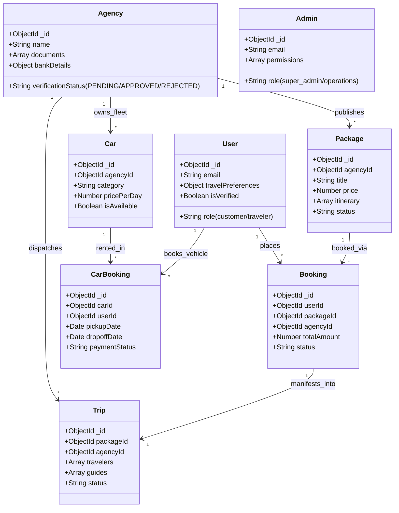
```mermaid
classDiagram
    class User {
        +ObjectId _id
        +String email
        +String role (customer/traveler)
        +Object travelPreferences
        +Boolean isVerified
    }
    class Agency {
        +ObjectId _id
        +String name
        +String verificationStatus (PENDING/APPROVED/REJECTED)
        +Array documents
        +Object bankDetails
    }
    class Admin {
        +ObjectId _id
        +String email
        +String role (super_admin/operations)
        +Array permissions
    }
    class Package {
        +ObjectId _id
        +ObjectId agencyId
        +String title
        +Number price
        +Array itinerary
        +String status
    }
    class Booking {
        +ObjectId _id
        +ObjectId userId
        +ObjectId packageId
        +ObjectId agencyId
        +Number totalAmount
        +String status
    }
    class Trip {
        +ObjectId _id
        +ObjectId packageId
        +ObjectId agencyId
        +Array travelers
        +Array guides
        +String status
    }
    class Car {
        +ObjectId _id
        +ObjectId agencyId
        +String category
        +Number pricePerDay
        +Boolean isAvailable
    }
    class CarBooking {
        +ObjectId _id
        +ObjectId carId
        +ObjectId userId
        +Date pickupDate
        +Date dropoffDate
        +String paymentStatus
    }

    User "1" --> "*" Booking : places
    Agency "1" --> "*" Package : publishes
    Package "1" --> "*" Booking : booked_via
    Agency "1" --> "*" Trip : dispatches
    Booking "1" --> "1" Trip : manifests_into
    Agency "1" --> "*" Car : owns_fleet
    Car "1" --> "*" CarBooking : rented_in
    User "1" --> "*" CarBooking : books_vehicle
```

### Complete 30-Collection Directory

| # | Collection Name | Mongoose Model | Primary Purpose & Schema Scope | Key Indexes & Partitioning |
| :--- | :--- | :--- | :--- | :--- |
| 1 | `users` | `UserModel` | Customer/Traveler credentials, Google OAuth profile, KYC, travel vibes, preferences. | `{ email: 1 }` (unique), `{ role: 1 }` |
| 2 | `agencies` | `AgencyModel` | Agency business profile, GST/PAN compliance, verification status, bank payout setup. | `{ email: 1 }`, `{ applicationId: 1 }`, `{ status: 1 }` |
| 3 | `admins` | `AdminModel` | Platform operators, super admin credentials, fine-grained RBAC permission matrix. | `{ email: 1 }` (unique), `{ role: 1 }` |
| 4 | `packages` | `PackageModel` | Travel catalog, multi-day itineraries, seasonal pricing tiers, inclusions/exclusions. | `{ agencyId: 1 }`, `{ status: 1 }`, `{ slug: 1 }` |
| 5 | `bookings` | `BookingModel` | Group reservations, passenger manifests, Razorpay order IDs, status machine. | `{ userId: 1 }`, `{ agencyId: 1 }`, `{ packageId: 1 }` |
| 6 | `payments` | `PaymentModel` | Financial transaction ledger, Razorpay payment signatures, currency, payout receipts. | `{ bookingId: 1 }`, `{ razorpayOrderId: 1 }`, `{ status: 1 }` |
| 7 | `trips` | `TripModel` | Live operational trip lifecycle, guide/driver rosters, vehicle allocation, attendance. | `{ agencyId: 1 }`, `{ packageId: 1 }`, `{ status: 1 }` |
| 8 | `cars` | `CarModel` | Car rental vehicle fleet, pricing per day, transmission, fuel, specs, host agency. | `{ agencyId: 1 }`, `{ category: 1 }`, `{ isAvailable: 1 }` |
| 9 | `car_bookings` | `CarBookingModel` | Car rental reservations, pickup/dropoff logs, driver license, advance token status. | `{ carId: 1 }`, `{ userId: 1 }`, `{ bookingStatus: 1 }` |
| 10 | `car_reviews` | `CarReviewModel` | Customer reviews, ratings, vehicle feedback, verified driver reviews. | `{ carId: 1 }`, `{ userId: 1 }` |
| 11 | `saved_travelers` | `SavedTravelerModel` | Companion profiles, passport numbers, dietary flags, emergency contacts. | `{ userId: 1 }` |
| 12 | `conversations` | `ConversationModel` | Customer-to-Agency & Concierge chat threads, last message timestamp, unread counts. | `{ participants: 1 }`, `{ updatedAt: -1 }` |
| 13 | `messages` | `MessageModel` | Individual chat messages, Cloudinary attachments, read receipts, sender role. | `{ conversationId: 1 }`, `{ createdAt: 1 }` |
| 14 | `agency_private_notes` | `AgencyPrivateNoteModel` | Agency internal CRM notes on travelers (hidden from travelers). | `{ agencyId: 1 }`, `{ customerId: 1 }` |
| 15 | `notifications` | `NotificationModel` | Omnichannel in-app activity notifications across User, Agency, and Admin panels. | `{ recipientId: 1 }`, `{ isRead: 1 }`, `{ createdAt: -1 }` |
| 16 | `community_posts` | `CommunityPostModel` | User-generated travel stories, itineraries, travel photographs, like counters. | `{ authorId: 1 }`, `{ createdAt: -1 }` |
| 17 | `reviews` | `ReviewModel` | Package and agency verified reviews, star breakdowns, official agency responses. | `{ packageId: 1 }`, `{ agencyId: 1 }`, `{ userId: 1 }` |
| 18 | `audit_logs` | `AuditLogModel` | Immutable administrative actions, status changes, KYC audits, security events. | `{ entityId: 1 }`, `{ action: 1 }`, `{ createdAt: -1 }` |
| 19 | `destinations` | `DestinationModel` | Platform destinations directory, highlights, best season to visit, geo coordinates. | `{ slug: 1 }` (unique), `{ name: 1 }` |
| 20 | `payouts` | `PayoutModel` | Agency withdrawal requests, bank settlement states, admin approval lifecycle. | `{ agencyId: 1 }`, `{ status: 1 }` |
| 21 | `coupons` | `CouponModel` | Promotional discount vouchers, minimum order thresholds, expiration timestamps. | `{ code: 1 }` (unique), `{ isActive: 1 }` |
| 22 | `hero_banners` | `HeroBannerModel` | CMS homepage sliders, promotional campaign banners, active date windows. | `{ isActive: 1 }`, `{ priority: 1 }` |
| 23 | `curated_collections` | `CuratedCollectionModel` | CMS curated themes ("Honeymoon Escapes", "Weekend Treks", "Luxury Villas"). | `{ slug: 1 }`, `{ isPublished: 1 }` |
| 24 | `faqs` | `FAQModel` | Platform knowledge base articles, customer support FAQs, category tags. | `{ category: 1 }`, `{ order: 1 }` |
| 25 | `trip_stories` | `TripStoryModel` | Editorial magazine stories, travel blogs, featured customer experiences. | `{ slug: 1 }`, `{ isPublished: 1 }` |
| 26 | `system_settings` | `SystemSettingsModel` | Global platform parameters, commission percentages, maintenance flags, tax rates. | `{ key: 1 }` (unique) |
| 27 | `agency_teams` | `AgencyTeamModel` | Tour guides, dispatch drivers, tour leaders, emergency field staff. | `{ agencyId: 1 }`, `{ role: 1 }` |
| 28 | `agency_vehicles` | `AgencyVehicleModel` | Fleet assets used for operational package trips (buses, vans, jeeps). | `{ agencyId: 1 }`, `{ registrationNumber: 1 }` |
| 29 | `trip_incidents` | `TripIncidentModel` | Emergency incident logging during active trips, medical alerts, resolution notes. | `{ tripId: 1 }`, `{ severity: 1 }` |
| 30 | `activity_logs` | `ActivityLogModel` | Real-time operational user telemetry and session audit trails. | `{ userId: 1 }`, `{ timestamp: -1 }` |
| 31 | `travel_profiles` | `TravelProfileModel` | Traveler personal details, emergency contact, Aadhaar, Voter ID, DL, Passport docs, verification status. | `{ userId: 1 }` (unique) |
| 32 | `user_kycs` | `UserKycModel` | Traveler KYC compliance record, telemetry (risk score, face match %, doc match %), review timeline, document checklist. | `{ userId: 1 }` (unique), `{ verificationId: 1 }` (unique), `{ status: 1 }` |

### Collections That Must NEVER Duplicate Data (Zero Duplication Rule)
- **User profiles**: Customer details (name, email, phone) live solely in `users`. `bookings`, `messages`, and `car_bookings` store only `userId: ObjectId`.
- **Agency compliance**: Bank details and documents live solely in `agencies`. Never copy bank routing or GST numbers into `payouts` or `packages`.
- **Package descriptions**: Day-by-day itineraries live in `packages`. When a booking occurs, `bookings` references `packageId` and stores only a price snapshot for invoice integrity.

---

## 15. Real-Time Event & Presence Network (Socket.IO Mesh)

Socket.IO is managed by `backend/src/services/socket.service.ts` and operates over an authenticated WebSocket connection.

### Channel Topologies
1. `user_{userId}`: Targeted customer channel for personal booking updates, trip status changes, payment notifications, and chat messages.
2. `agency_{agencyId}`: Tenant channel for incoming bookings, customer inquiries, document verification alerts, and review submissions.
3. `admin`: Global operational control room channel for pending agency applications, KYC submissions, system telemetry, and high-severity trip incidents.
4. `conversation_{conversationId}`: Direct bi-directional messaging pipe between customer and assigned agency agent.

### Socket Event Matrix

| Event Name | Direction | Room Target | Payload |
| :--- | :--- | :--- | :--- |
| `notification:new` | Server $\rightarrow$ Client | `user_{id}` / `agency_{id}` | `{ id, title, message, category, actionUrl }` |
| `notification:read` | Server $\rightarrow$ Client | `user_{id}` / `agency_{id}` | `{ notificationId }` |
| `chat:message` | Server $\rightarrow$ Client | `conversation_{id}` | `{ id, senderId, text, attachments, createdAt }` |
| `chat:typing` | Client $\leftrightarrow$ Server | `conversation_{id}` | `{ conversationId, isTyping, senderName }` |
| `trip:status_change` | Server $\rightarrow$ Client | `user_{id}` | `{ tripId, status: 'Ongoing' | 'Delayed' }` |
| `agency:booking_received` | Server $\rightarrow$ Client | `agency_{id}` | `{ bookingId, customerName, amount, packageName }` |

---

## 16. Codebase Topology & Knowledge Graph (Graphify Insights)

Based on the topological analysis executed via Graphify:
- **Total Graph Size**: 4,417 nodes, 9,257 edges, across 225 identified functional communities.
- **Top 10 God Nodes (Core System Abstractions)**:
  1. `usePackageWizard()` (87 edges) $\rightarrow$ Central multi-step package builder driving agency commerce catalog creation.
  2. `useToast()` (55 edges) $\rightarrow$ Universal feedback abstraction used across all UI panels.
  3. `AdminCMSManagementService` (35 edges) $\rightarrow$ Platform CMS governance hub (Hero banners, curated collections, FAQs).
  4. `Destination` (33 edges) $\rightarrow$ Universal destination entity linking packages, search, homepage curation, and user preferences.
  5. `AdvancedNotificationCenterService` (28 edges) $\rightarrow$ Omnichannel activity broadcaster bridging database mutations to Socket.IO.
  6. `DesktopSidebar()` (28 edges) $\rightarrow$ Primary navigation shell for the Agency and Admin command centers.
  7. `DashboardHeader()` (27 edges) $\rightarrow$ Universal telemetry, theme toggle, and notification bell header.
  8. `AdminCommunityManagementService` (26 edges) $\rightarrow$ Content moderation and user-generated travel feed controller.
  9. `AdminReportsManagementService` (26 edges) $\rightarrow$ Cross-collection financial and operational business intelligence aggregator.
  10. `AdminSettingsManagementService` (26 edges) $\rightarrow$ System configuration, commission control, and platform maintenance toggles.

---

## 17. Multi-Panel Folder Responsibilities & Structure

```text
APNA_TRIPV4/
├── backend/
│   ├── src/
│   │   ├── controllers/      # 50 controllers: HTTP input extraction, calling services, ResponseUtil
│   │   ├── services/         # 54 services: Business logic, aggregation pipelines, transactions, events
│   │   ├── models/           # 30 Mongoose models: Schemas, indexes, validations for MongoDB Atlas
│   │   ├── routes/           # 24 router modules: Express route groupings mounted under /api
│   │   ├── middlewares/      # 9 middlewares: Auth JWT, RBAC requireRole, Zod validation, RateLimit
│   │   ├── validators/       # 15 Zod validation schemas for strict request payload verification
│   │   ├── utils/            # Shared utilities: ResponseUtil, email sender, token helpers
│   │   ├── types/            # TypeScript interfaces, custom Express Request augmentations
│   │   ├── scripts/          # E2E test suites and MongoDB seeding scripts (seedCars, seedTravelers, etc.)
│   │   ├── app.ts            # Express app assembly, middleware pipelines, route mounting
│   │   └── server.ts         # HTTP + Socket.IO server initialization, graceful shutdown
├── frontend/
│   ├── src/
│   │   ├── user-panel/       # 27 pages: Traveler PWA, Home, Explore, Packages, Car Rental, Trips, Chat
│   │   ├── agency-panel/     # 17 pages: Agency Operations, Wizard, Live Trips, Manifests, Finance, CRM
│   │   ├── admin-panel/      # 22 pages: Super Admin Command Center, KYC, Approvals, CMS, Reports, RBAC
│   │   ├── components/       # Shared UI primitives (buttons, modals, badges, cards, sheets)
│   │   ├── contexts/         # Theme providers, Auth contexts, Socket contexts
│   │   ├── hooks/            # Custom reusable React hooks (useBookings, useToast, useSearch, etc.)
│   │   ├── services/         # Axios API clients for User, Agency, and Admin endpoints
│   │   └── types/            # Shared frontend TypeScript declarations
```

---

## 18. Official Architecture Decision: Multi-Business Platform Architecture (Travel Agency + Car Rental)

### 18.1 Multi-Business Model Concept
ApnaTrip is officially architected as a **multi-business travel ecosystem**. A single registered business account can operate in one or more business verticals under a unified organization identity:
1. **Travel Agency**: Curated tour packages, itineraries, group departures, traveler manifests.
2. **Car Rental**: Fleet management, vehicle inventory, commercial chauffeurs, point-to-point and hourly reservations.
3. **Both (Integrated Provider)**: Full-suite travel enterprise offering bundled flights, stays, tours, and personal transit.

```mermaid
graph TD
    Account[Unified Business Account / Agency Document] --> Types{Business Verticals}
    Types -->|Vertical 1| TA[Travel Agency Module]
    Types -->|Vertical 2| CR[Car Rental Module]
    Types -->|Future Vertical 3| ST[Stays & Accommodation]
    Types -->|Future Vertical 4| EX[Activities & Experiences]

    subgraph Core Shared Infrastructure
        AUTH[Unified JWT / Auth System]
        NOTIF[Omnichannel Notification Engine]
        MSG[Real-Time Customer Messaging]
        PAY[Payment & Settlement Gateway]
        MEDIA[Cloudinary Media Pipeline]
        AUDIT[Audit Logs & Activity Timeline]
    end

    TA -.-> Core Shared Infrastructure
    CR -.-> Core Shared Infrastructure
```

---

### 18.2 Single Authentication & Identity Invariance
There is strictly **one authentication system** across the platform:
- **No Secondary Portals**: Providers do not log into a separate car rental portal or separate agency URL.
- **No Duplicate Tokens**: A single verified JWT (`req.agency.agencyId`) governs all vertical operations.
- **Single Account Ownership**: One provider account owns multiple business capabilities.
- **Role & Scope Resolution**: Verification status for each vertical is resolved independently (`agency.verificationStatus` for tour agency operations, `agency.carRentalVerificationStatus` for car rental operations).

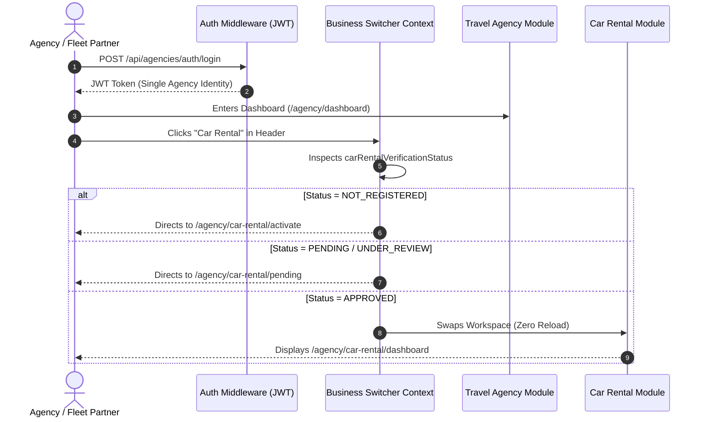
```mermaid
sequenceDiagram
    autonumber
    actor Provider as Agency / Fleet Partner
    participant Auth as Auth Middleware (JWT)
    participant Switcher as Business Switcher Context
    participant AgencyMod as Travel Agency Module
    participant CarRentalMod as Car Rental Module

    Provider->>Auth: POST /api/agencies/auth/login
    Auth-->>Provider: JWT Token (Single Agency Identity)
    Provider->>AgencyMod: Enters Dashboard (/agency/dashboard)
    Provider->>Switcher: Clicks "Car Rental" in Header
    Switcher->>Switcher: Inspects carRentalVerificationStatus
    alt Status = NOT_REGISTERED
        Switcher-->>Provider: Directs to /agency/car-rental/activate
    else Status = PENDING / UNDER_REVIEW
        Switcher-->>Provider: Directs to /agency/car-rental/pending
    else Status = APPROVED
        Switcher->>CarRentalMod: Swaps Workspace (Zero Reload)
        CarRentalMod-->>Provider: Displays /agency/car-rental/dashboard
    end
```

---

### 18.3 Business Module Hierarchy

Each module operates independently with dedicated operational tools while reusing platform-wide services:

```text
├── Travel Agency Module
│   ├── Dashboard (/agency/dashboard)
│   ├── Package Wizard & Catalog (/agency/packages)
│   ├── Bookings & Reservations (/agency/bookings)
│   ├── Dispatch & Trip Manifests (/agency/trips)
│   ├── Customer CRM (/agency/customers)
│   ├── Real-Time Inbox (/agency/messages) [SHARED]
│   ├── Financial Telemetry (/agency/finance)
│   ├── Notifications (/agency/notifications) [SHARED]
│   └── Profile & Verification (/agency/profile)
│
└── Car Rental Module
    ├── Fleet Overview Dashboard (/agency/car-rental/dashboard)
    ├── Fleet Catalog & Listing CRUD (/agency/car-rental/cars)
    ├── Reservations & Status Actions (/agency/car-rental/bookings)
    ├── Schedule & Availability Grid (/agency/car-rental/calendar)
    ├── Chauffeur Roster & Licenses (/agency/car-rental/drivers)
    ├── Fleet Revenue & Utilization (/agency/car-rental/analytics)
    ├── Real-Time Customer Chat (/agency/messages) [SHARED]
    ├── Notifications Center (/agency/notifications) [SHARED]
    └── Rental Brand & Dispatch Settings (/agency/car-rental/settings)
```

---

### 18.4 Zero-Reload Workspace Switching Architecture
Agencies with multiple business verticals switch workspaces dynamically within the UI without logging into separate accounts:
1. **Dynamic Navigation**: `DesktopSidebar` and `BottomNavigation` adapt links, icons, and portal branding (`TRAVEL AGENCY PORTAL` vs `CAR RENTAL PORTAL`) based on `activeBusiness`.
2. **Context Persistence**: `ActiveBusinessContext` persists current active workspace in session storage and synchronizes route changes bidirectionally.
3. **Backend Alignment**: `POST /api/agencies/car-rental/switch-business` records active operational mode in the `agencies` document.
4. **Zero Page Disruption**: No full page reloads, no loss of application state, no token regeneration.

---

### 18.5 Onboarding & Vertical Registration Standard
New business registrations allow immediate or progressive vertical selection:

```mermaid
graph TD
    Start[Agency Onboarding Portal] --> Choice{Select Business Type}
    Choice -->|Travel Agency| RegTA[Agency Profile & Tour Documents]
    Choice -->|Car Rental| RegCR[Fleet Profile & Commercial Licenses]
    Choice -->|Both| RegBoth[Unified Agency & Car Rental Onboarding]

    RegTA --> SuperAdmin[Super Admin Review Queue]
    RegCR --> SuperAdmin
    RegBoth --> SuperAdmin

    SuperAdmin -->|Independent Decision| AppTA[Approve Tour Operations]
    SuperAdmin -->|Independent Decision| AppCR[Approve Fleet Operations]
```

- Existing agencies can activate Car Rental at any time via the one-click **Activate Car Rental** workflow (`/agency/car-rental/activate`) without re-entering already-provided corporate details.
- Super Admin verifies and approves each business vertical independently. Rejecting or approving Car Rental has zero impact on the provider's active Travel Agency status.

---

### 18.6 Shared Systems Architecture
The following core infrastructure components are platform-wide singletons and must **never** be duplicated per vertical:
- **Authentication**: Single JWT issuance, token verification, password recovery, session handling.
- **Omnichannel Notification Center**: Universal notification dispatching to database, WebSockets, and email.
- **Messaging System**: Reuses `conversations` and `messages` collections; customer conversations link seamlessly regardless of whether the inquiry is about a tour package or a car rental.
- **Payment & Settlement Pipeline**: Unified payment gateways (advance token deposits, balance collection, payout bank routing).
- **User Management**: Unified customer traveler accounts, KYC, saved companions.
- **Cloudinary Storage**: Central media folder organization (`/agencies/:id/fleet`, `/agencies/:id/packages`).
- **Audit Logs**: All vertical administrative actions log to the universal `audit_logs` collection.
- **Roles & Permissions (RBAC)**: Common permission validation layers across API endpoints.

---

### 18.7 Database Architecture & Collection Boundaries

#### Permanent Immutability Rule
Existing collections must **never** be renamed, recreated, or restructured destructively:
- `users`
- `agencies`
- `packages`
- `bookings`
- `notifications`
- `messages`
- `payments`

#### Expansion Protocol
When expanding capabilities:
1. Prefer extending primary documents (`AgencyModel` extended with `businessTypes`, `activeBusiness`, `carRentalVerificationStatus`, `carRentalProfile`).
2. Only introduce new collections when genuine schema differentiation is required:
   - `cars`: Vehicle inventory, fuel types, transmission, seating, daily rates, availability.
   - `car_bookings`: Vehicle reservation lifecycle, pickup/drop locations, split payment tracking, driver assignment.
   - `car_reviews`: Vehicle-specific customer ratings and verified reviews.
3. Maintain referential integrity: All new collections reference the root `agencyId` foreign key.

---

---

### 18.9 Partner Onboarding Architecture Specification (One Business at a Time + In-Dashboard Expansion)

Partners register for **one business vertical at a time** through dedicated, specialized onboarding flows. Multi-business ownership is achieved naturally via **in-dashboard expansion**:

```
                          ┌──────────────────────────┐
                          │   Partner Landing Page   │
                          │   /agency / /partner     │
                          └─────────────┬────────────┘
                                        │ Click "Get Started"
                                        ▼
                          ┌──────────────────────────┐
                          │ Choose Business Vertical │
                          │ /partner/select-business │
                          └──────┬────────────┬──────┘
                     ┌───────────┘            └───────────┐
                     ▼                                    ▼
           ① Travel Agency                        ② Car Rental Provider
           ┌───────────────────────┐              ┌─────────────────────────┐
           │ Agency Onboarding     │              │ Car Rental Onboarding   │
           │ /agency/onboarding/*  │              │ /partner/car-rental/    │
           │ - Pure tour questions │              │   onboarding            │
           │ - KYC & Bank Details  │              │ - Fleet Specs & Permits │
           └───────────┬───────────┘              └───────────┬─────────────┘
                       │                                      │
                       ▼                                      ▼
           ┌───────────────────────┐              ┌─────────────────────────┐
           │ Status: PENDING       │              │ Status: PENDING         │
           │ Admin Verification    │              │ Admin Verification      │
           └───────────┬───────────┘              └───────────┬─────────────┘
                       │                                      │
                       ▼                                      ▼
           ┌───────────────────────┐              ┌─────────────────────────┐
           │ Agency Dashboard      │              │ Car Rental Dashboard    │
           │ /agency/dashboard     │              │ /agency/car-rental/dash │
           └───────────┬───────────┘              └───────────┬─────────────┘
                       │                                      │
                       │ "Expand Your Business"               │ "Expand Your Business"
                       │ [Start a Car Rental Business]        │ [Start a Travel Agency]
                       ▼                                      ▼
             Launches Car Rental                    Launches Travel Agency
             Activation (/activate)                 Onboarding (/business)
                       │                                      │
                       └──────────────────┬───────────────────┘
                                          │ Both Verified
                                          ▼
                            Unified Dashboard Switching
                           [Agency | Car Rental Toggle]
                             (Same Login, Same JWT)
```

#### Key Implementation Details:
1. **Business Selection Gate (`/partner/select-business`, `/partner`)**:
   - Zero "Both" option. Partners choose ① Travel Agency or ② Car Rental Provider.
   - Clean, modern 2-column layout.
2. **Agency Onboarding Isolation**:
   - The "Business Type" dropdown is completely removed. Form state defaults `businessType = 'Travel Agency'`.
   - Zero fleet, vehicle, or chauffeur questions appear in agency onboarding.
3. **Standalone Car Rental Onboarding**:
   - 4-step wizard at `/partner/car-rental/onboarding` submitting to public `POST /api/agencies/car-rental/onboard`.
   - Generates tracking ID `ATP-CR-YYYY-XXXXXX`, hashes password with bcrypt, initializes status as `PENDING`.
4. **In-Dashboard Expansion ("Expand Your Business")**:
   - **Agency Dashboard**: Displays an "Expand Your Business — Start a Car Rental Business" card if car rental is not yet approved. Clicking navigates to `/agency/car-rental/activate` (or status tracking if under review).
   - **Car Rental Dashboard**: Displays an "Expand Your Business — Start a Travel Agency" card if travel agency is not yet approved. Clicking navigates to `/agency/onboarding/business` (or status tracking if under review).
   - Backend `submitOnboarding()` explicitly permits an existing Car Rental provider to expand into Travel Agency without duplicate account conflicts, merging `'agency'` into `businessTypes`.
5. **Conditional Dashboard Switching**:
   - `BusinessSwitcher` capsule appears in the header **ONLY** after the partner owns **both** businesses and both are verified (`verificationStatus === 'APPROVED'` and `carRentalStatus === 'APPROVED'`).
   - Switches workspaces instantaneously with 0 reloads and 0 re-authentications under the same JWT.

---

### 18.10 Business Expansion UX Refinements & Settings Hub

To provide a non-intrusive, production-grade multi-business experience, the business expansion UX adheres to the following standards:

#### 1. Non-Intrusive & Dismissible Expansion Cards
- **Soft Tone**: The expansion prompt uses friendly, optional copy (*"Reach more travelers by offering car rental services alongside your travel agency"*).
- **Two-Action Controls**:
  - `[Start Now]`: Directly routes to the activation/onboarding wizard.
  - `[Maybe Later]`: Gracefully dismisses the banner immediately with smooth exit animations.
- **Persistent Dismissal**: Dismissal state is saved to `localStorage` (`apnatrip_agency_dismiss_car_rental_expansion` / `apnatrip_car_rental_dismiss_agency_expansion`), preventing the prompt from repeatedly nagging users across sessions or page reloads.

#### 2. Permanent "Business Services" Management in Settings
Inside `AgencySettingsPage.tsx`, providers have a permanent centralized management hub (`BusinessServicesCard.tsx`) regardless of banner dismissal:
- **Active Services**: Clear operational status badges (Active, In Review, Not Enabled).
- **Service Activation**: Providers with un-enabled services can click `+ Add Service` anytime to launch vertical onboarding without needing a dashboard banner.
- **Future Roadmap Verticals Display**:
  - *Hotels & Resorts* (Beds, villas, inventory management)
  - *Homestays & Villas* (Vacation rentals & guest hospitality)
  - *Activities & Experiences* (Trekking, adventures, sightseeing tours)
  - *Taxi Network* (Point-to-point city cabs & airport transfers)
  - *Local Guides* (Expert tour escort and cultural host services)
  - All future verticals render with disabled "Coming Soon" badges and informative value propositions.

#### 3. Responsive Workspace Switcher & Mobile Bottom Sheet
- **Desktop (`sm:block`)**: Elegant dropdown capsule displaying active vertical with checkmark and available vertical with swap action.
- **Mobile (`< sm`)**: Clicking the switcher capsule triggers an accessible, thumb-friendly native **Bottom Sheet** modal (`Select Workspace`):
  - Darkened backdrop overlay with touch-dismiss.
  - Centered drag handle pill.
  - Card-based workspace selectors with active green checkmarks and subtle ring borders.
  - Full-width `Cancel` action button and background scroll locking.
  - Zero page reload, zero re-authentication, instantaneous workspace transition.

---

### 18.11 Dedicated Admin Car Rental Approval Architecture

To maintain strict operational boundary isolation between travel agency tour operations and commercial car rental fleets, the Super Admin Panel provides dedicated verification workflows for each vertical:

#### 1. Isolated Admin Verification Queues
- **Agency Approvals**: Available at `/admin/verification-pending` and `/super-admin/agency-requests`. Focuses on tour operator licenses, package itineraries, tour guide compliance, and traveler safety standards.
- **Car Rental Approvals**: Dedicated at `/admin/car-rental-approvals` and `/super-admin/car-rental-approvals`. Focuses on commercial vehicle permits (All-India Tourist Permit, RTO permits), vehicle registration certificates (RC), fitness certificates, pollution certificates, comprehensive fleet insurance, and chauffeur driver licenses.
- **Admin Sidebar Verification Section**:
  - `Agency Approvals` with dynamic live count badge of pending agency requests.
  - `Car Rental Approvals` with dynamic live count badge of pending commercial fleet requests.

#### 2. Backend-Driven Architecture & Query Standard
- **No Mock/Dummy Data**: 100% powered by live MongoDB collections (`agencies`, `cars`, `audit_logs`, `notifications`).
- **Data Model Topology**:
  - Provider record: `AgencyModel` where `businessTypes: 'car_rental'` or `carRentalVerificationStatus !== 'NOT_REGISTERED'`.
  - Registered fleet inventory: `CarModel.find({ agencyId: agency._id })` dynamically joined to provide vehicle counts, vehicle cards with photos and specifications (fuel, transmission, seats, daily price, chauffeur assigned).
  - Driver roster: Extracted from commercial vehicle assignments (`car.driver`) with verification statuses and license numbers.
  - Uploaded documents: Queried from `carRentalProfile.documents` (RC, Fleet Insurance, Tourist Permits, Chauffeur Licenses, PAN, GST, Bank settlement details).

#### 3. 4-Tab Approval Queue & Filter Matrix
- **Queue Tabs**:
  1. `Pending`: `carRentalVerificationStatus IN ['PENDING', 'UNDER_REVIEW']`
  2. `Approved`: `carRentalVerificationStatus === 'APPROVED'`
  3. `Needs Changes`: `carRentalVerificationStatus === 'CHANGES_REQUESTED'`
  4. `Rejected`: `carRentalVerificationStatus === 'REJECTED'`
  5. `All`: Universal queue
- **Multi-Dimensional Filters**: Search by provider name, owner, email, phone, application ID (`ATP-CR-YYYY-XXXXXX`), city, state, and date range.

#### 4. Multi-Stage Action Lifecycle & Real-Time Notifications
- **Approve**: Sets `carRentalVerificationStatus = 'APPROVED'`, adds `'car_rental'` to `businessTypes`, sets `carRentalApprovedAt` and `carRentalApprovedBy`, activates partner account if needed, logs administrative audit record (`module: 'CarRental'`, `action: 'Car Rental Approved'`), and dispatches real-time in-app notification to provider.
- **Reject**: Enforces mandatory rejection reason, sets status to `'REJECTED'`, logs audit record, and dispatches notification and email.
- **Request Changes**: Admin flags specific compliance issues (`RC Expired`, `Fleet Insurance Missing`, `Chauffeur License Unclear`, `Commercial Permit Missing`, `Bank Details Incorrect`) with custom instructions. Sets status to `'CHANGES_REQUESTED'`, updates timeline, and notifies provider to edit and resubmit their submission.
- **Suspend & Reopen Review**: Allows temporary freeze of fleet operations or resetting status back to active review queue.

---

## 25. Agency Dashboard Car Rental Integration Architecture (Phase 2)

```mermaid
graph TD
    subgraph Agency Unified Frontend
        TOGGLE[BusinessSegmentedToggle layoutId:businessSegmentedPill]
        SIDEBAR[DesktopSidebar Dynamic Nav Menus]
        DASH_A[Travel Agency Dashboard]
        DASH_CR[Car Rental Command Center]
        FLEET[Fleet & Vehicles Directory]
        DRAWER_V[VehicleDetailsDrawer]
        OVERVIEW[Fleet Overview & Matrix]
        DRAWER_O[OwnerProfileDrawer]
        BOOKINGS[Rental Reservations & Dispatch]
        DRIVERS[Driver Directory]
        DRAWER_D[DriverDetailsDrawer]
        CUSTOMERS[Rental CRM]
        ANALYTICS[Telemetry & Intelligence]
    end

    subgraph Backend Routing & Controller Layer
        API[/api/agencies/car-rental/*]
        CTRL[AgencyCarRentalController]
        SVC[AgencyCarRentalService]
    end

    subgraph MongoDB Persistence Layer
        M_CAR[(cars collection - CarModel)]
        M_DRIVER[(drivers collection - DriverModel)]
        M_BOOKING[(car_bookings collection - CarBookingModel)]
        M_AGENCY[(agencies collection - AgencyModel)]
    end

    TOGGLE --> DASH_A
    TOGGLE --> DASH_CR
    SIDEBAR --> FLEET
    SIDEBAR --> OVERVIEW
    SIDEBAR --> BOOKINGS
    SIDEBAR --> DRIVERS
    SIDEBAR --> CUSTOMERS
    SIDEBAR --> ANALYTICS

    FLEET --> DRAWER_V
    OVERVIEW --> DRAWER_O
    DRIVERS --> DRAWER_D

    DASH_CR --> API
    FLEET --> API
    OVERVIEW --> API
    BOOKINGS --> API
    DRIVERS --> API
    CUSTOMERS --> API
    ANALYTICS --> API

    API --> CTRL --> SVC
    SVC --> M_CAR
    SVC --> M_DRIVER
    SVC --> M_BOOKING
    SVC --> M_AGENCY
```

### Key Architectural Tenets:
1. **Single Account & Single Dashboard Shell**: Reuses the authenticated agency session and core dashboard layout without page reloads or layout duplication.
2. **Context-Synchronized Navigation**: `ActiveBusinessContext` stores the active mode (`'agency'` | `'car_rental'`) with automatic sync to route changes and local storage persistence.
3. **100% MongoDB-Backed Telemetry**: All 6 KPI tiles, fleet utilization matrices, customer CRM rows, driver rosters, and analytics telemetry query directly from MongoDB Atlas.
4. **Slide-over Detailed Drawers**: Modular slide-over sheets for Vehicles (`VehicleDetailsDrawer`), Owners (`OwnerProfileDrawer`), and Drivers (`DriverDetailsDrawer`) provide instant inspection of RC, permits, compliance certs, and lifetime revenue without navigating away from tables.

---

## 32. Global Search & Deep Linking System Architecture

The Global Search system functions as an ecosystem-wide navigation index spanning 8 distinct MongoDB collections:

```mermaid
graph TD
    UI[Global Search Input / Top Navigation] --> USE_SEARCH[useSearch Hook]
    USE_SEARCH --> API_SEARCH[GET /api/search?q=...]
    API_SEARCH --> SVC[search.service.ts SearchService.globalSearch]
    
    subgraph Parallel Aggregation & Querying
        SVC --> P_PKG[PackageModel]
        SVC --> P_DEST[PackageModel - destinations]
        SVC --> P_AGC[AgencyModel]
        SVC --> P_CAR[CarModel]
        SVC --> P_USR[UserModel]
        SVC --> P_TRIP[TripModel]
        SVC --> P_BKG[BookingModel]
        SVC --> P_CBKG[CarBookingModel]
        SVC --> P_CONV[ConversationModel]
    end

    SVC --> CANONICAL[Canonical Route Formatter]
    CANONICAL --> RES[Standardized Unified Results JSON]
    
    RES --> SEARCH_PAGE[SearchPage.tsx & SearchResults.tsx]
    SEARCH_PAGE --> CARDS[Result Cards: Package, Agency, Destination, Car, Traveler, Booking]
    CARDS --> NAV[navigate item.route || item.targetUrl]
    
    NAV --> ROUTER[React Router v6 - UserRoutes.tsx]
    ROUTER --> D_PKG[/packages/:id -> PackageDetailsPage]
    ROUTER --> D_DEST[/destinations/:id -> DestinationDetailsPage]
    ROUTER --> D_AGC[/agency/:id -> AgencyDetailsPage]
    ROUTER --> D_CAR[/cars/:id -> VehicleDetailsPage]
    ROUTER --> D_BKG[/bookings/:id -> BookingDetailsPage]
    ROUTER --> D_USR[/traveler/:id -> TravelerProfilePage]
    ROUTER --> D_TRIP[/trips/:id -> TripDetailsPage]
    ROUTER --> D_CHAT[/chat/:id -> ChatModal / Messenger]
```

### Routing & Deep Linking Standard
- **Direct Link Accessibility**: Every entity route supports direct browser navigation, bookmarks, and hard page refreshes (F5).
- **Dual Param Resolution**: Destination pages support both singular and plural parameter bindings (`:id`, `:packageId`, `:destinationId`, `:agencyId`, `:userId`, `:bookingId`, `:tripId`).
- **Zero Refresh Redirection**: Result cards bind directly to canonical route targets; `navigate()` never triggers a `/search` loop or empty state.


