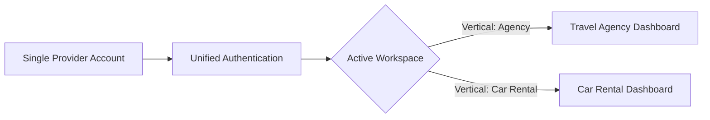

# ApnaTrip / Travel OS — Developer Handbook & Implementation Guide

This handbook is the official engineering guide for building, extending, and maintaining features within the **ApnaTrip Multi-Business Platform**. Every developer and AI assistant contributing to this codebase must adhere strictly to these patterns and rules.

---

## 1. Multi-Business Architectural Paradigm

ApnaTrip is a **multi-business travel operating system**. A single provider account can operate in one or more business verticals:
- **Travel Agency**: Tour packages, itineraries, group departures, traveler manifests.
- **Car Rental**: Fleet inventory, point-to-point and hourly vehicle rentals, commercial chauffeurs.
- **Both**: Unified provider operating both tour packages and rental fleet.



### Key Principles
1. **Single Authentication Only**: Never build a secondary login screen, secondary JWT, or duplicate provider accounts. One business account owns all vertical capabilities.
2. **Zero-Reload Workspace Switching**: Switching between verticals occurs inside the UI without full page reloads, session resets, or token regeneration.
3. **Existing Agency Invariance**: The Travel Agency vertical is production-active. All existing agency routes, controllers, and queries must remain 100% functional and backward-compatible.
4. **Permanent Collection Immutability**: Core MongoDB collections (`users`, `agencies`, `packages`, `bookings`, `notifications`, `messages`, `payments`) must **never** be renamed, deleted, or recreated.

---

## 2. Working with Multi-Business Verticals (Frontend)

### The `useActiveBusiness` Hook
All multi-business state is governed by `ActiveBusinessContext` (`frontend/src/agency-panel/context/ActiveBusinessContext.tsx`):

```tsx
import { useActiveBusiness } from '../context/ActiveBusinessContext';

export const MyComponent: React.FC = () => {
  const { 
    activeBusiness,        // 'agency' | 'car_rental'
    carRentalStatus,       // 'NOT_REGISTERED' | 'PENDING' | 'UNDER_REVIEW' | 'APPROVED' | 'REJECTED'
    isCarRentalApproved,   // boolean
    switchBusiness,        // (target: 'agency' | 'car_rental') => void
  } = useActiveBusiness();

  return (
    <div>
      <p>Current Workspace: {activeBusiness}</p>
      <button onClick={() => switchBusiness('car_rental')}>
        Switch to Car Rental
      </button>
    </div>
  );
};
```

### How Workspace Switching Works
1. If the user requests `'car_rental'` and `carRentalStatus === 'NOT_REGISTERED'`, `switchBusiness()` automatically routes them to `/agency/car-rental/activate`.
2. If `carRentalStatus === 'PENDING'` or `'UNDER_REVIEW'`, it routes to `/agency/car-rental/pending`.
3. If `carRentalStatus === 'APPROVED'`, it sets `activeBusiness = 'car_rental'`, updates `localStorage`, and navigates to `/agency/car-rental/dashboard`.
4. `DesktopSidebar` and `BottomNavigation` automatically read `activeBusiness` and dynamically update menu items, icons, and portal branding (`TRAVEL AGENCY PORTAL` vs `CAR RENTAL PORTAL`).

---

## 3. Database Modeling & Expansion Protocol

### Primary Document Extension (`agencies` collection)
Vertical registration and profiles attach directly to `AgencyModel`:

```typescript
// backend/src/models/agency.model.ts
{
  businessTypes: ['agency', 'car_rental'],
  activeBusiness: 'agency', // or 'car_rental'
  carRentalVerificationStatus: 'NOT_REGISTERED' | 'PENDING' | 'UNDER_REVIEW' | 'APPROVED' | 'REJECTED',
  carRentalProfile: {
    businessName: string,
    fleetSize: number,
    operatingCities: string[],
    emergencyContact: string,
    workingHours: string,
    description: string,
    documents: Array<{ id: string, name: string, fileUrl: string, status: string }>,
    bankDetails: {
      accountHolderName: string,
      bankName: string,
      accountNumber: string,
      ifscCode: string,
      upiId: string,
    }
  },
  carRentalApprovedAt: Date,
  carRentalApprovedBy: ObjectId,
  carRentalRejectionReason: string,
}
```

### When to Create a New Collection
Only create a new collection when domain logic requires distinct schema models with their own independent lifecycles:
- ✅ `cars`: Vehicle attributes, fuel, transmission, seating, daily prices, availability toggles.
- ✅ `car_bookings`: Vehicle reservations, pickup/drop dates & locations, token split payments, driver credentials.
- ✅ `car_reviews`: Vehicle-specific customer ratings and verified reviews.
- ❌ **Prohibited**: Creating duplicate `agency_users`, duplicate `agency_messages`, or duplicate `agency_payments`.

### Foreign Key Conventions
Every vertical-specific entity MUST maintain referential integrity to the root business account:
```typescript
agencyId: {
  type: Schema.Types.ObjectId,
  ref: 'Agency',
  required: true,
  index: true,
}
```

---

## 4. Shared Platform Systems (Never Duplicate)

| Shared System | Location | Integration Method |
|---|---|---|
| **Authentication** | `backend/src/middlewares/agencyAuth.middleware.ts` | Wrap routes with `agencyAuthMiddleware`. Extract identity from `req.agency._id`. |
| **Notifications** | `backend/src/services/notification.service.ts` | Call `notificationService.createNotification()` to push in-app alerts and trigger Socket.IO events. |
| **Messaging / Chat** | `backend/src/models/conversation.model.ts` | Reuses existing conversations. Messages link to `agencyId` regardless of vertical. |
| **Payments** | `backend/src/models/payment.model.ts` | Universal gateway handling advance tokens and settlement payouts. |
| **Media / Cloudinary** | `backend/src/services/media.service.ts` | Upload to designated Cloudinary folders (e.g. `/agencies/:id/fleet`). |
| **Audit Logs** | `backend/src/models/auditLog.model.ts` | Call `auditLogService.logAction()` on all administrative mutations. |

---

## 5. Coding Standards & Pre-Flight Checklist

Before proposing or finalizing any pull request:
1. **Compilation Check**:
   - Backend: `cd backend && npx tsc --noEmit` must return **0 errors**.
   - Frontend: `cd frontend && npx tsc --noEmit` must return **0 errors**.
2. **Zero Mock Data**: Ensure all pages fetch real data from MongoDB Atlas via verified API endpoints.
4. **Git Safety Rule**: Never execute `git push` unless explicitly commanded by the user.

---

## 6. Traveler KYC & One-Time Travel Profile Rules

### Invariant 1: Zero Frontend State Derivation
The frontend must **never** infer, calculate, or guess whether a user is KYC verified. All status badges, CTAs, and membership cards must consume backend fields directly (`user.isKycVerified`, `profile.verificationStatus`, `kyc.status`).

### Invariant 2: Parent Status Is Document-Derived
In the backend, overall KYC status is strictly calculated from child document statuses via `adminKycService.deriveParentStatus()`:
- If ANY document is `Rejected` $\implies$ parent status is `Rejected`.
- If ANY document is `Pending` $\implies$ parent status is `Pending`.
- If ALL documents are `Verified` $\implies$ parent status is `Verified`.
- It is strictly forbidden to mark a parent KYC as `Verified` while any document remains in `Pending` review.

### Invariant 3: Mandatory vs. Optional Documents
- **Mandatory (Either/Or):** Aadhaar Card (Front + Back) OR Voter ID (Front only).
- **Optional:** Driving Licence (Front + Back), Passport (Photo page only).
- **Prohibited:** Visa collection is NOT permitted during traveler profile setup.

### Invariant 4: Traveler Home Screen Card Lifecycle
`TravelProfileDashboardCard` must adhere to the 4-state lifecycle:
- **In Progress:** Promotional card with progress bar and "Complete Travel Profile" CTA.
- **Pending Verification:** Compact informational card (~45% height reduction), amber badge, concise text, "Manage" button.
- **Verified:** Return `null` to eliminate empty DOM wrappers and margin gaps, allowing the Home feed to reflow naturally.
- **Rejected:** "Verification Failed" alert card with the exact administrative reason and "Re-upload Documents" CTA.

### Invariant 5: Automated Silver Tier Membership Unlock
When an admin approves a traveler's KYC, the backend must automatically upgrade their membership from `Free` to `Silver` for 1 year, record an immutable audit log, and dispatch an in-app notification.
