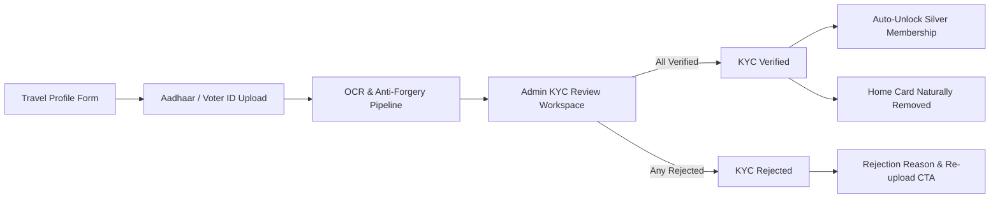

# ApnaTrip (TravelOS) — Enterprise Multi-Business Travel Platform

ApnaTrip (TravelOS) is an enterprise-grade multi-business travel operating system designed for managing group tour packages, point-to-point and hourly vehicle rental fleets, customer bookings, verified identity compliance, and unified administrative governance.

---

## 1. Architectural Highlights

- **Multi-Business Provider Model:** A single provider account operates both **Travel Agency** (curated group departures, tour packages) and **Car Rental** (vehicle fleets, chauffeurs) verticals with zero-reload workspace switching.
- **Enterprise Traveler KYC & Travel Profile System:** Fully backend-driven identity verification pipeline with automated OCR, EXIF forgery checks, document-level derivation, admin review workspace, and automated Silver Membership tier unlock.
- **Super Admin Control Center:** Unified compliance and moderation workstation for approving agency applications, car rental fleets, package catalogs, and traveler identity verifications.
- **Progressive Traveler PWA:** High-performance responsive traveler experience with dynamic CMS discovery, 1-click verified bookings, companion travel manifests, and real-time flight/trip widgets.

---

## 2. Technology Stack

### Backend
- **Runtime:** Node.js (v18+) with TypeScript
- **Framework:** Express.js with custom async route handlers and error middleware
- **Database:** MongoDB Atlas with Mongoose ODM (30+ collections, indexed relational mappings)
- **Real-Time:** Socket.IO for customer support, live agency messaging, and trip updates
- **Object Storage & CDN:** Cloudinary (secure private folders for KYC and media)
- **Validation:** Zod schemas for runtime request payload verification

### Frontend
- **Framework:** React 18 + Vite + TypeScript
- **Styling:** Vanilla CSS + Tailwind CSS (dynamic design tokens, responsive breakpoints)
- **Motion & Gestures:** Framer Motion animation suite
- **Icons:** Lucide React
- **State Management:** Modular React Contexts (`ActiveBusinessContext`, `AuthContext`, `ThemeContext`)

---

## 3. Traveler KYC & One-Time Travel Profile Verification

The KYC verification flow is 100% backend-driven and ensures complete compliance across the platform.



### Key KYC Invariants
1. **Mathematical Parent Status Derivation:**
   - If no required documents exist $\to$ `None` (`NOT_SUBMITTED`).
   - If ANY required document is `Rejected` $\to$ Overall KYC is `Rejected`.
   - Else if ANY required document is `Pending` $\to$ Overall KYC is `Pending` (`UNDER_REVIEW`).
   - Else if ALL required documents are `Verified` $\to$ Overall KYC is `Verified`.
   - The frontend never infers or hardcodes status.
2. **Document Requirements:**
   - **Mandatory (Either):** Aadhaar Card (Front + Back) OR Voter ID Card (Front only).
   - **Optional:** Driving Licence (Front + Back), Passport (Photo page only).
   - **Excluded:** Visa is NOT collected during traveler profile setup.
3. **Admin Review Workspace (`UserDetailsDrawer`):**
   - Telemetry Header (Risk score, verification source, face match %, doc match %, govt validation).
   - Interactive `DocumentSummary` bar (counters for Uploaded, Verified, Pending, Rejected, Expired).
   - Review Cards with masked document numbers (`•••• •••• 4289`), expiry date, country, and review decisions.
   - Enterprise `DocumentPreviewModal` with zoom (+/-), 90° rotation, brightness/contrast filters, prev/next pagination, and inline approve/reject buttons.
   - Chronological audit timeline with automated and manual stage tracking.
4. **Traveler Home Lifecycle (`TravelProfileDashboardCard`):**
   - **State 1 (In Progress):** Completion card with "Complete Travel Profile" CTA.
   - **State 2 (Pending Verification):** Compact informational card (~45% reduced height) without promotional clutter.
   - **State 3 (Verified):** Automatically removed from Home screen (`return null`), naturally reflowing the page.
   - **State 4 (Rejected):** "Verification Failed" warning with administrative reason and "Re-upload Documents" CTA.
5. **Membership Unlock:**
   - Approval of KYC automatically upgrades traveler accounts from `Free` to **Silver Tier Membership** for 1 year, enabling 1-click booking and 5% discounts.

*For complete technical details, see [`docs/KYC_TRAVEL_PROFILE_SPECIFICATION.md`](docs/KYC_TRAVEL_PROFILE_SPECIFICATION.md).*

---

## 4. Repository Structure

```text
APNA_TRIPV4/
├── backend/
│   ├── src/
│   │   ├── config/           # Database, Cloudinary, socket configurations
│   │   ├── controllers/      # REST API controllers
│   │   ├── models/           # Mongoose schemas (userKyc, travelProfile, user, agency, etc.)
│   │   ├── routes/           # Express router endpoints
│   │   └── services/         # Business logic (adminKyc.service, travelProfile.service, etc.)
│   └── scripts/              # Migration, verification, and seeding scripts
│
├── frontend/
│   └── src/
│       ├── admin-panel/      # Super Admin Workspace (KYC, Agencies, Approvals, CMS)
│       ├── agency-panel/     # Agency & Car Rental Multi-Business Portal
│       ├── user-panel/       # Traveler PWA (Home, Travel Profile, Packages, Rentals)
│       ├── services/         # Axios API clients
│       └── types/            # TypeScript type contracts
│
├── docs/
│   └── KYC_TRAVEL_PROFILE_SPECIFICATION.md  # Definitive KYC System Architecture Spec
├── ARCHITECTURE.md           # Master System Architecture Document
├── DEVELOPMENT_GUIDE.md      # Engineering Handbook & Protocol
├── PROJECT_STRUCTURE.md      # Comprehensive Directory & Module Mapping
└── ROADMAP.md                # Strategic Roadmap
```

---

## 5. Getting Started

### Prerequisites
- Node.js 18+
- npm 9+
- MongoDB Atlas connection string
- Cloudinary credentials

### Backend Setup
```bash
cd backend
npm install
npm run dev
# Server running on http://localhost:5000
```

### Frontend Setup
```bash
cd frontend
npm install
npm run dev
# App running on http://localhost:5173
```

---

## 6. Documentation Index

- [KYC & Travel Profile Master Specification](docs/KYC_TRAVEL_PROFILE_SPECIFICATION.md)
- [System Architecture Blueprint](ARCHITECTURE.md)
- [Developer Implementation Guide](DEVELOPMENT_GUIDE.md)
- [Project Directory Layout](PROJECT_STRUCTURE.md)
- [Technical Roadmap](ROADMAP.md)
