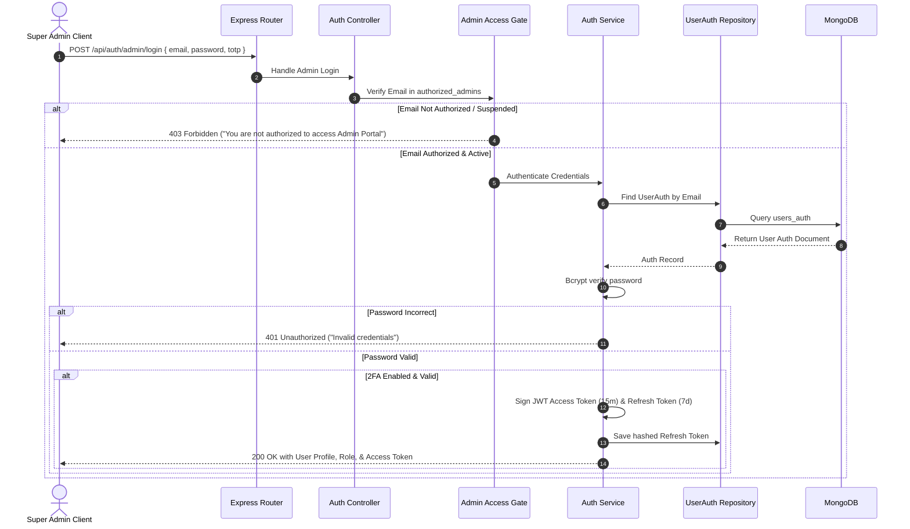

# Travel OS — Master Backend Architecture Blueprint

This document defines the complete backend architectural blueprint, directory layout, design patterns, security frameworks, database standards, request lifecycles, and coding standards for the **Travel OS** marketplace backend.

---

## 1. Complete Project & Directory Structure

```text
backend/
├── src/
│   ├── config/               # Configuration modules (Environment, DB, Cloudinary, JWT, Mail, CORS, Swagger)
│   │   ├── env.config.ts     # Zod-validated environment schema & typed configuration object
│   │   ├── db.config.ts      # MongoDB connection pool & Mongoose settings
│   │   ├── jwt.config.ts     # Secret keys, expiration durations, and token algorithms
│   │   ├── cloudinary.config.ts # Media storage credentials & upload presets
│   │   ├── mail.config.ts    # Nodemailer SMTP transporter configuration
│   │   ├── cors.config.ts    # Allowed origins, headers, and credential policies
│   │   ├── swagger.config.ts # OpenAPI / Swagger JSDoc definitions
│   │   └── logger.config.ts  # Winston multi-transport logging setup
│   │
│   ├── constants/            # Global application constants, status enums, and HTTP codes
│   │   ├── enums.constant.ts # Status enums for all 23 modules
│   │   ├── http.constant.ts  # HTTP status code constants & error symbols
│   │   ├── rbac.constant.ts  # Default role definitions & permission action bits
│   │   └── regex.constant.ts # Validated regex patterns (Email, Phone, GST, PAN, Slugs)
│   │
│   ├── controllers/          # Coordinate HTTP requests, delegate to Services, format responses
│   │   ├── auth.controller.ts
│   │   ├── user.controller.ts
│   │   ├── agency.controller.ts
│   │   ├── agencyKyc.controller.ts
│   │   ├── package.controller.ts
│   │   ├── trip.controller.ts
│   │   ├── booking.controller.ts
│   │   ├── payment.controller.ts
│   │   ├── finance.controller.ts
│   │   ├── review.controller.ts
│   │   ├── support.controller.ts
│   │   ├── community.controller.ts
│   │   ├── notification.controller.ts
│   │   ├── cms.controller.ts
│   │   ├── media.controller.ts
│   │   ├── report.controller.ts
│   │   ├── dashboard.controller.ts
│   │   ├── rbac.controller.ts
│   │   ├── adminAccess.controller.ts
│   │   ├── adminManagement.controller.ts
│   │   ├── auditLog.controller.ts
│   │   ├── settings.controller.ts
│   │   └── system.controller.ts
│   │
│   ├── services/             # Core business logic, transactions, orchestrations, and event triggers
│   │   ├── auth.service.ts
│   │   ├── user.service.ts
│   │   ├── agency.service.ts
│   │   ├── agencyKyc.service.ts
│   │   ├── package.service.ts
│   │   ├── trip.service.ts
│   │   ├── booking.service.ts
│   │   ├── payment.service.ts
│   │   ├── finance.service.ts
│   │   ├── review.service.ts
│   │   ├── support.service.ts
│   │   ├── community.service.ts
│   │   ├── notification.service.ts
│   │   ├── cms.service.ts
│   │   ├── media.service.ts
│   │   ├── report.service.ts
│   │   ├── dashboard.service.ts
│   │   ├── rbac.service.ts
│   │   ├── adminAccess.service.ts
│   │   ├── adminManagement.service.ts
│   │   ├── auditLog.service.ts
│   │   ├── settings.service.ts
│   │   └── system.service.ts
│   │
│   ├── repositories/         # Pure data access layer (Mongoose queries, aggregations, projections)
│   │   ├── base.repository.ts # Generic repository with CRUD, soft-delete, and pagination
│   │   ├── user.repository.ts
│   │   ├── agency.repository.ts
│   │   ├── agencyKyc.repository.ts
│   │   ├── package.repository.ts
│   │   ├── trip.repository.ts
│   │   ├── booking.repository.ts
│   │   ├── payment.repository.ts
│   │   ├── settlement.repository.ts
│   │   ├── review.repository.ts
│   │   ├── support.repository.ts
│   │   ├── community.repository.ts
│   │   ├── notification.repository.ts
│   │   ├── cms.repository.ts
│   │   ├── media.repository.ts
│   │   ├── rbac.repository.ts
│   │   ├── adminAccess.repository.ts
│   │   ├── adminSession.repository.ts
│   │   ├── auditLog.repository.ts
│   │   └── settings.repository.ts
│   │
│   ├── models/               # Mongoose schema definitions, field types, and document interfaces
│   │   ├── user.model.ts
│   │   ├── userAuth.model.ts
│   │   ├── agency.model.ts
│   │   ├── agencyKyc.model.ts
│   │   ├── package.model.ts
│   │   ├── trip.model.ts
│   │   ├── booking.model.ts
│   │   ├── payment.model.ts
│   │   ├── settlement.model.ts
│   │   ├── review.model.ts
│   │   ├── supportTicket.model.ts
│   │   ├── communityPost.model.ts
│   │   ├── notification.model.ts
│   │   ├── cmsBanner.model.ts
│   │   ├── cmsAnnouncement.model.ts
│   │   ├── cmsDestination.model.ts
│   │   ├── cmsFeaturedAgency.model.ts
│   │   ├── cmsCampaign.model.ts
│   │   ├── cmsPopup.model.ts
│   │   ├── cmsSection.model.ts
│   │   ├── mediaAsset.model.ts
│   │   ├── rbacRole.model.ts
│   │   ├── authorizedAdmin.model.ts
│   │   ├── adminSession.model.ts
│   │   ├── auditLog.model.ts
│   │   └── platformSetting.model.ts
│   │
│   ├── routes/               # Modular Express router definitions mounting middlewares and controllers
│   │   ├── index.ts          # Master API router aggregating all v1 sub-routes
│   │   ├── auth.routes.ts
│   │   ├── user.routes.ts
│   │   ├── agency.routes.ts
│   │   ├── package.routes.ts
│   │   ├── trip.routes.ts
│   │   ├── booking.routes.ts
│   │   ├── payment.routes.ts
│   │   ├── finance.routes.ts
│   │   ├── review.routes.ts
│   │   ├── support.routes.ts
│   │   ├── community.routes.ts
│   │   ├── notification.routes.ts
│   │   ├── cms.routes.ts
│   │   ├── media.routes.ts
│   │   ├── report.routes.ts
│   │   ├── dashboard.routes.ts
│   │   ├── rbac.routes.ts
│   │   ├── adminAccess.routes.ts
│   │   ├── adminManagement.routes.ts
│   │   ├── auditLog.routes.ts
│   │   ├── settings.routes.ts
│   │   └── system.routes.ts
│   │
│   ├── middlewares/          # Reusable Express request middlewares
│   │   ├── auth.middleware.ts        # JWT authentication & session context extraction
│   │   ├── adminGate.middleware.ts   # Super Admin Authorized Email IAM gate validation
│   │   ├── rbac.middleware.ts        # Granular role & permission matrix check
│   │   ├── validate.middleware.ts    # Zod schema validation middleware (Body, Query, Params)
│   │   ├── error.middleware.ts       # Global exception handler & error response envelope
│   │   ├── rateLimiter.middleware.ts # IP and account-level rate limiter
│   │   ├── requestLogger.middleware.ts # HTTP request/response latency logger
│   │   └── upload.middleware.ts      # Multer memory storage & MIME whitelist filter
│   │
│   ├── validations/          # Zod validation schemas per endpoint action (Create, Update, Query)
│   │   ├── auth.validation.ts
│   │   ├── user.validation.ts
│   │   ├── agency.validation.ts
│   │   ├── package.validation.ts
│   │   ├── booking.validation.ts
│   │   ├── payment.validation.ts
│   │   ├── cms.validation.ts
│   │   ├── rbac.validation.ts
│   │   ├── adminAccess.validation.ts
│   │   └── common.validation.ts     # Pagination, ID, and date range schemas
│   │
│   ├── utils/                # Pure reusable utility functions
│   │   ├── response.util.ts         # Unified success & pagination response formatters
│   │   ├── token.util.ts            # JWT signing, verification, and refresh token generator
│   │   ├── hash.util.ts             # Bcrypt password hashing and comparison
│   │   ├── slug.util.ts             # SEO URL slug generator with duplicate collision handler
│   │   ├── date.util.ts             # Date calculation, range parsing, and formatting
│   │   └── otp.util.ts              # Secure cryptographic numeric OTP generator
│   │
│   ├── helpers/              # High-level helper orchestrators
│   │   ├── email.helper.ts          # Email template compilation and transporter dispatch
│   │   ├── file.helper.ts           # Image compression, metadata extraction, format conversions
│   │   └── pagination.helper.ts     # Page/limit calculation and MongoDB skip/limit offsets
│   │
│   ├── jobs/                 # Scheduled background jobs & maintenance crons (Node-cron / BullMQ ready)
│   │   ├── index.ts                 # Master cron registry & scheduler initialization
│   │   ├── settlement.job.ts        # Daily midnight agency commission & payout processor
│   │   ├── campaignExpiry.job.ts    # Hourly promotion & banner status reconciliation
│   │   ├── sessionCleanup.job.ts    # Token expiration and closed session pruner
│   │   ├── reviewReminder.job.ts    # 24h post-trip traveler review notification sender
│   │   └── inventoryRelease.job.ts  # 15-minute unconfirmed booking seat lock release
│   │
│   ├── events/               # Event emitter pub-sub architecture for decoupled side effects
│   │   ├── eventEmitter.ts          # Central Node.js EventEmitter instance
│   │   ├── eventTypes.ts            # Strongly typed event definitions and payloads
│   │   └── listeners/               # Event subscriber handlers
│   │       ├── audit.listener.ts    # Writes audit log records on critical actions
│   │       ├── notification.listener.ts # Dispatches in-app, email, and SMS notifications
│   │       └── analytics.listener.ts # Updates cached KPI counters and telemetry
│   │
│   ├── mail/                 # Transactional HTML email templates
│   │   ├── templates/
│   │   │   ├── welcomeCustomer.html
│   │   │   ├── agencyKycApproved.html
│   │   │   ├── agencyKycRejected.html
│   │   │   ├── bookingConfirmation.html
│   │   │   ├── adminInvitation.html
│   │   │   └── passwordReset.html
│   │   └── templateEngine.ts
│   │
│   ├── storage/              # Cloudinary & local storage abstraction layer
│   │   ├── storageEngine.ts         # Unified interface for file uploads
│   │   ├── cloudinaryStorage.ts     # Cloudinary SDK client implementation
│   │   └── localStorage.ts          # Local disk storage implementation (Dev/Fallback)
│   │
│   ├── sockets/              # Socket.IO WebSocket architecture (Prepared for real-time telemetry)
│   │   ├── socketServer.ts          # Socket server initialization and auth handshake
│   │   └── handlers/
│   │       ├── liveActivity.handler.ts # Live activity event stream broadcaster
│   │       └── notification.handler.ts # Real-time user notification dispatcher
│   │
│   ├── database/             # Database connection, seeders, and migration scripts
│   │   ├── connection.ts            # Mongoose multi-cluster connection logic
│   │   ├── seeds/                   # Initial system roles, super admin, and CMS data
│   │   │   ├── roles.seed.ts
│   │   │   ├── superAdmin.seed.ts
│   │   │   └── cms.seed.ts
│   │   └── seedRunner.ts            # Command-line seed execution utility
│   │
│   ├── app.ts                # Express application setup, security middlewares, and route binding
│   └── server.ts             # HTTP server bootstrap, graceful shutdown listeners, and DB connect
│
├── tests/                    # Automated testing suite
│   ├── unit/                 # Pure service, helper, and validation unit tests
│   ├── integration/          # API endpoint and database integration tests
│   └── fixtures/             # Mock test datasets and bearer token helpers
│
├── .env.example              # Documented environment variable template
├── tsconfig.json             # TypeScript compiler settings
└── package.json              # Node dependencies, scripts, and build pipeline
```

---

## 2. Clean Architecture Pattern

The Travel OS backend enforces a strict **unidirectional dependency flow**:

```
[ HTTP Request ]
       │
       ▼
┌──────────────┐
│    Routes    │  -> Maps URI & HTTP verb to Middlewares & Controller
└──────┬───────┘
       │
       ▼
┌──────────────┐
│ Middlewares  │  -> Auth JWT verify, Admin Gate Check, Rate Limiter, Upload
└──────┬───────┘
       │
       ▼
┌──────────────┐
│  Validation  │  -> Zod schema parse (Body, Query, Params). Aborts on 422
└──────┬───────┘
       │
       ▼
┌──────────────┐
│  Controller  │  -> Extracts sanitized input, calls Service, sends response
└──────┬───────┘
       │
       ▼
┌──────────────┐
│   Service    │  -> Executes Business Logic, Transactions, Emits Events
└──────┬───────┘
       │
       ▼
┌──────────────┐
│  Repository  │  -> Encapsulates Mongoose queries, aggregations & soft delete
└──────┬───────┘
       │
       ▼
┌──────────────┐
│   Database   │  -> MongoDB cluster with ACID transactions
└──────────────┘
```

### Layer Responsibilities:
1. **Routes:** Route declaration only. No business logic or inline anonymous handlers.
2. **Middlewares:** Reusable request filters (JWT decoding, Role authorization, Multer memory caching).
3. **Validations:** Declarative Zod schemas rejecting invalid payloads before controller execution.
4. **Controllers:** Pure coordinators. Extract `req.body`/`req.query`/`req.user`, invoke the appropriate Service method, and call `ResponseUtil.success(res, data)`. Never call Mongoose models directly.
5. **Services:** Complete business logic, calculations, permission validations, multi-document database transactions, and event emissions.
6. **Repositories:** Complete database isolation. Only repository classes execute `.find()`, `.aggregate()`, `.findOneAndUpdate()`.
7. **Models:** Mongoose schemas, field types, constraints, virtuals, and indexes.

---

## 3. Authentication Architecture

### 3.1 Token Strategy
* **Access Token:** Short-lived JWT (15 minutes). Contains minimal payload (`userId`, `role`, `userType`, `email`). Sent in `Authorization: Bearer <token>` header.
* **Refresh Token:** Long-lived cryptographically secure random token (7 days). Stored in `users_auth` table (hashed). Stored client-side in an `HttpOnly`, `Secure`, `SameSite=Strict` cookie.
* **Rotation:** Every time a refresh token is used to generate a new access token, the old refresh token is invalidated and a fresh refresh token is issued.

### 3.2 Super Admin IAM Access Gate
Before issuing an administrator session, the backend checks:
1. Does the email exist in `authorized_admins`? (If NO $\to$ `403 Forbidden: Email not authorized`)
2. Is `accountStatus === 'Active'`? (If `Suspended`/`Disabled`/`Pending` $\to$ `403 Forbidden: Account suspended`)
3. Is password valid? (Bcrypt comparison)
4. Is 2FA enabled? (If YES $\to$ Require TOTP validation)
5. Load assigned RBAC Role permissions.

### 3.3 Authentication Sequence Diagram


---

## 4. Authorization & RBAC System

### 4.1 Role Hierarchy & Granular Actions
Every staff role has specific permissions evaluated against 8 action bits:
1. `view` — Read records
2. `create` — Create new records
3. `edit` — Update existing records
4. `delete` — Soft delete records
5. `approve` — Approve KYC / Packages / Settlements
6. `export` — Export CSV / PDF reports
7. `assign` — Assign support tickets or roles
8. `fullAccess` — Unrestricted module privilege

### 4.2 Permission Checking Middleware
```text
Client Request
      │
      ▼
authMiddleware (Decodes JWT -> req.user)
      │
      ▼
checkPermission('Agencies', 'approve')
      │
      ├── Is Super Admin? ─────────► [ YES ] ──► Next (Execute Controller)
      │
      ▼ [ NO ]
Query rbac_roles for req.user.roleId
      │
      ├── Has permission['Agencies'].approve === true? ─► [ YES ] ──► Next
      │
      └── [ NO ] ──► Return 403 Forbidden ("Insufficient permission to approve agency")
```

---

## 5. Database Architecture & Schema Strategy

### 5.1 Common Schema Standards
Every Mongoose collection includes:
* `_id`: ObjectId (Primary key)
* `isDeleted`: Boolean (Default: `false`, indexed for soft deletes)
* `deletedAt`: Date (Nullable)
* `deletedBy`: ObjectId (Nullable)
* `createdBy`: ObjectId (Nullable)
* `updatedBy`: ObjectId (Nullable)
* `createdAt`: Date (Auto timestamp)
* `updatedAt`: Date (Auto timestamp)

### 5.2 Indexing Strategy
* **Unique Indexes:** `users.email`, `agencies.email`, `agencies.gstNumber`, `bookings.bookingReference`, `payments.transactionId`, `packages.slug`, `authorized_admins.email`.
* **Compound Performance Indexes:**
  * `bookings: { agencyId: 1, status: 1, createdAt: -1 }`
  * `packages: { destination: 1, status: 1, basePrice: 1 }`
  * `trips: { packageId: 1, departureDate: 1, status: 1 }`
  * `audit_logs: { module: 1, timestamp: -1 }`
* **Text Indexes:** `packages: { title: "text", destination: "text", description: "text" }`

---

## 6. Request Lifecycle & Global Error Handling

### 6.1 Error Class Hierarchy
```text
                     ┌──────────────────┐
                     │    Error Base    │
                     └────────┬─────────┘
                              │
                     ┌────────┴─────────┐
                     │     AppError     │ (isOperational: true, statusCode)
                     └────────┬─────────┘
          ┌───────────────────┼───────────────────┐
          ▼                   ▼                   ▼
┌──────────────────┐ ┌──────────────────┐ ┌──────────────────┐
│ ValidationError  │ │  ForbiddenError  │ │  NotFoundError   │
│  (HTTP 400/422)  │ │    (HTTP 403)    │ │    (HTTP 404)    │
└──────────────────┘ └──────────────────┘ └──────────────────┘
```

### 6.2 Global Error Handler Middleware
Catches all unhandled rejections, Mongoose validation errors, duplicate key errors (`code: 11000`), Zod validation failures, and JWT token errors, converting them into the unified JSON error envelope:
```json
{
  "success": false,
  "message": "The requested package was not found",
  "errorCode": "RESOURCE_NOT_FOUND",
  "errors": [],
  "meta": {
    "timestamp": "2026-08-19T14:48:00.000Z",
    "requestId": "req_uuid_99"
  }
}
```

---

## 7. Logging & Telemetry System

### 7.1 Winston Multi-Transport Architecture
* **Console Transport:** Colorized, formatted for local development.
* **Daily Rotating File Transport:**
  * `logs/combined-%DATE%.log` (All HTTP info & debug logs)
  * `logs/error-%DATE%.log` (Only warning & error level logs with full stack traces)
  * `logs/audit-%DATE%.log` (Security, IAM, and administrative audit trail)
* **Metadata Attachment:** Every log entry automatically captures `requestId`, `userId`, `ipAddress`, `method`, `url`, `durationMs`, and `statusCode`.

---

## 8. Validation Strategy (Zod)

Every route has strict schemas validated before hitting controllers:
* **Body Schema:** Validates payload types, regex constraints, and required fields.
* **Query Schema:** Validates pagination `page`, `limit`, filter enums, and date ranges.
* **Params Schema:** Validates MongoDB ObjectIds (`/^[0-9a-fA-F]{24}$/`) and URL slugs.

---

## 9. File Upload Architecture (Cloudinary)

### 9.1 Storage Flow
```
Client (Multipart/form-data)
      │
      ▼
Multer Middleware (Memory storage, 10MB limit, Whitelist: image/*, application/pdf)
      │
      ▼
File Helper (Auto-compresses image to WebP, extracts width/height)
      │
      ▼
Cloudinary Storage SDK (Uploads to structured folder)
      │
      ▼
Cloudinary CDN URL & PublicID saved in media_assets collection
```

### 9.2 Folder Hierarchy
* `travelos/banners/` — Hero carousel slides & campaign banners
* `travelos/packages/` — Package cover & gallery photos
* `travelos/kyc/` — GST, PAN, and trade licenses (Private access)
* `travelos/avatars/` — User & agency profile photos
* `travelos/popups/` — Storefront promotional popup graphics

---

## 10. Event-Driven Architecture & Decoupled Side Effects

```
                  ┌──────────────────────┐
                  │  Service Operation   │ (e.g. Booking Created)
                  └──────────┬───────────┘
                             │
                             ▼
                  ┌──────────────────────┐
                  │ Event Emitter Publish│ (EVENTS.BOOKING.CREATED)
                  └──────────┬───────────┘
                             │
         ┌───────────────────┼───────────────────┐
         ▼                   ▼                   ▼
┌──────────────────┐ ┌──────────────────┐ ┌──────────────────┐
│  Email Listener  │ │Notification List.│ │  Audit Listener  │
│ (Sends Voucher)  │ │ (Push Alert/App) │ │ (Appends to Log) │
└──────────────────┘ └──────────────────┘ └──────────────────┘
```

---

## 11. Environment Configuration Template (`.env.example`)

```ini
# ── Application Environment ──
NODE_ENV=development
PORT=5000
APP_NAME=TravelOS_API
API_PREFIX=/api
FRONTEND_URL=http://localhost:5173
ADMIN_URL=http://localhost:5173/admin

# ── MongoDB Database ──
MONGODB_URI=mongodb://localhost:27017/travelos_db
MONGODB_MAX_POOL_SIZE=50

# ── JWT Authentication ──
JWT_ACCESS_SECRET=your_super_secret_access_key_minimum_32_chars
JWT_ACCESS_EXPIRES_IN=15m
JWT_REFRESH_SECRET=your_super_secret_refresh_key_minimum_32_chars
JWT_REFRESH_EXPIRES_IN=7d

# ── Cloudinary Media Storage ──
CLOUDINARY_CLOUD_NAME=your_cloud_name
CLOUDINARY_API_KEY=your_api_key
CLOUDINARY_API_SECRET=your_api_secret

# ── Transactional Email (SMTP) ──
SMTP_HOST=smtp.sendgrid.net
SMTP_PORT=587
SMTP_USER=apikey
SMTP_PASS=your_sendgrid_api_key
EMAIL_FROM_NAME=Travel OS
EMAIL_FROM_ADDRESS=support@travelos.com

# ── Payment Gateways ──
RAZORPAY_KEY_ID=rzp_test_xxxx
RAZORPAY_KEY_SECRET=your_razorpay_secret
STRIPE_SECRET_KEY=sk_test_xxxx
STRIPE_WEBHOOK_SECRET=whsec_xxxx

# ── Security & Rate Limiting ──
RATE_LIMIT_WINDOW_MS=60000
RATE_LIMIT_MAX_REQUESTS=100
AUTH_RATE_LIMIT_MAX_REQUESTS=5
```

---

## 12. Development Standards & Coding Guidelines

1. **File Naming:** CamelCase for classes (`User.model.ts`), kebab-case for files (`auth.controller.ts`, `agency-kyc.service.ts`).
2. **Function Naming:** Descriptive verbs (`createBooking`, `verifyAgencyKyc`, `calculateSettlementPayout`).
3. **No Direct Model Access:** Controllers must **never** import Mongoose models directly. All data access must pass through Services $\to$ Repositories.
4. **Transactions:** Any operation modifying multiple related records (e.g. Booking + Payment + Seat inventory deduction) **must** use a MongoDB Mongoose session transaction (`session.withTransaction()`).
5. **Soft Deletes by Default:** Core transactional records (`users`, `agencies`, `packages`, `bookings`) must never be hard-deleted from the database.
