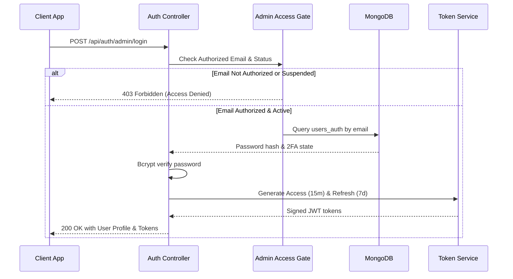
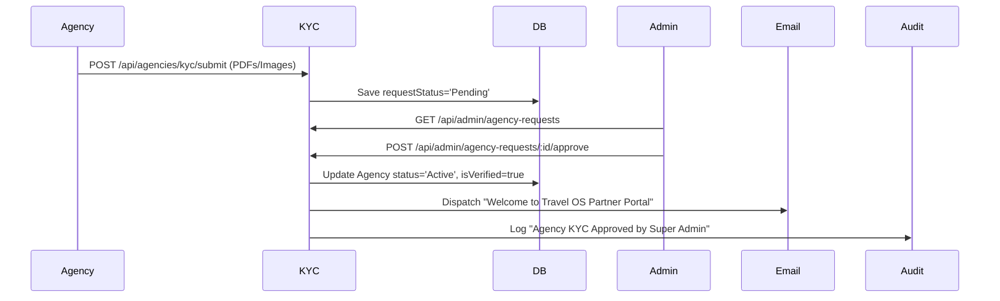

# Travel OS — Complete Backend Specification & API Contract

This document provides the exhaustive, production-grade backend architecture, database schemas, REST API endpoints, validation rules, authentication/authorization flows, business logic, sequence diagrams, and security specifications for **Travel OS** across Customer, Agency, and Super Admin panels.

---

## 1. Unified Architecture & Standards

### 1.1 API Response Standards
Every REST API returns a deterministic envelope structure:

#### Success Response Envelope (`HTTP 200 / 201`)
```json
{
  "success": true,
  "message": "Operation completed successfully",
  "data": {},
  "meta": {
    "timestamp": "2026-08-19T14:40:00.000Z",
    "requestId": "req_8f3d1b9e-01"
  }
}
```

#### Paginated Success Response Envelope (`HTTP 200`)
```json
{
  "success": true,
  "message": "Records fetched successfully",
  "data": [],
  "pagination": {
    "page": 1,
    "limit": 10,
    "totalPages": 5,
    "totalRecords": 48,
    "hasNext": true,
    "hasPrevious": false
  },
  "meta": {
    "timestamp": "2026-08-19T14:40:00.000Z",
    "requestId": "req_8f3d1b9e-02"
  }
}
```

#### Failure / Error Response Envelope (`HTTP 4xx / 5xx`)
```json
{
  "success": false,
  "message": "Validation failed on request payload",
  "errors": [
    {
      "field": "email",
      "message": "Email must be a valid email address format"
    }
  ],
  "errorCode": "VALIDATION_ERROR",
  "meta": {
    "timestamp": "2026-08-19T14:40:00.000Z",
    "requestId": "req_8f3d1b9e-03"
  }
}
```

### 1.2 Global HTTP Error Codes
| Code | Enum | Meaning & Example Message |
|---|---|---|
| `400` | `BAD_REQUEST` | Malformed JSON or invalid parameter syntax |
| `401` | `UNAUTHORIZED` | Missing, expired, or invalid JWT token |
| `403` | `FORBIDDEN` | Insufficient role privilege or unverified access gate |
| `404` | `NOT_FOUND` | Target resource does not exist or has been soft-deleted |
| `409` | `CONFLICT` | Resource already exists (e.g. duplicate email, duplicate booking slot) |
| `422` | `UNPROCESSABLE_ENTITY` | Business logic failure (e.g. insufficient package seats) |
| `429` | `TOO_MANY_REQUESTS` | Rate limit threshold exceeded (e.g. 100 req/min) |
| `500` | `INTERNAL_SERVER_ERROR` | Unhandled runtime exception |

---

## 2. Exhaustive Module Specifications

---

### Module 1: Authentication & Authorization

#### 1. Overview
Handles identity management, password hashing (bcrypt, 12 rounds), JWT access/refresh token pairs, Google Workspace SSO, 2FA TOTP secrets, password resets, and the Super Admin Authorized Email Gate.

#### 2. Database Collections
* **Collection:** `users_auth`
  * `_id`: ObjectId
  * `userId`: ObjectId (Ref -> `users` or `agencies` or `admin_users`)
  * `userType`: Enum (`CUSTOMER`, `AGENCY`, `ADMIN`, `SUPER_ADMIN`)
  * `email`: String (Index: Unique, Lowercase)
  * `passwordHash`: String (Bcrypt)
  * `twoFactorSecret`: String (Nullable)
  * `isTwoFactorEnabled`: Boolean (Default: `false`)
  * `refreshTokenHash`: String (Nullable)
  * `resetPasswordToken`: String (Nullable)
  * `resetPasswordExpires`: Date (Nullable)
  * `failedLoginAttempts`: Number (Default: 0)
  * `lockUntil`: Date (Nullable)
  * `lastLoginAt`: Date
  * `createdAt`: Date, `updatedAt`: Date, `isDeleted`: Boolean

#### 3. API Endpoints
* `POST /api/auth/register` (Customer registration)
* `POST /api/auth/login` (Customer / Agency login)
* `POST /api/auth/admin/login` (Super Admin & Admin IAM Gate login)
* `POST /api/auth/google` (Google OAuth SSO)
* `POST /api/auth/refresh-token` (Exchange refresh token for access token)
* `POST /api/auth/logout` (Revoke active session)
* `POST /api/auth/forgot-password` (Dispatch password reset email)
* `POST /api/auth/reset-password` (Verify token and update password)
* `POST /api/auth/2fa/setup` (Generate TOTP QR & Secret)
* `POST /api/auth/2fa/verify` (Enable 2FA with 6-digit code)

#### 4. Request & Response Payloads
```json
// POST /api/auth/admin/login
{
  "email": "admin@travelos.com",
  "password": "SecurePassword@123",
  "twoFactorCode": "489201"
}
```
```json
// Response HTTP 200
{
  "success": true,
  "message": "Authentication successful",
  "data": {
    "token": "eyJhbGciOiJIUzI1NiIsInR5cCI6IkpXVCJ9...",
    "refreshToken": "ref_8923fbc091...",
    "user": {
      "id": "adm_01",
      "name": "Super Admin",
      "email": "admin@travelos.com",
      "role": "SUPER_ADMIN",
      "avatar": "https://images.unsplash.com/..."
    }
  }
}
```

#### 5. Validation & Business Rules
* Passwords must be $\ge 8$ chars with 1 uppercase, 1 lowercase, 1 number, and 1 special char.
* Admin Login Gate: Checks `authorized_admins` collection. If email is not approved or account is `Suspended`/`Disabled`/`Pending`, login is strictly rejected (`HTTP 403`).
* 5 consecutive failed logins trigger a 15-minute temporary account lockout (`HTTP 429`).

#### 6. Sequence Diagram


---

### Module 2: Users (Customer Management)

#### 1. Overview
Manages traveler identity, profiles, contact details, traveler KYC/passports, loyalty points, booking history, reviews, support tickets, and account suspension/activation.

#### 2. Database Collections
* **Collection:** `users`
  * `_id`: ObjectId
  * `fullName`: String (Required, Index)
  * `email`: String (Unique, Index)
  * `phone`: String (Index)
  * `avatar`: String
  * `status`: Enum (`Active`, `Suspended`, `Disabled`, `Pending`)
  * `loyaltyTier`: Enum (`Bronze`, `Silver`, `Gold`, `Platinum`)
  * `rewardPoints`: Number (Default: 0)
  * `totalBookingsCount`: Number (Default: 0)
  * `totalSpent`: Number (Default: 0)
  * `passportNumber`: String (Encrypted, Nullable)
  * `emergencyContact`: Object (`name`, `phone`, `relationship`)
  * `createdAt`: Date, `updatedAt`: Date, `isDeleted`: Boolean

#### 3. API Endpoints
* `GET /api/users/profile` (Get self profile)
* `PATCH /api/users/profile` (Update personal details)
* `GET /api/admin/users` (Paginated search & filters)
* `GET /api/admin/users/:id` (User detail & timeline)
* `PATCH /api/admin/users/:id/status` (Suspend / Activate user)
* `DELETE /api/admin/users/:id` (Soft delete user)
* `GET /api/admin/users/export` (Export CSV)

#### 4. Validation & Search
* `email`: valid format, unique. `phone`: E.164 format.
* Search: `fullName`, `email`, `phone`, `passportNumber`.
* Filters: `status`, `loyaltyTier`, `createdAtRange`, `minSpent`.

---

### Module 3: Agencies (Agency Partner Management)

#### 1. Overview
Manages travel agencies, agency profiles, commission tiers, business licenses, bank accounts for settlements, performance ratings, and marketplace visibility.

#### 2. Database Collections
* **Collection:** `agencies`
  * `_id`: ObjectId
  * `agencyName`: String (Unique, Index)
  * `contactPerson`: String
  * `email`: String (Unique, Index)
  * `phone`: String
  * `logo`: String
  * `coverImage`: String
  * `gstNumber`: String (Unique, Index)
  * `panNumber`: String (Unique, Index)
  * `status`: Enum (`Active`, `Pending_KYC`, `Suspended`, `Rejected`)
  * `isVerified`: Boolean (Default: `false`)
  * `isFeatured`: Boolean (Default: `false`)
  * `commissionRate`: Number (Default: 10.0) // %
  * `rating`: Number (Default: 5.0)
  * `reviewsCount`: Number (Default: 0)
  * `bankDetails`: Object (`accountHolder`, `accountNumber`, `ifscCode`, `bankName`)
  * `address`: Object (`street`, `city`, `state`, `country`, `zipCode`)
  * `createdAt`: Date, `updatedAt`: Date, `isDeleted`: Boolean

#### 3. API Endpoints
* `GET /api/agencies/public` (Directory listing on storefront)
* `GET /api/agencies/profile` (Agency self profile)
* `PATCH /api/agencies/profile` (Agency updates profile/bank)
* `GET /api/admin/agencies` (Super Admin agency list with search & filter)
* `GET /api/admin/agencies/:id` (Agency full dossier)
* `PATCH /api/admin/agencies/:id/status` (Activate, Suspend, Blacklist)
* `PATCH /api/admin/agencies/:id/commission` (Adjust commission rate)
* `PATCH /api/admin/agencies/:id/featured` (Toggle featured status)
* `GET /api/admin/agencies/export` (Export agencies CSV)

---

### Module 4: Agency Requests (KYC & Onboarding Verification)

#### 1. Overview
Dedicated module for processing new travel agency onboarding requests, document verification (GST, PAN, Trade License, Bank Cheque), risk assessment, approval, or rejection with reason.

#### 2. Database Collections
* **Collection:** `agency_kyc_requests`
  * `_id`: ObjectId
  * `agencyId`: ObjectId (Ref -> `agencies`)
  * `applicantName`: String
  * `companyRegistrationNumber`: String
  * `gstCertificateUrl`: String (Required)
  * `panCardUrl`: String (Required)
  * `cancelledChequeUrl`: String (Required)
  * `businessLicenseUrl`: String
  * `requestStatus`: Enum (`Pending`, `Under_Review`, `Approved`, `Rejected`)
  * `rejectionReason`: String (Nullable)
  * `verifiedBy`: ObjectId (Ref -> `admin_users`, Nullable)
  * `verifiedAt`: Date (Nullable)
  * `submittedAt`: Date
  * `createdAt`: Date, `updatedAt`: Date

#### 3. API Endpoints & Business Flow
* `POST /api/agencies/kyc/submit` (Agency uploads documents)
* `GET /api/admin/agency-requests` (Admin list pending KYC requests)
* `GET /api/admin/agency-requests/:id` (Review document previews)
* `POST /api/admin/agency-requests/:id/approve` (Approve KYC $\to$ enable agency portal)
* `POST /api/admin/agency-requests/:id/reject` (Reject with feedback reason)



---

### Module 5: Packages (Tour & Holiday Packages)

#### 1. Overview
Manages holiday itineraries, pricing tiers, destination tagging, inclusions/exclusions, photo galleries, day-by-day schedules, and Super Admin approval workflows.

#### 2. Database Collections
* **Collection:** `packages`
  * `_id`: ObjectId
  * `agencyId`: ObjectId (Ref -> `agencies`, Index)
  * `title`: String (Index)
  * `slug`: String (Unique, Index)
  * `destination`: String (Index)
  * `country`: String (Index)
  * `durationDays`: Number, `durationNights`: Number
  * `basePrice`: Number (Required)
  * `discountedPrice`: Number
  * `category`: Enum (`Adventure`, `Beach`, `Honeymoon`, `Family`, `Wildlife`, `Heritage`)
  * `itinerary`: Array of Objects (`dayNumber`, `title`, `description`, `meals`, `hotel`)
  * `inclusions`: Array of Strings, `exclusions`: Array of Strings
  * `galleryImages`: Array of Strings
  * `status`: Enum (`Draft`, `Pending_Approval`, `Published`, `Archived`, `Rejected`)
  * `approvalStatus`: Enum (`Pending`, `Approved`, `Rejected`)
  * `rating`: Number (Default: 5.0)
  * `bookingsCount`: Number (Default: 0)
  * `createdAt`: Date, `updatedAt`: Date, `isDeleted`: Boolean

#### 3. API Endpoints
* `GET /api/packages/search` (Public storefront catalog search with faceted filters)
* `GET /api/packages/:slug` (Public package detail)
* `POST /api/agency/packages` (Agency creates package)
* `PUT /api/agency/packages/:id` (Agency updates package)
* `DELETE /api/agency/packages/:id` (Agency deletes package)
* `GET /api/admin/packages` (Super admin package oversight)
* `POST /api/admin/packages/:id/approve` (Admin publishes package)
* `POST /api/admin/packages/:id/reject` (Admin rejects with remarks)

---

### Module 6: Trips (Departure Batches & Tour Operations)

#### 1. Overview
Controls fixed departure dates, group capacity/seats, assigned tour leads, live trip telemetry (En Route, Delayed, Completed), passenger manifests, and emergency broadcasts.

#### 2. Database Collections
* **Collection:** `trips`
  * `_id`: ObjectId
  * `packageId`: ObjectId (Ref -> `packages`, Index)
  * `agencyId`: ObjectId (Ref -> `agencies`, Index)
  * `tripCode`: String (Unique, Index, e.g. `TRP-9021`)
  * `departureDate`: Date (Index)
  * `returnDate`: Date
  * `totalCapacity`: Number
  * `bookedSeats`: Number (Default: 0)
  * `status`: Enum (`Upcoming`, `Registration_Open`, `Fully_Booked`, `In_Progress`, `Completed`, `Cancelled`)
  * `tourLead`: Object (`name`, `phone`, `email`)
  * `pickupLocation`: String
  * `currentLocation`: Object (`lat`, `lng`, `landmark`, `lastReportedAt`)
  * `createdAt`: Date, `updatedAt`: Date

#### 3. API Endpoints
* `GET /api/trips/upcoming` (Storefront departure dates for packages)
* `GET /api/agency/trips` (Agency operations schedule)
* `POST /api/agency/trips` (Schedule new departure batch)
* `GET /api/agency/trips/:id/manifest` (Download passenger roster PDF/CSV)
* `PATCH /api/agency/trips/:id/status` (Update live status to `In_Progress`, `Completed`)
* `GET /api/admin/trips` (Super Admin live active trips overview)
* `POST /api/admin/trips/:id/broadcast` (Send emergency SMS/Email to all passengers)

---

### Module 7: Bookings (Reservations & Order Engine)

#### 1. Overview
Central transactional engine managing passenger reservations, seat inventory locking, voucher generation, booking cancellations, refund rules, and travel insurance add-ons.

#### 2. Database Collections
* **Collection:** `bookings`
  * `_id`: ObjectId
  * `bookingReference`: String (Unique, Index, e.g. `BK-78452`)
  * `userId`: ObjectId (Ref -> `users`, Index)
  * `packageId`: ObjectId (Ref -> `packages`, Index)
  * `tripId`: ObjectId (Ref -> `trips`, Index)
  * `agencyId`: ObjectId (Ref -> `agencies`, Index)
  * `passengerCount`: Number
  * `passengers`: Array of Objects (`fullName`, `age`, `gender`, `passportNumber`, `seatNumber`)
  * `totalAmount`: Number (Required)
  * `taxAmount`: Number
  * `discountAmount`: Number
  * `netAmount`: Number
  * `currency`: String (Default: `INR`)
  * `status`: Enum (`Pending_Payment`, `Confirmed`, `In_Progress`, `Completed`, `Cancelled`, `Refunded`)
  * `paymentStatus`: Enum (`Unpaid`, `Paid`, `Partially_Refunded`, `Refunded`)
  * `voucherUrl`: String
  * `cancellationReason`: String (Nullable)
  * `bookedAt`: Date, `createdAt`: Date, `updatedAt`: Date

#### 3. API Endpoints & State Machine
* `POST /api/bookings/create` (Lock seats & initiate checkout)
* `GET /api/bookings/:id` (Customer view booking & download voucher)
* `POST /api/bookings/:id/cancel` (Customer cancel booking with auto-refund calculation)
* `GET /api/agency/bookings` (Agency booking list)
* `GET /api/admin/bookings` (Super Admin global booking directory)
* `PATCH /api/admin/bookings/:id/override` (Admin modify booking details)

---

### Module 8: Payments (Gateway Integration & Transactions)

#### 1. Overview
Handles online payment gateway webhooks (Razorpay, Stripe), payment intent generation, signature verification, automatic transaction logging, gateway fees, and partial/full refunds.

#### 2. Database Collections
* **Collection:** `payments`
  * `_id`: ObjectId
  * `transactionId`: String (Unique, Index, e.g. `PMT-23892`)
  * `bookingId`: ObjectId (Ref -> `bookings`, Index)
  * `userId`: ObjectId (Ref -> `users`, Index)
  * `agencyId`: ObjectId (Ref -> `agencies`, Index)
  * `gateway`: Enum (`Razorpay`, `Stripe`, `UPI`, `NetBanking`)
  * `gatewayPaymentId`: String (Index)
  * `gatewayOrderId`: String (Index)
  * `amount`: Number (Required)
  * `currency`: String (Default: `INR`)
  * `gatewayFee`: Number (Default: 0)
  * `taxOnFee`: Number (Default: 0)
  * `paymentStatus`: Enum (`Success`, `Processing`, `Failed`, `Refunded`, `Disputed`)
  * `refundAmount`: Number (Default: 0)
  * `refundReference`: String (Nullable)
  * `rawWebhookPayload`: Object
  * `paidAt`: Date, `createdAt`: Date

#### 3. API Endpoints
* `POST /api/payments/create-intent` (Generate Razorpay Order / Stripe PaymentIntent)
* `POST /api/payments/verify-signature` (HMAC-SHA256 signature verification)
* `POST /api/payments/webhook` (Idempotent webhook handler)
* `POST /api/admin/payments/:id/refund` (Super admin trigger instant gateway refund)
* `GET /api/admin/payments` (Super Admin real-time transactions stream)

---

### Module 9: Finance (Commissions & Agency Payout Settlements)

#### 1. Overview
Calculates platform take-rate (commission), tax withholding (TDS/GST), automated ledger accounting, net agency payouts, bulk bank payouts, and financial settlement receipts.

#### 2. Database Collections
* **Collection:** `settlements`
  * `_id`: ObjectId
  * `settlementNumber`: String (Unique, Index, e.g. `SET-4901`)
  * `agencyId`: ObjectId (Ref -> `agencies`, Index)
  * `periodStart`: Date, `periodEnd`: Date
  * `grossVolume`: Number
  * `platformCommission`: Number
  * `tdsDeduction`: Number
  * `gatewayCharges`: Number
  * `netPayout`: Number
  * `status`: Enum (`Pending`, `Approved`, `Processing`, `Settled`, `Rejected`)
  * `utrNumber`: String (Bank Transfer Ref)
  * `settledAt`: Date (Nullable)
  * `createdAt`: Date, `updatedAt`: Date

#### 3. API Endpoints
* `GET /api/agency/finance/earnings` (Agency revenue dashboard & monthly breakdown)
* `GET /api/admin/finance/summary` (Super admin platform-wide GMV, Commissions, Net Revenue)
* `GET /api/admin/finance/settlements` (Pending settlement queue)
* `POST /api/admin/finance/settlements/bulk-settle` (Process automated payout batch)
* `GET /api/admin/finance/settlements/:id/invoice` (Download GST Tax Invoice PDF)

---

### Module 10: Reviews (Ratings & Trust Moderation)

#### 1. Overview
Manages traveler verified reviews, multi-criterion ratings (Safety, Value, Guide, Punctuality), agency public responses, and Super Admin review moderation (flagging/hiding abusive comments).

#### 2. Database Collections
* **Collection:** `reviews`
  * `_id`: ObjectId
  * `bookingId`: ObjectId (Ref -> `bookings`, Unique, Index)
  * `packageId`: ObjectId (Ref -> `packages`, Index)
  * `agencyId`: ObjectId (Ref -> `agencies`, Index)
  * `userId`: ObjectId (Ref -> `users`, Index)
  * `rating`: Number (1 to 5)
  * `ratingsBreakdown`: Object (`safety`: 1-5, `value`: 1-5, `guide`: 1-5, `punctuality`: 1-5)
  * `comment`: String
  * `photos`: Array of Strings
  * `agencyReply`: Object (`replyText`, `repliedAt`, `repliedBy`)
  * `status`: Enum (`Published`, `Under_Review`, `Flagged`, `Hidden`)
  * `helpfulVotesCount`: Number (Default: 0)
  * `createdAt`: Date, `updatedAt`: Date

#### 3. API Endpoints
* `POST /api/reviews/create` (Verified traveler submits review)
* `GET /api/reviews/package/:packageId` (Public package reviews)
* `POST /api/agency/reviews/:id/reply` (Agency posts response)
* `GET /api/admin/reviews` (Super Admin moderation feed)
* `PATCH /api/admin/reviews/:id/status` (Flag, Approve, or Hide review)

---

### Module 11: Support (Enterprise Helpdesk & Ticketing)

#### 1. Overview
Customer and agency support ticketing system with priority escalation (`Low`, `Medium`, `High`, `Critical`), SLA countdowns, attachments, agent assignment, and internal notes.

#### 2. Database Collections
* **Collection:** `support_tickets`
  * `_id`: ObjectId
  * `ticketNumber`: String (Unique, Index, e.g. `TK-9845`)
  * `creatorType`: Enum (`CUSTOMER`, `AGENCY`)
  * `creatorId`: ObjectId (Index)
  * `subject`: String (Required)
  * `category`: Enum (`Booking_Issue`, `Refund_Request`, `KYC_Verification`, `Technical`, `Other`)
  * `priority`: Enum (`Low`, `Medium`, `High`, `Critical`)
  * `status`: Enum (`Open`, `In_Progress`, `Waiting_Response`, `Resolved`, `Closed`)
  * `assignedTo`: ObjectId (Ref -> `admin_users`, Nullable, Index)
  * `messages`: Array of Objects (`senderId`, `senderType`, `message`, `attachments`, `isInternalNote`, `sentAt`)
  * `resolvedAt`: Date (Nullable)
  * `createdAt`: Date, `updatedAt`: Date

#### 3. API Endpoints
* `POST /api/support/tickets` (Create new inquiry)
* `GET /api/support/tickets/my-tickets` (Customer/Agency view their tickets)
* `POST /api/support/tickets/:id/reply` (Post reply or attachment)
* `GET /api/admin/support/tickets` (Super Admin support triage queue)
* `PATCH /api/admin/support/tickets/:id/assign` (Assign to Support Lead)
* `PATCH /api/admin/support/tickets/:id/status` (Resolve or close ticket)

---

### Module 12: Community (Traveler Social Forum & Stories)

#### 1. Overview
Community engagement feed allowing verified travelers to post travel stories, trip photos, seek travel buddies, like/comment, and report inappropriate content.

#### 2. Database Collections
* **Collection:** `community_posts`
  * `_id`: ObjectId
  * `authorId`: ObjectId (Ref -> `users`, Index)
  * `title`: String
  * `content`: String
  * `destinationTag`: String (Index)
  * `mediaUrls`: Array of Strings
  * `likesCount`: Number (Default: 0)
  * `commentsCount`: Number (Default: 0)
  * `status`: Enum (`Active`, `Reported`, `Removed`)
  * `createdAt`: Date, `updatedAt`: Date

#### 3. API Endpoints
* `GET /api/community/feed` (Paginated community social feed)
* `POST /api/community/posts` (Create story post)
* `POST /api/community/posts/:id/like` (Toggle like)
* `POST /api/community/posts/:id/comments` (Post comment)
* `POST /api/community/posts/:id/report` (Report post)
* `GET /api/admin/community/moderation` (Admin moderation dashboard)
* `DELETE /api/admin/community/posts/:id` (Admin remove violating post)

---

### Module 13: Notifications (Multi-Channel Dispatcher)

#### 1. Overview
Central event-driven notification hub sending In-App Alerts, WebSockets, transactional Emails (SES/SendGrid), and SMS alerts with user delivery preferences.

#### 2. Database Collections
* **Collection:** `notifications`
  * `_id`: ObjectId
  * `recipientType`: Enum (`CUSTOMER`, `AGENCY`, `ADMIN`, `ALL`)
  * `recipientId`: ObjectId (Index, Nullable when `recipientType='ALL'`)
  * `title`: String (Required)
  * `body`: String (Required)
  * `category`: Enum (`Booking`, `Payment`, `KYC`, `Security`, `System`, `Marketing`)
  * `priority`: Enum (`Low`, `Normal`, `High`, `Urgent`)
  * `linkUrl`: String (Nullable)
  * `isRead`: Boolean (Default: `false`)
  * `readAt`: Date (Nullable)
  * `channels`: Array of Enums (`IN_APP`, `EMAIL`, `SMS`, `PUSH`)
  * `createdAt`: Date

#### 3. API Endpoints
* `GET /api/notifications` (Fetch current user unread notification inbox)
* `PATCH /api/notifications/:id/read` (Mark single notification as read)
* `PATCH /api/notifications/mark-all-read` (Mark entire inbox read)
* `POST /api/admin/notifications/broadcast` (Super Admin broadcast notification)
* `GET /api/admin/notifications/center` (Advanced Enterprise Notification Center)

---

### Module 14: CMS (Content & Campaign Management Center)

#### 1. Overview
Replaces website builders with a centralized, data-driven content hub to manage Hero Carousel Banners, Platform Announcements, Trending Destinations, Featured Agencies, Featured Trips, Seasonal Campaigns, Popups, and Homepage Section order.

#### 2. Database Collections
* **Collection:** `cms_hero_banners`
  * `_id`: ObjectId, `title`: String, `subtitle`: String, `ctaText`: String, `ctaLink`: String, `desktopImage`: String, `mobileImage`: String, `startDate`: Date, `endDate`: Date, `priority`: Number, `isEnabled`: Boolean, `status`: Enum (`draft`, `published`, `expired`)
* **Collection:** `cms_announcements`
  * `_id`: ObjectId, `title`: String, `description`: String, `type`: Enum (`info`, `warning`, `success`, `critical`), `audience`: Enum (`all`, `customers`, `agencies`, `logged_in`), `location`: Enum (`homepage`, `customer_dashboard`, `agency_dashboard`, `both`), `isPinned`: Boolean, `isDismissible`: Boolean, `requireAck`: Boolean, `startDate`: Date, `endDate`: Date, `status`: Enum (`draft`, `published`, `expired`)
* **Collection:** `cms_destinations`
  * `_id`: ObjectId, `name`: String, `country`: String, `description`: String, `imageUrl`: String, `priority`: Number, `isTrending`: Boolean, `displayOrder`: Number, `isEnabled`: Boolean
* **Collection:** `cms_featured_agencies`
  * `_id`: ObjectId, `agencyId`: ObjectId (Ref -> `agencies`), `priority`: Number, `featuredUntil`: Date, `sortOrder`: Number, `isEnabled`: Boolean
* **Collection:** `cms_campaigns`
  * `_id`: ObjectId, `title`: String, `description`: String, `bannerImage`: String, `ctaText`: String, `ctaLink`: String, `startDate`: Date, `endDate`: Date, `status`: Enum (`draft`, `active`, `scheduled`, `expired`), `applicableTo`: Enum (`homepage`, `agency`, `customer`, `both`)
* **Collection:** `cms_popups`
  * `_id`: ObjectId, `title`: String, `description`: String, `imageUrl`: String, `buttonText`: String, `buttonLink`: String, `delaySeconds`: Number, `audience`: Enum (`all`, `first_time`, `registered`, `agencies`), `frequency`: Enum (`once_per_session`, `always`, `once_per_user`), `isEnabled`: Boolean
* **Collection:** `cms_sections`
  * `_id`: ObjectId, `key`: String, `name`: String, `isEnabled`: Boolean, `order`: Number

#### 3. API Endpoints
* `GET /api/cms/storefront` (Public bundle: active banners, announcements, trending spots, featured agencies, popups)
* `GET /api/admin/cms/all` (Super Admin fetch all CMS data)
* `POST /api/admin/cms/banners` & `PUT /api/admin/cms/banners/:id`
* `POST /api/admin/cms/announcements` & `PUT /api/admin/cms/announcements/:id`
* `POST /api/admin/cms/destinations` & `PUT /api/admin/cms/destinations/:id`
* `POST /api/admin/cms/featured-agencies` & `DELETE /api/admin/cms/featured-agencies/:id`
* `POST /api/admin/cms/campaigns` & `PUT /api/admin/cms/campaigns/:id`
* `POST /api/admin/cms/popups` & `PUT /api/admin/cms/popups/:id`
* `PATCH /api/admin/cms/sections/reorder` (Update homepage section order)

---

### Module 15: Media Library (Cloud Asset Storage)

#### 1. Overview
Secure asset management for image/document uploads (S3/Cloudinary/Local), image optimization, automatic thumbnail generation, mime-type validation, and metadata tracking.

#### 2. Database Collections
* **Collection:** `media_assets`
  * `_id`: ObjectId
  * `fileName`: String, `originalName`: String
  * `fileUrl`: String (CDN URL)
  * `thumbnailUrl`: String
  * `fileType`: String (`image/jpeg`, `image/png`, `application/pdf`)
  * `fileSizeBytes`: Number
  * `folder`: Enum (`banners`, `packages`, `kyc`, `avatars`, `general`)
  * `uploadedBy`: ObjectId (Ref -> `admin_users` or `users` or `agencies`)
  * `createdAt`: Date

#### 3. API Endpoints
* `POST /api/media/upload` (Multipart/form-data upload with 10MB limit)
* `GET /api/admin/media` (Browse media library with folder filter)
* `DELETE /api/admin/media/:id` (Delete file from storage & database)

---

### Module 16: Reports (Analytics & Data Export)

#### 1. Overview
Aggregates platform KPIs, GMV trends, agency growth, booking cancellation ratios, customer retention, and generates on-demand CSV/Excel/PDF exports.

#### 2. API Endpoints
* `GET /api/admin/reports/revenue` (Monthly/Weekly GMV, Commission, Net Profit)
* `GET /api/admin/reports/agencies` (Top performing agencies by booking volume)
* `GET /api/admin/reports/destinations` (Most booked destinations)
* `POST /api/admin/reports/generate-export` (Trigger async report generation with download link)

---

### Module 17: Dashboard & Live Activity Center

#### 1. Overview
Supplies real-time operational telemetry to `/admin` dashboard: 8 KPI summary cards, 4 analytics charts, recent approvals/activity feeds, System Health, and the **Live Activity Center** (Live Event Feed stream, Platform Live Status service checks, Live Metrics counters, Active Trips, Payment Queue, Support Queue).

#### 2. API Endpoints
* `GET /api/admin/dashboard/stats` (Consolidated dashboard metrics)
* `GET /api/admin/dashboard/live-activity` (Polling / WebSocket stream for live operations command center)

---

### Module 18: Roles & Permissions (Enterprise RBAC)

#### 1. Overview
Granular Role-Based Access Control (RBAC) defining role privileges across 15 core platform modules for 8 distinct actions (`View`, `Create`, `Edit`, `Delete`, `Approve`, `Export`, `Assign`, `FullAccess`).

#### 2. Database Collections
* **Collection:** `rbac_roles`
  * `_id`: ObjectId
  * `roleId`: String (Unique, Index, e.g. `role-finance-manager`)
  * `name`: String (e.g. `Finance Manager`)
  * `description`: String
  * `type`: Enum (`System`, `Custom`)
  * `assignedUsersCount`: Number (Default: 0)
  * `permissions`: Array of Objects (`moduleId`, `moduleName`, `view`, `create`, `edit`, `delete`, `approve`, `export`, `assign`, `fullAccess`)
  * `createdAt`: Date, `updatedAt`: Date

#### 3. API Endpoints
* `GET /api/admin/roles` (Fetch all RBAC roles)
* `POST /api/admin/roles` (Create custom role)
* `PUT /api/admin/roles/:id/permissions` (Update permission matrix)
* `DELETE /api/admin/roles/:id` (Delete custom role)
* `POST /api/admin/roles/:id/duplicate` (Clone existing role)

---

### Module 19: Admin Access Control (IAM Email Gate)

#### 1. Overview
Enterprise security layer controlling who can access the Super Admin Portal. Only email addresses explicitly authorized by the Super Admin in the `authorized_admins` registry can authenticate.

#### 2. Database Collections
* **Collection:** `authorized_admins`
  * `_id`: ObjectId
  * `name`: String
  * `email`: String (Unique, Lowercase, Index)
  * `phone`: String
  * `avatar`: String
  * `role`: String, `roleId`: String
  * `department`: String
  * `accountStatus`: Enum (`Active`, `Pending Invitation`, `Suspended`, `Disabled`)
  * `invitationStatus`: Enum (`Accepted`, `Pending`, `Expired`)
  * `invitationToken`: String (Nullable)
  * `twoFactorEnabled`: Boolean (Default: `false`)
  * `lastLogin`: Date (Nullable)
  * `createdAt`: Date, `updatedAt`: Date

#### 3. API Endpoints & Gate Logic
* `GET /api/admin/access-control/admins` (List authorized admin registry)
* `POST /api/admin/access-control/authorize` (Add email & dispatch invite)
* `PATCH /api/admin/access-control/:id/status` (Suspend / Activate admin)
* `DELETE /api/admin/access-control/:id` (Revoke authorization)
* `POST /api/admin/access-control/:id/resend-invite` (Re-dispatch invite token)
* `POST /api/admin/access-control/bulk-status` (Bulk activate / suspend)

---

### Module 20: Admin Management (Staff Profiles & Sessions)

#### 1. Overview
Manages administrative staff profiles, department assignments, active browser sessions, IP logs, and session revocation.

#### 2. Database Collections
* **Collection:** `admin_sessions`
  * `_id`: ObjectId
  * `adminId`: ObjectId (Ref -> `authorized_admins`, Index)
  * `tokenHash`: String
  * `ipAddress`: String
  * `userAgent`: String
  * `device`: String
  * `location`: String
  * `expiresAt`: Date
  * `createdAt`: Date

#### 3. API Endpoints
* `GET /api/admin/sessions` (View all active admin login sessions)
* `DELETE /api/admin/sessions/:id` (Terminate specific session)
* `DELETE /api/admin/sessions/terminate-all` (Force logout all sessions)

---

### Module 21: Audit Logs (Immutable Compliance Stream)

#### 1. Overview
Append-only tamper-evident audit log recording every administrative action (`Create`, `Update`, `Delete`, `Approve`, `Reject`, `Login`, `Export`, `StatusChange`) with actor metadata, IP, and diff state.

#### 2. Database Collections
* **Collection:** `audit_logs`
  * `_id`: ObjectId
  * `actorId`: ObjectId (Ref -> `authorized_admins` or `users`)
  * `actorName`: String, `actorEmail`: String, `actorRole`: String
  * `action`: String (e.g. `AGENCY_KYC_APPROVED`, `PERMISSION_CHANGED`, `ADMIN_AUTHORIZED`)
  * `module`: String (e.g. `Agencies`, `Roles`, `Payments`, `CMS`)
  * `targetId`: String, `targetName`: String
  * `ipAddress`: String, `userAgent`: String
  * `changes`: Object (`before`: {}, `after`: {})
  * `status`: Enum (`Success`, `Failed`)
  * `timestamp`: Date (Index)

#### 3. API Endpoints
* `GET /api/admin/audit-logs` (Paginated search & filtering by date, actor, module, action)
* `GET /api/admin/audit-logs/export` (Export audit compliance log to CSV)

---

### Module 22: Platform Settings (Configuration & Integrations)

#### 1. Overview
Central platform key-value configuration store for payment gateway keys, SMTP credentials, default platform commission %, tax rates (GST/TDS), currency defaults, and maintenance mode toggles.

#### 2. Database Collections
* **Collection:** `platform_settings`
  * `_id`: ObjectId
  * `key`: String (Unique, Index)
  * `value`: Mixed
  * `category`: Enum (`General`, `Payments`, `Email`, `Security`, `Commission`, `Integrations`)
  * `isSecret`: Boolean (Default: `false`)
  * `updatedBy`: ObjectId (Ref -> `authorized_admins`)
  * `updatedAt`: Date

#### 3. API Endpoints
* `GET /api/admin/settings` (Fetch all non-secret settings)
* `PUT /api/admin/settings` (Update platform configurations)

---

### Module 23: System Monitoring (Health & Telemetry)

#### 1. Overview
Real-time health check probes and telemetry metrics for Node.js process memory/CPU, MongoDB connection pool, Redis cache latency, WebSocket connections, and external API gateways.

#### 2. API Endpoints
* `GET /api/health` (Liveness & readiness probe for load balancers)
* `GET /api/admin/system/metrics` (CPU, RAM, DB Latency, WebSocket connection count)
* `POST /api/admin/system/cache-clear` (Flush application cache)

---

## 3. Background Jobs & Scheduled Crons

1. **Daily Settlement Processor (02:00 AM IST):** Aggregates completed trips, computes commission & taxes, and creates pending payout batches.
2. **Expired Promotions & Banners Cleaner (Hourly):** Toggles status of past `endDate` campaigns to `expired`.
3. **Session Expiry & Token Cleanup (Every 6 Hours):** Prunes expired refresh tokens and closed session entries.
4. **Automated Review & Feedback Reminder (Daily 10:00 AM IST):** Sends review email to travelers 24 hours after trip completion.
5. **Inventory Sync & Seat Release (Every 10 Minutes):** Frees unconfirmed reservation seat locks older than 15 minutes.

---

## 4. Security & Hardening Checklist

* **JWT Strategy:** Short-lived access tokens (15 mins) stored in memory / Authorization header; HttpOnly, Secure, SameSite Refresh Tokens (7 days).
* **Rate Limiting:** `express-rate-limit` with Redis store: 100 requests / min for standard APIs; 5 requests / min for login and password reset routes.
* **Input Sanitization & Validation:** Strict `Zod` / `Joi` schema validation on all request bodies, headers, and params.
* **Access Control Guard:** Every Admin API verifies `req.user.role` against `rbac_roles` permission matrix before executing controller handlers.
* **File Upload Defense:** Magic number validation, file extension whitelist (`.jpg`, `.jpeg`, `.png`, `.webp`, `.pdf`), 10MB size ceiling, random UUID naming.
