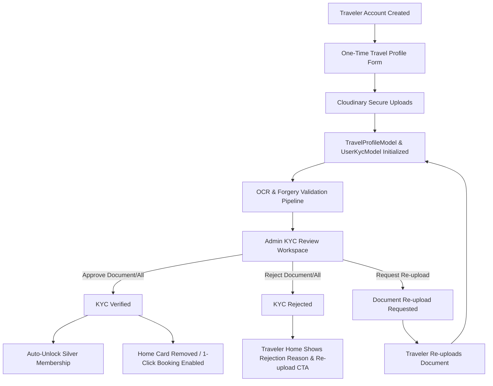

# TravelOS / ApnaTrip — Enterprise KYC & Travel Profile Verification System

This specification is the definitive architectural and operational document for the **Traveler KYC & One-Time Travel Profile Verification System** in ApnaTrip / TravelOS. It details the backend-driven state machine, document validation rules, admin review workspace, traveler home experience, membership auto-unlocking, notifications, and REST API contracts.

---

## 1. Architectural Overview & Single Source of Truth

The KYC verification system establishes identity assurance for travelers before enabling 1-click package bookings, luxury rentals, and elite membership benefits.

### Core Architectural Principles
1. **Zero Frontend State Inference:** The frontend never computes, infers, or guesses KYC status or document status. The backend is the single source of truth (`UserKycModel`, `TravelProfileModel`, and `UserModel`).
2. **Document-Derived Parent KYC State:** The parent KYC status is mathematically derived directly from individual document statuses. A parent status can never be `Verified` if any document is `Pending` or `Rejected`.
3. **Automated Tier Upgrade:** Approval of identity documents instantly upgrades traveler status from `Free` to **Silver Tier Membership** with a 1-year expiration schedule and tailored platform privileges.
4. **Natural Traveler UI Reflow:** Once KYC is verified by compliance, the promotional/completion card automatically disappears from the Traveler Home screen without leaving ghost wrappers or whitespace.



---

## 2. The Complete Backend-Driven KYC Lifecycle

The verification workflow enforces an immutable state machine. Transitions are restricted to specific backend services and administrative roles.

| Lifecycle State | Description | Transition Owner | Allowed Next States |
|---|---|---|---|
| `NOT_SUBMITTED` (`None`) | Traveler has created an account but has not uploaded required government identity documents. | User / System | `PROFILE_COMPLETED`, `DOCUMENTS_UPLOADED` |
| `PROFILE_COMPLETED` | Traveler has saved personal profile (full name, DOB, address, emergency contact). | `travelProfile.service.ts` | `DOCUMENTS_UPLOADED` |
| `DOCUMENTS_UPLOADED` | Identity document files uploaded to Cloudinary CDN; records written to `TravelProfileModel`. | `travelProfile.service.ts` | `UNDER_REVIEW` |
| `UNDER_REVIEW` (`Pending`) | Submission synchronized into `UserKycModel`; queued in Super Admin compliance workspace. | `adminKyc.service.ts` | `OCR_PROCESSING`, `ADMIN_REVIEW` |
| `OCR_PROCESSING` | Automated optical character recognition, MRZ checksum, and EXIF forgery verification. | `adminKyc.service.ts` / Background Worker | `ADMIN_REVIEW` |
| `ADMIN_REVIEW` | Active compliance review by compliance officer in `UserDetailsDrawer`. | Super Admin / Compliance Officer | `VERIFIED`, `REJECTED`, `PENDING` (Re-upload) |
| `VERIFIED` | All mandatory documents verified; traveler verified on `UserModel`; Silver Membership unlocked. | `adminKyc.service.ts` (`approveKyc` / `approveDocument`) | `SUSPENDED`, `EXPIRED`, `PENDING` (Revoked) |
| `REJECTED` | One or more documents rejected by compliance with mandatory explanatory notes. | `adminKyc.service.ts` (`rejectKyc` / `rejectDocument`) | `PENDING` (Upon document re-upload) |
| `EXPIRED` | Document past official validity date (e.g. expired passport) or KYC periodic renewal deadline. | Automated Cron / System | `VERIFIED` (Upon Renewal), `PENDING` |
| `SUSPENDED` | Account suspended due to fraud detection, deepfake mismatch, or administrative investigation. | Super Admin | `VERIFIED`, `PENDING` (Unsuspended) |

---

## 3. Mathematical Status Derivation Rules

The parent KYC status (`kyc.status`) is computed using a deterministic rule engine:

$$\text{KYC Status} = f(\text{Documents})$$

### Operational Logic
1. **Empty Set:** If no required documents exist $\implies$ `None` (`NOT_SUBMITTED`).
2. **Rejection Precedence:** If **ANY** required document has `status === 'Rejected'` $\implies$ `Rejected`.
3. **Pending Precedence:** Else if **ANY** required document has `status === 'Pending'` $\implies$ `Pending` (`UNDER_REVIEW`).
4. **Universal Verification:** Else if **ALL** required documents have `status === 'Verified'` $\implies$ `Verified`.
5. **Periodic Expiration:** If the validity date has lapsed $\implies$ `Expired`.

> **Guarantee:** It is mathematically impossible for an account to display `Verified` if any document remains in `Pending` review.

---

## 4. Document Collection Requirements & Specifications

ApnaTrip enforces clear document policies aligned with Indian compliance and global travel standards:

| Document Type | Requirement Level | Sides / Pages Required | Accepted Formats | Max File Size | OCR & Verification Checks |
|---|---|---|---|---|---|
| **Aadhaar Card** | **Mandatory Alternative A** | Front + Back | JPEG, PNG, WebP | 5.0 MB | 12-digit UIDAI format masking (`•••• •••• 4289`), QR code check, address match |
| **Voter ID (EPIC)** | **Mandatory Alternative B** | Front only | JPEG, PNG, WebP | 5.0 MB | ECI alphanumeric series masking (`WBC••••412`), full name cross-reference |
| **Driving Licence** | **Optional** | Front + Back | JPEG, PNG, WebP | 5.0 MB | Sarathi national register match, vehicle endorsement check, expiry validation |
| **Passport** | **Optional** | Photo / Info page only | JPEG, PNG, WebP | 5.0 MB | ICAO 9303 MRZ 2-line checksum verification, 6-month validity threshold |
| **Visa** | ❌ **NOT COLLECTED** | N/A | N/A | N/A | Visa management is handled per international booking and is excluded from Traveler KYC |

### Privacy & Data Masking Standards
- All government identification numbers are masked at rest in API responses (e.g. `•••• •••• 4289` or `P•••••88`).
- Raw document URLs point to access-controlled private Cloudinary folders (`travelos/kyc/travelers/`).

---

## 5. Admin KYC Review Workspace (`UserDetailsDrawer`)

The Admin KYC section inside `frontend/src/admin-panel/components/super-admin/users/UserDetailsDrawer.tsx` is an interactive compliance workstation.

```text
┌────────────────────────────────────────────────────────────────────────┐
│ KYC Verification Header (ID: KYC-2026-USR-8912)   [ VERIFIED BADGE ]   │
│ Submitted: Oct 1, 2026 │ Verified: Oct 1, 2026 │ Reviewer: Compliance  │
│ Risk Assessment: 12/100 (Low Risk)             │ Biometric Match: 98.4%│
│ Gateway: UIDAI & DigiLocker Validation         │ Forgery Check: Passed │
├────────────────────────────────────────────────────────────────────────┤
│ Compliance Actions Bar                                                 │
│ [ Revoke Verification ]   [ Verification Report ]   [ View Audit ]     │
├────────────────────────────────────────────────────────────────────────┤
│ Documents Summary Bar                                                  │
│ [ Uploaded: 2 ]  [ Verified: 2 ]  [ Pending: 0 ]  [ Rejected: 0 ]      │
├────────────────────────────────────────────────────────────────────────┤
│ Review Cards [ Search: "Aadhaar" ] [ Sort: Newest ▾ ]                  │
│ ┌────────────────────────────────────────────────────────────────────┐ │
│ │ [Thumb] Aadhaar Card (Front)               [ Verified Badge ]      │ │
│ │ Uploaded: Oct 1, 2026 • 2.1 MB • Masked: •••• •••• 4289             │ │
│ │ [ Preview ] [ Metadata ▾ ] [ Download ]                            │ │
│ └────────────────────────────────────────────────────────────────────┘ │
├────────────────────────────────────────────────────────────────────────┤
│ Multi-Stage Audit Timeline                                             │
│ ● Submitted (Oct 1, 10:14 AM) — System                                 │
│ ● OCR Completed (Oct 1, 10:15 AM) — Name & QR Validated                │
│ ● Forgery Check (Oct 1, 10:15 AM) — Original EXIF Verified            │
│ ● Face Match (Oct 1, 10:16 AM) — 98.4% Match to Profile Photo         │
│ ● Government Validation (Oct 1, 10:16 AM) — UIDAI Gateway Cleared     │
│ ● Admin Viewed (Oct 1, 10:20 AM) — Admin Compliance                   │
│ ● Approved (Oct 1, 10:22 AM) — Compliance Officer                     │
└────────────────────────────────────────────────────────────────────────┘
```

### Key Workspace Features
1. **Dynamic Compliance Action Bar:**
   - **Pending:** `Approve KYC`, `Reject KYC`, `Request Re-upload`, `View Audit History`.
   - **Verified:** `Revoke Verification`, `Download Verification Report` (JSON audit export), `View Audit History`.
   - **Rejected:** `Approve`, `Request New Upload`.
   - **Expired:** `Renew Verification`.
   - **Suspended:** `Unsuspend KYC`.
2. **Interactive Document Summary Bar:**
   - Real-time counters for `Uploaded`, `Verified`, `Pending`, `Rejected`, and `Expired`.
   - Clicking any counter instantly filters the document cards.
3. **Enterprise Document Inspection Stage (`DocumentPreviewModal`):**
   - **Zoom:** 50% to 350% scale with step controls and reset.
   - **Rotation:** 90° clockwise increments.
   - **Lighting Filters:** Brightness & Contrast toggles to inspect watermarks and micro-print.
   - **Previous / Next Navigation:** Step between multi-page submissions without closing the modal.
   - **Inline Document Decisions:** `Approve Document`, `Reject`, and `Request Re-upload` directly from the preview stage.
4. **Document Search & Chronological Sorting:**
   - Real-time search across document types, categories, and masked numbers.
   - Fast toggle between `Newest` and `Oldest` uploads.

---

## 6. Traveler App Experience (`TravelProfileDashboardCard`)

The Traveler App Home screen (`frontend/src/user-panel/pages/Home/HomePage.tsx`) renders the `TravelProfileDashboardCard` using a strict **4-state lifecycle**:

### State 1: Travel Profile Not Started / In Progress
- **UI:** Promotional banner with progress percentage bar, missing fields counter, and primary CTA `"Complete Travel Profile"`.
- **Purpose:** Guides new travelers to complete identity setup.

### State 2: Travel Profile Completed, KYC Pending Verification
- **UI:** **Compact informational card** (~45% height reduction).
- **Attributes:** Amber pulse badge `"Pending Verification"`, concise copy (`"Your profile has been submitted and is under review by compliance"`), progress badge (`100%`), and a compact `"Manage"` button.
- **Purpose:** Eliminates oversized promotional clutter while providing peace of mind.

### State 3: Admin Verified KYC
- **UI:** **Card automatically returns `null`**.
- **Attributes:** Zero DOM wrappers, zero margins, no empty gaps. The Home screen naturally reflows to highlight curated trips, CMS hero carousels, and verified booking tools.
- **Purpose:** Traveler has completed compliance; redundant onboarding reminders are permanently cleared.

### State 4: KYC Verification Rejected
- **UI:** Rose alert card titled `"Verification Failed"`.
- **Attributes:** Displays the exact rejection reason entered by the compliance officer, with actionable buttons: `"Re-upload Documents"` and `"Manage Profile"`.
- **Purpose:** Clear, friction-free recovery path for travelers.

---

## 7. Membership Auto-Unlock Logic

When an administrator approves a traveler's KYC submission:

```typescript
// backend/src/services/adminKyc.service.ts
if (!user.membership || user.membership === 'Free') {
  user.membership = 'Silver';
  user.membershipSince = now;
  const validTill = new Date(now);
  validTill.setFullYear(validTill.getFullYear() + 1);
  user.membershipValidTill = validTill;
}
```

### Unlocked Privileges (Silver Tier)
- **5% Discount** on all package bookings and verified car rentals.
- **1-Click Instant Bookings:** Traveler details auto-filled without re-entering passport or Aadhaar data.
- **Priority Ticket Protection & Refund Queue.**
- **Early-bird access** to seasonal group departure sales.

---

## 8. Automated Notifications

| Event Trigger | Notification Title | Priority | Target URL | Content Summary |
|---|---|---|---|---|
| **KYC Approved** | `KYC Verification Approved & Silver Membership Unlocked!` | `HIGH` | `/profile` | "Your identity documents have been approved by ApnaTrip Compliance. Enjoy 5% booking discounts and 1-click reservations!" |
| **KYC Rejected** | `KYC Verification Needs Attention` | `CRITICAL` | `/profile` | "Your KYC documents could not be approved: [Reason]. Please update your documents in profile settings." |
| **Doc Re-upload Requested** | `Re-upload Required: [Document Type]` | `HIGH` | `/profile` | "Please re-upload your [Document Type]: [Reason]" |

---

## 9. Comprehensive REST API Contracts

### 9.1 Traveler Endpoints

#### `GET /api/profile/travel-profile`
- **Authentication:** Traveler JWT (`authenticateUser`)
- **Response:**
```json
{
  "success": true,
  "data": {
    "profile": {
      "fullName": "Rahul Sharma",
      "dob": "1995-04-12T00:00:00.000Z",
      "gender": "male",
      "nationality": "Indian",
      "phone": "+91 98765 43210",
      "email": "rahul.sharma@example.com",
      "aadhaar": {
        "number": "•••• •••• 4289",
        "frontUrl": "https://res.cloudinary.com/.../aadhaar_front.jpg",
        "backUrl": "https://res.cloudinary.com/.../aadhaar_back.jpg"
      },
      "verificationStatus": "PENDING",
      "rejectionReason": "",
      "completionPercentage": 100
    },
    "stats": {
      "completionPercentage": 100,
      "missingFields": [],
      "savedTravelersCount": 1,
      "isVerified": false
    }
  }
}
```

#### `PUT /api/profile/travel-profile`
- **Authentication:** Traveler JWT
- **Behavior:** Updates personal attributes or identity document URLs. If new documents are submitted while in `REJECTED` status, the profile status automatically transitions back to `PENDING`.

---

### 9.2 Super Admin Endpoints

#### `GET /api/admin/users/:userId/kyc`
- **Authentication:** Admin JWT (`authenticateAdmin`)
- **Response:** Returns full `UserKycDetailsResponse` including telemetry, `summary`, document metadata, and timeline.

#### `POST /api/admin/users/:userId/kyc/approve`
- **Payload:** `{ "notes": "All identity checks passed." }`
- **Behavior:** Marks parent KYC and all documents as `Verified`, updates `UserModel.isKycVerified = true`, auto-unlocks Silver Tier membership, dispatches high-priority notification, and writes an immutable audit log.

#### `POST /api/admin/users/:userId/kyc/reject`
- **Payload:** `{ "reason": "Aadhaar photo is blurry.", "internalNote": "Check EXIF on re-upload" }`
- **Behavior:** Transitions parent status to `Rejected`, updates documents, updates `TravelProfileModel.verificationStatus = 'REJECTED'`, and notifies traveler.

#### `POST /api/admin/users/:userId/kyc/documents/:docId/approve`
- **Behavior:** Approves individual document, re-computes parent status dynamically via `deriveParentStatus`. If all documents are verified, parent KYC is verified and Silver membership is granted.

#### `POST /api/admin/users/:userId/kyc/documents/:docId/reject`
- **Payload:** `{ "reason": "Corner cut off in photo." }`
- **Behavior:** Marks individual document as `Rejected`, immediately derives overall KYC status as `Rejected`.

#### `POST /api/admin/users/:userId/kyc/documents/:docId/request-reupload`
- **Payload:** `{ "reason": "Please upload a higher-resolution scan." }`
- **Behavior:** Sets document to `Pending` with explanatory feedback, re-derives parent status, and dispatches targeted notification.

#### `POST /api/admin/users/:userId/kyc/revoke`
- **Payload:** `{ "reason": "Suspected identity dispute" }`
- **Behavior:** Revokes verified status, resets traveler to `Pending`.

---

## 10. Database Schema & Indexing

### `user_kycs` Collection (`UserKycModel`)
```typescript
{
  userId: ObjectId,                // Index: true, Unique: true (Ref: 'User')
  verificationId: String,          // Index: true, Unique: true (e.g. KYC-2026-USR-8912)
  status: String,                  // Enum: 'Pending' | 'Verified' | 'Rejected' | 'Expired' | 'Suspended' | 'None'
  submittedAt: Date,
  verifiedAt: Date,
  lastUpdated: Date,
  reviewedBy: {
    id: String,
    name: String,
    email: String,
    role: String,
  },
  rejectionReason: String,
  internalNote: String,
  riskScore: Number,               // Telemetry: 0 - 100
  riskLevel: String,               // 'Low' | 'Medium' | 'High'
  verificationSource: String,      // Gateway source
  fraudDetection: String,          // Anti-tamper verification result
  faceMatchPercent: Number,        // Biometric accuracy (e.g. 98.4)
  documentMatchPercent: Number,    // OCR name accuracy
  governmentValidation: String,    // NSDL / Parivahan status
  documents: [{
    id: String,
    type: String,                  // 'Aadhaar Card (Front)', 'Voter ID', etc.
    docCategory: String,           // 'aadhaar' | 'voterId' | 'drivingLicence' | 'passport'
    status: String,                // 'Pending' | 'Verified' | 'Rejected'
    uploadedAt: Date,
    verifiedAt: Date,
    mimeType: String,
    size: String,
    fileUrl: String,
    thumbnailUrl: String,
    documentNumberMasked: String,
    country: String,
    expiryDate: String,
    ocrResult: String,
    forgeryCheck: String,
    faceMatchPercent: Number,
    rejectionReason: String,
  }],
  timeline: [{
    id: String,
    action: String,
    timestamp: Date,
    admin: { id: String, name: String, email: String, role: String },
    notes: String,
  }]
}
```

### Key MongoDB Indexes
- `{ userId: 1 }` (unique)
- `{ verificationId: 1 }` (unique)
- `{ status: 1 }`
- `{ "documents.id": 1 }`
- `{ createdAt: -1 }`

---

## 11. Security, Permissions & Compliance Auditing

1. **Role-Based Access Control (RBAC):** Only administrators with KYC compliance authorization can approve, reject, revoke, or inspect raw identity documents.
2. **Immutable Audit Trail:** Every document approval, rejection, re-upload request, or status revocation generates a persistent record in `audit_logs` capturing actor ID, actor name, timestamp, previous status, updated status, IP address, and explanation.
3. **No PII Leaks:** Frontend components consume masked identification numbers. Document URLs require signed session tokens for raw download.
